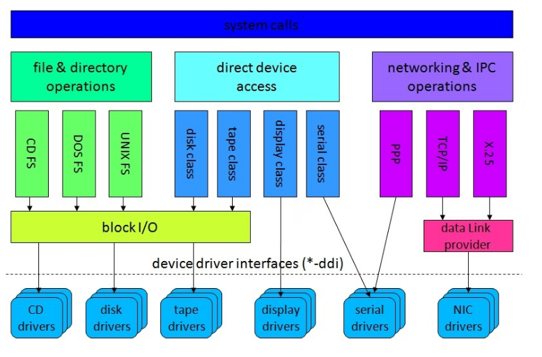
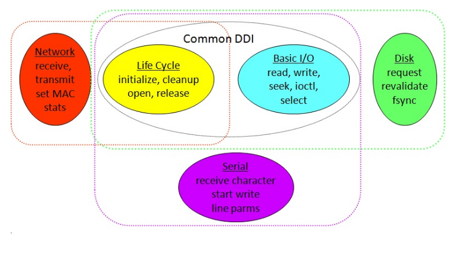

# Device Drivers: Classes and Services
- Device drivers act as generalizing abstractions able to specify a few general classes and interfaces to be implemented within those classes for a wide variety of devices
    - However, device drivers also act as simplifying abstractions that encapsulate the details of how to effectively use a specific device
- Although operating systems are not implemented in object-oriented languages, the idea behind structuring device drivers mimic common object-oriented ideas, such as class interfaces, inheritance, and so forth
    - By nature, this class-based structure for drivers is important to ensure that an overall system behaves the same, regardless of which devices are being used and that the cost of developing new drivers is minimal
- Higher-level functionality associated with the general class of a device is implemented in lower level code associated with the actual device itself
## Major Device Classes
- In early Unix, there were two major classes for *all devices*
- **Block devices** are random-access devices that are addressible in a fixed size (i.e. 512 byte) blocks
    - These devices have associated *request* methods to enqueue asynchronous (non-blocking) direct-memory access requests
        - A request descriptor may have information about the operation, such as the byte count, target device, disk address and in-memory buffer address, etc.), completed information about the request, and a conditional variable that the requestor could use to await the request completion
    - Read or write requests larger than a single block can be issued, but these are typically broken into multiple single-block requests passed through the system buffer cache
    - Block devices were designed to be used within the operating system, such as by file systems, to access disks since all I/O operations are forced to go through a buffer cache
- **Character devices** are devices that may be sequentially accessible or byte-addressable (direct memory access)
    - Byte-addressable devices expect read or write operations to be done as a single, large transfer between the buffer and the user address space
    - Character devices were designed to be used directly by applications since direct transfer between the device and the user address space is much more efficient
- These classes were not necessarily mutually exclusive, as a single device could extend both 
    -  Both classes (and therefore all device drivers) support *initialize* and *cleanup* methods for dynamic loading and unloading, as well as *open* and *release* methods to open and close the device for use
## Driver Subclasses
- Over time, as more functionality became required from systems, more driver sub-classes emerged
    - 
- Associated with these sub-classes are **Device Driver Interfaces (DDIs)** specifying the minimum requirements for devices that fall under a given sub-class
    - 
## Services for Device Drivers
- Most implementations of device drivers cannot be completely self-contained, as they often require common operating system services (memory allocation, mutexes, etc.)
    - These services, exposed by the operating system for use by device drivers, is known as the **Driver-Kernel Interface (DKI)** - it is important that the interface for the DKI is stable, as otherwise many drivers that depend on the interface would stop working
