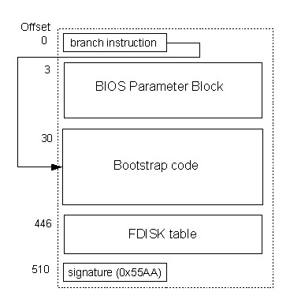
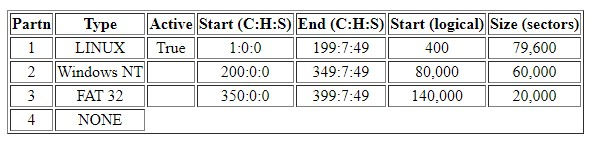
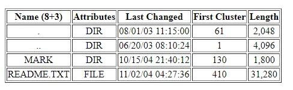
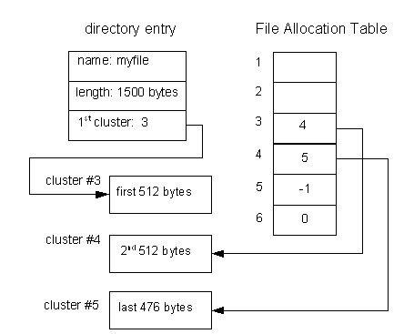
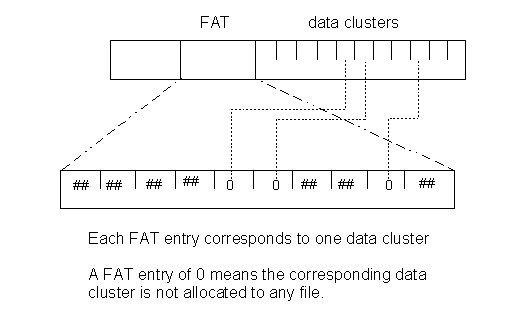

# An Introduction to DOS FAT Volume and File Structure
## Structure
- The FAT file system utilizes a **file allocation table** to keep track of which blocks are allocated to which files as well as to track which blocks are free
## Boot Block
- The FAT file system combines the boot block (contains code to be executed when the computer is powered on) with the volume descriptor information block (contains information about the file system) into a single block
    - 
- The **BIOS parameter block** contains a summary of the device and file system
    - For the physical device, it includes the number of bytes per sector, the number of sectors per track, the number of tracks per cylinder, and the total number of sectors on the device
    - For the file system, it includes the number of sectors per cluster, number of reserved sectors (not part of the file system), number of entries in the root directory
- The **FDISK** table enables a disk to be partitioned into sub-disks, enabling multiple file systems to exist on a single disk
    - Each entry in the table describes a disk partition: partition type, whether the partition is the one to boot from, the start and end disk addresses of the partition, and the number of sectors in the partition
    - The bootstrap searches through the FDISK table, finds the active partition, and boots from it
    - 
## File Descriptors
- The FAT file system combines file descriptors and file naming into a single file descriptor 
- A DOS FAT directory contains a series of fixed sized directory entries, each of which describes a single file:  
    - 11-byte name
    - Attribute bits (file or subdirectory, changed since last backup, hidden or not, read-only or not, system file or not, etc.)
    - Times of creation, modification, and last access
    - Pointer to first logical block
    - Length of file
- 
## File Allocation Table
- The DOS FAT file system utilizes a linked list to keep track of which blocks are allocated to which file
    - If a block is free, the entry indicates so
    - If a block is allocated, the entry gives the address to the *next* block in the file
- The actual file access table containing this linked list is small enough to fit into memory, so it is read from disk once and then accessed from memory afterwards when traversing through the blocks of a file
- The deletion of a file would not actually free it, rather the directory entry associated with that file would be marked with a byte to indicate it as invalid
    - Only when the system ran out of space would a garbage collection mechanism be utilized to traverse through the root directory to find every "valid" and follow the pointers of each file, freeing any clusters not found
- 
- 
