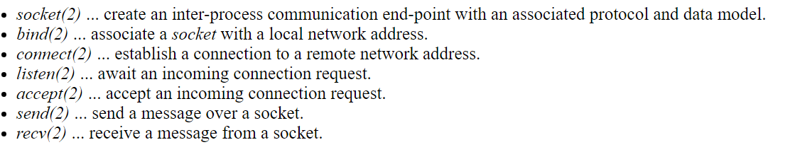

# Inter-Process Communication
- One way processes can interact with each other is through pipelines
## Simple Uni-Directional Byte Streams
- A standard **pipe** can be opened by a parent and inherited by a child, which takes standard input from the read end of the pipe and outputs standard output to the write end of the pipe
- These pipes accept *byte streams* inputs and outputs, which allows for processes interacting between pipes to operate independently
    - These byte streams are inherently unstructured and are made sense of using conventions (i.e. newlines or comma separated values) that are parsed
- Pipes act akin to temporary files, though there are notable differences
    - Unlike a file, if the reader exhausts all of the data in the pipe but there is still an *open* write file descriptor associated with it, the reader will be blocked until either more data becomes available or the write side becomes closed
    - Unlike a file, the buffering capacity of a pipe may be limited, so if the writer is too far ahead than the reader, the operating system may block the writer - *flow control*
    - When both the write and read file descriptors to a pipe are closed, the file associated with it is automatically deleted
## Named Pipes and Mailboxes
- A named-pipe (using the `fifo` system call) is a more persistent pipe that can be opened by *name* as opposed to being inherited (as a standard `pipe` system call pipe usually is); they otherwise work the same as normal pipes in regards to read and write ends
    - With named pipes, though, readers and writers have no ways to authenticate each other's identities
    - There may be writes from multiple writers interspersed in the byte stream - there is no indication of who wrote each byte, so it would be difficult to appropriately parse the byte stream
    - Readers and writers must still be running on the same device
- A more general inter-process communication mechanism is a **mailbox**, which delivers distinct messages accompanied by identification information rather than a byte stream - these messages can still be parsed even after the death of the reader/sender
    - Mailboxes communication is still limited to being within a single device
## General Network Connections
- Operating systems also provide network communication APIs
    - 
- These APIs can be used for network protocols such as TCP and UDP, or higher-level communication models (Remote Procedure Calls for distributed systems, RESTful API, Pub/Sub for content-based information flow)
- Interacting with services all over the world adds more complexity, however
    - There must be interopability with software running under different architectures
    - Security must be accounted for when dealing with data exchange over unknown networks
    - The addresses of servers may constantly change and therefore must be constantly discovered
    - Connection failures, which are common, must constantly be detected and recovered from
## Shared Memory
- When dealing with *local* interprocess communication, it is better to move data between processes through shared memory rather than through the operating system, as there is considerable overhead with system calls
    - Typically, a shared segment is created and mapped onto the address space of each process (this address space might be locked-down so it is not paged out)
    - Processes can then communicate using this shared segment and through any agreed-on data structures and conventions
- This approach can only be used between processes on the same memory bus, and there is no authentication or error-preventing since there is no kernel involvement
## Out-of-Band Signals
- With networks, data sent is first-in, first-out - which presents an issue for cases when future requests may need to be aborted or when an important message must take priority over all others
- This is done for network requests by opening up an additional communication channel for **out of band requests** (as opposed to the heavily-used channel for normal requests), which the server periodically checks