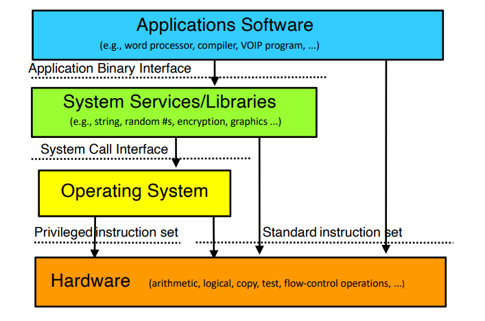

# Introduction
- At the bare minimum, a computer consists of memory (RAM), a processor (CPU), and a bus connecting to various I/O devices (disk, mouse, monitor, etc.)
    - The memory can read or write some binary words
    - The processor can perform various instructions, such as add numbers, move a value to memory, etc.
    - The bus can read input and request input
    - The disk can read or write a block of data
    - The mouse can report X and Y axis movements
    - The monitor can write to groups of pixels
- Higher level programs make use of all the aforementioned hardware aspects of the computer, but they are assisted via the *operating system*
    - Operating systems help perform complex operations that *interact* - with the hardware, with various bits of software, etc.
    - Operating systems hide *complexity*, acting as an abstraction that makes sure nothing gets in the way of anything else in the background
        - Most modern devices have many, many processes running at the same time to get everything properly functioning, and the operating system ensures that such processes do not get in the way of each other
- An operating system is a system software intended to provide support for higher level applications; they build up from the basic, lower level operations with hardware (i.e. assembly) and provide a higher-level interface for user processes and software applications
    - Operating systems sit between the hardware and everything else - thus, it ensures that the hardware works for all softwares while hiding the nasty details from higher-level users and software
- Virtually every device uses an operating system of some sort, and users use their features whenever they interact with the device
    - Since you rely on the services that they offer (memory management, storage, scheduling, security, etc.), it is important to understand how they work
- Common problems in operating systems can be applicable to other fields of programming:
    - Coordinating separate computations
    - Managing shared resources
    - Virtualizing hardware and software
    - Organizing communications
    - Protecting computing resources
- Operating System Wisdom:
    - View services provided by the operating system as objects and operations 
        - Each object is represented by a data structure(s)
    - There is an important difference between an interface and implementation
        - Implementation is not a specification - the interface is a specification
            - The interface is a contract, specifying the responsibilities of both the users of the interface (what to do to use it) as well as the creator of the interface (guarantee that it works in a certain way)
        - If the implementation is changed, the interface should still be able to work seamlessly 
        - Avoid inappropriate dependencies within your implementation
    - Build complex features in modules (individual, self-contained pieces of code with interfaces for other modules) and make use of functional encapsulation (everything related to a certain feature/function should be self-contained in a single module - i.e. module dealing with memory management)
        - Doing so allows for complexity to be hidden and for an appropriate level of abstraction
    - Separate policies and mechanisms
        - Policies determine what can/should be done
        - Mechanisms implement the basic operations to do such policies
        - Mechanisms shouldn't limit policies and policies should be changeable without changing the mechanisms
        - Systems should be built in a way where it is easy to switch from one policy to another - though this requires the underlying mechanism for the new policy to exist
    - Parallelism and asynchrony are powerful and vital but can be dangerous when used carelessly
    - Performance and correctness are often at odds - in this case, you need to choose whichever is more important for the issue at hand
- One definition of an operating system is a low level software that provides a better, more usable abstraction of the hardware below it as well as easy, safe, fair use and sharing of hardware resources
    - The operating system manages the hardware for programs - allocating it and managing its use, enforces controlled sharing (privacy), and overseeing execution and handling problems
    - The operating system abstracts the hardware, making it easier/faster to use and allowing for software to be more portable
        - The operating system is responsible for ensuring that different devices (CPUs, etc.) work without the user worrying
    - The operating system provides new abstractions for applications, thus allowing for new, powerful features beyond just the hardware
- An operating system is effectively a set of management and abstraction services that occur behind the scenes
    - Applications see the objects and their services - files, processes, threads, devices, ports, etc. and creating, destroying, reading, writing, and signalling such objects
    - An operating system therefore extends a computer beyond just the bare minimum of the hardware, creating a more richer, virtual computing platform 
        - The hardware at its basic can just do addition, memory writing/reading, etc., but it is the operating system that extends the hardware to be able to do more advanced tasks
- 
    - The hardware has a *privileged instruction set* separate from its standard instruction set, and it is this privileged instruction set that the operating system has access to
    - System services or *libraries* convert function calls into actual binary system calls 
    - Application programs use the application binary interface to easily make system calls (as otherwise you would need to write assembly to directly call them)
- The operating system is just software, but it is unique from other programs in that it always has control and complete access to all of the hardware
    - The operating system mediates other applications' access to the hardware and is trusted to manage critical data and act in good faith
    - Since the operating system is important for dealing with the hardware, it is automatically loaded when the machine boots and continues to run in the background
    - Due to the role of the operating system in managing the device's hardware and resources, if the operating system crashes, then everything else will also crash
        - It is important, therefore, that operating systems do not crash - and if they do, they should at least save the state before the crash fully occurs
- The **instruction set architecture** is the set of instructions supported by the computer, specifying which bit patterns (binary) correspond to what operations
    - ISAs may vary in different ways - word width (8, 16, 32, 64 bit), features (floating point), design philosophies (RISC vs. CISC), etc.
        - Thus, different ISAs tend to be incompatible - meaning that machine code that works for one ISA will likely not work for a different ISA 
    - ISAs tend to come in families, which are upwards compatible with older models 
- Modern ISAs divide their instruction set into *privileged* vs *general*
    - Any code on the machine can run general instructions, but the processor must be put into a special mode (usually a register stores whether the processor is in this mode) to execute privileged instructions
        - The processor is usually in that mode only when the operating system is running
    - Privileged instructions tend to involve things that are "dangerous" - i.e. allocating memory to processes, use an I/O device - and therefore should be under the operating system's discretion to decide
- ISA does not completely define a computer, as they may contain variations in terms of I/O devices (different SSD, HDD, etc.) as well as functionality beyond user mode instructions (BIOS configuration)
    - These additions define the *platform* that the operating system runs on, which presents a challenge for operating systems to be able to run on as many platforms as possible
- To maximize portability, operating systems *abstract* the ISA (screen functionality - to display, speaker functionality - to display sound, network card functionality - to send IP messages) and deal with their specifics later via drivers
    - These abstractions are built into the operating systems, with as few assumptions about the hardware made as possible - that is, the general frameworks regarding file systems, protocols, processes, etc. 
    - The *binary distribution model* involves the operating system written in the source code (i.e. C) and then compiled for that specific ISA, resulting in a binary distrubtion ready to run
        - After the binary distribution is installed, device drivers can be added, after-market
        - The binary can be configured according to the platform, usually automatically based on the various hardware present (self-identifying busses)
            - Once the hardware is known, the resources can be allocated accordingly (i.e. how much memory to set aside for background processes)
- Operating systems maintain as much code as necessary, but as little as possible since they are *expensive* to develop and maintain
    - Functionality should be in the operating system if it requires the use of privileged instructions, requires the manipulation of operating system data structures, or must maintain security, trust, or resource integrity
    - Otherwise, functions should be in libraries if they are commonly needed by applications but do not need to be implemented inside of the operating system (though there is an argument that some things are faster if done in the operating system)