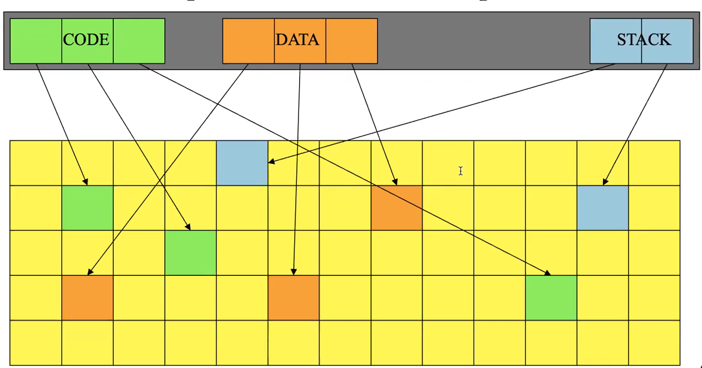
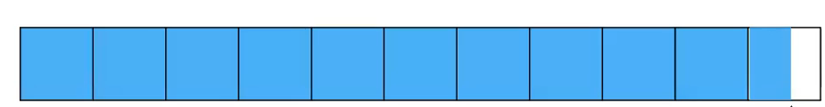

# Memory Management: Swapping and Paging
- Virtualizing memory via segmentation so that physical addresses are not referenced by programs (but instead virtual memory addresses than be translated to physical addresses) allows for relocation to be implemented for feasibly
    - This, however, does not solve the issues of memory segments needing to be contiguous and processes using more memory than physical memory available
## Swapping
- If a set of processes require more RAM than available on the system, it may be necessary to keep some of the memory elsewhere, such as on *disk*
- Programs cannot directly use data on disk - it must be in RAM - so there must be a mechanism to enable *swapping to and from disk*
- One approach is, when a process is yield or blocked (context switch), its memory can be copied to disk and then copied back when it is scheduled again
    - This allows for each currently running process to have an effective address space as large as the total amount of RAM
    - This approach, however, results in the cost of context switches being *very* high, since every single bit of RAM would need to be copied to disk and then the replacement memory must be copied from disk
        - Additionally, this does not deal with the issue that may emerge if a process needs more memory than is physically available
## Paging
- Paging eliminates the requirement of address spaces needing to be contiguous, which in turn allows for swapping to be more flexible 
- Physical memory is divided into units of a *single, fixed* size, typically one that is small (1-4k bytes) known as a **page frame**
- The same division is done for the virtual address space of each process, which now has units known as **pages**
- Each virtual address space page will store its data in one physical address page frame 
    - Both pages and page frames are the same size, so any page can be stored in any page frame
- When addressing pages, then, a per-page translation mechanism converts a virtual page to a physical page
- 
    - Notice that, with the paging approach, a process's address space is not necessarily contiguous (even the code, data, and stack segments are not contiguous)
### Paging and Fragmentation
- With the paging approach, internal fragmentation with data segments will only result in the *last* page being fragmented, and this fragmentation averages to only half a page
    - 
- Paging *does not* result in external fragmentation because there are fixed-size page units
- Overall, paging reduces fragmentation heavily
### Page Translation
- A page translation mechanism must change a virtual address to a physical address for *every* memory reference
- Since this must be done quickly, hardware support is necessary
    - This support is via the memory management unit (MMU), which is designed to perform translations quickly
    - The MMU is typically integrated into the CPU (though this was not the case before)
- Each process requires a page table containing translations for its virtual pages 
    - This page table is typically stored in memory (usually that reserved for the operating system) because the amount of page translations are too large to fit into hardware registers
    - A page table typically contains a *valid bit* indicating whether a page frame is valid (i.e. it actually belongs to the process)
- Virtual addresses are divided into two segments - the virtual page number (higher order bits) and the address offset (lower order bits)
    - The virtual page number is translated into a physical page number (using the MMU) and then the offset is added to this physical page frame to complete the translation
        - The offset is the same for the virtual and physical page, so it is not necessary to translate it
### Memory Management Unit
- Keeping a page table in memory requires performing two memory cycles for each address access (one to look up the page table entry, and another to get the actual data)
- To account for this, a very fast set of MMU registers are used as a cache, known as the **translation lookaside buffer**
    - This cache does not contain pages of memory but rather *translations* - entries from page tables (indicating if the page is valid, and if it is, its address)
- Dealing with caching, however, requires worrying about hit ratios, cache invalidation, and other problems
### Multiple Processes
- When there are several processes running, each requires its own set of pages 
- If there are more virtual pages than physical, extra pages must be stored somewhere else
    - These extra pages are stored on disk (flash drive)
- If the current process adds or removes pages, the active page table in memory must be updated and stale cache entries must be flushed
- Processes require their own page tables, so if a process is switched, a privileged instruction must load a pointer to the new page table when dealing with translations
    - A reload instruction may also be necessary to flush previous cache entries
- Pages can be shared between processes by having each process's page table point to the same physical page (which can be kept as read-only)
### Demand Paging
- Processes don't need all of its pages in memory to run - it only needs those that is actually going to use
- **On demand** paging, then, swaps pages from disk when they are actually needed versus when they are not
    - This means that the entire process does not need to be in memory to start running - only a necessary subset of pages can be loaded and can added on over time when demanded
- For this to work, though, the MMU must be able to determine if a page is on disk or not - if it is on disk, a trap can be generated so the operating system can bring it in to RAM
- Demand paging can perform porly if most memory references require disk access
    - To deal with this, *spacial locality* is exploited - the next address is likely to be one that was close to the last address demanded
    - Most programs tend to exhibit spatial locality 
        - Code segments are usually executed consecutive (or branches nearby)
        - Variable accesses are usually done in the current or previous stack frame
        - Heap references are usually to recently allocated structures
- **Page faults** occur when a page is not in RAM but rather in disk (according to the page table it is "not present"), resulting in a trap that the operating system handles
    - The kernel's page fault handler determines which page is required, and where on disk it resides
        - It then schedules I/O to fetch it, blocking the process while it is occurring
        - Once the I/O is complete, the page table is updated to point to the newly read-in page and the initial instruction is retried (back up the program counter to retry)
- Page faults do not affect a program's correctness - only its performance since processes are blocked
    - Page faults can be reduced by having enough of the requested pages in memory, which is in turn a result of the page eviction policy chosen
## Virtual Memory
- Virtual memory is a generalization of what demand paging allows - it is an abstraction for a very large quantity of memory for each process that is *still directly accessible via normal addressing*
    - The speed of virtual memory access approaches that of actual RAM
- Each process is given an address space of immense size, typically as large as the hardware's word size allows (i.e. 264)
- Upon startup, processes are given a certain amount of memory (much smaller than their total address space), and they can request more memory as they run
- Dynamic paging (moving out a page) and swapping (moving out a whole segment) is used to support the abstraction that each process has a very large address space
## Page Replacement
- The goal with page replacement algorithms is to have each page already in memory when a process accesses it, though this is difficult because it cannot be known *ahead of time* which pages will be accessed
    - Instead, *locality of access* is relied upon to determine which pages to move out of memory and onto disk
- The optimal page replacement algorithm will replace the page that will be next referenced furthest in the future, delaying the next page fault as long as possible - of course this cannot be implemented because the future cannot be perfectly predicted by a program (**oracle**)
    - Typically, this optimal page replacement algorithm is used as a benchmark for comparison with implementable page replacement algorithms
- The optimal page replacement algorithm can be approximated using *locality of reference*
    - Pages which have been recently used should be noted (perhaps with extra bits in the page tables)
    - This data can be used to approximate future behavior, as pages accessed recently are *likely* to be accessed again soon
- The **least recently used (LRU)** algorithm will replace the page that has least recently been used
- A naive implementation of LRU will have record the time each page is accessed, and when a page needs to be ejected all of the timestamps can be searched to find the oldest one
    - This requires not only storing all of the timestamps somewhere, but also searching all timestamps every time an ejection is necessary
    - With 64 gigabytes of RAM and 4 kilobyte sized pages, 16 megabytes of timestamps (one for each page) is very expensive
- The timestamp information needed for LRU would be difficult to store in the MMU because it would cause overhead in getting and storing the time on every fetch
    - At best, the MMU will maintain a *read* and *written* bit per page
- Timestamp information cannot be maintained in software either because there would be overhead for *every single memory reference* in order to update the timestamp 
- An ideal implementation modeling LRU should not need extra instructions per memory reference and should not need to scan through an entire timestamp list on replacement (since this list would be very large)
- **Clock algorithms** approximate LRU by organizing all pages in a circular list and when a page is accessed, the MMU sets a reference bit for that page
    - Whenever a replacement is necessary, the MMU scans each page and checks if its reference bit is set
        - If this bit is set, it is cleared and the next page is scanned
        - If this bit is not set, the MMU considers that page to be the least recently used, replaces it, and sets the next position to be start of the next scan (like a clock hand)
    - This algorithm only requires a single "clock" position pointer and a access bit for each entry in the MMU
        - The "clock" pointer is only updated on page loads or replacements
- On a context switch, all page frames should not be cleared out, as this would otherwise incur many page faults when the switched-out-process runs again
    - With a *single global page frame pool* approach, the entire set of page frames is treated as a shared resource and LRU is approximated for the entire set
        - This does not fare well with round-robin scheduling since the process last in the scheduling queue will find all of their processes swapped out since it was not running - this will incur many page faults 
    - With a *per-process page frame pools* approach, a number of page frames is set aside for each running process, and LRU is used separately for each pool
        - This does not fare well since different processes exhibit different locality - which pages are needed and number of pages needed change over time
    - With a *working set* approach, each running process is given an allocation of page frames matched to its needs *dynamically*
        - The optimal working set for a process is the number of pages needed during the next time slace - if there are too few frames, there will be frequent page faults, but if there are too many frames the gains from the extra pages will be minimal
            - This working set size can be determined by observing the process's behavior 
            - The actual pages in the process's working set is determined by its locality of reference - the pages that it does not needed are faulted out
        - Working sets can  be implemented by first assigning a certain amount (guess amount) of page frames to each in-memory process
            - Processes page against themselves in the working set, and the paging behavior (faults per unit time) is used to adjust the number of assigned page frames accordingly
        - **Page stealing algorithms** are used to adjust workign sets, such as the working-set-clock which approximates the last use time for owning processes, find the page approximately least recently used by its owner, and page it out
            - Processes that need more pages tend to get more, while processes that don't use their pages tend to lose them
## Thrashing
- Thrasing occurs when there is not enough memory for the sum of the active working sets - in this case, no process will have enough pages in memory and whenever anything runs, it will grab a page from some other process
    - This results in many, many page faults, resulting in all processes running slowly
- One way to deal with thrashing is to *reduce* the number of competing processes - such as by swapping some of the ready processes out and giving their page frames to the other processes
    - These swapped-out processes won't run for quite a while, but this ensures progress for the other processes
        - Perhaps round-robin can be used for which processes are swapped out and which are not
## Clean vs. Dirty Pages
- A page that was recently swapped from disk will have two copies - one on disk (as swapping does not just clear out the disk memory), and one on memory
- If the in-memory copy becomes modified, the copy on the disk is no longer up-to-date, and if it is paged out of memory it must now be *written* to disk
- Clean pages can be replaced at any time since the copy on disk is up to date, but dirty pages must be written to disk before the frame can be reused
    - **Pre-emptive page laundering** is used to address this issue - dirty pages are converted to clean ones via background writes to disk
        - All dirty, *non-running* pages are written to disk since eventually they will likely to  be paged out; once the write is completed, it is marked as clean (such as by unsetting the dirty bit)