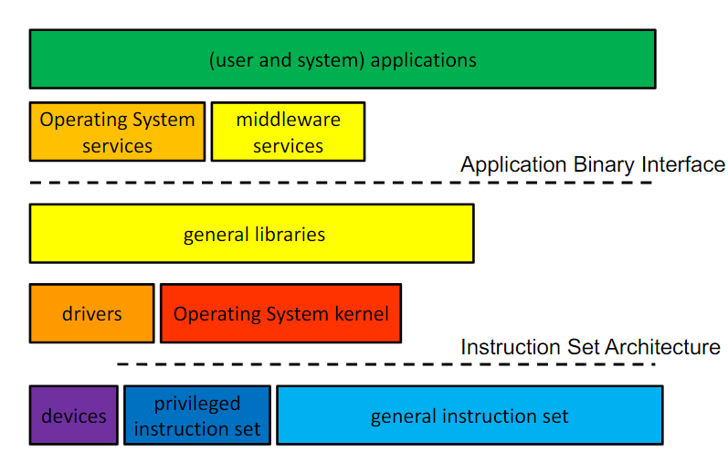

# Operating System Services
## Abstractions
- Directly using hardware functionality is very difficult, as they are often detail-oriented (i.e. directly setting a pixel on the screen)
- The operating system offers abstract versions of these resources, allowing for easier use of hardware functionality since the operating system deals with the difficult, often platform-specific details while the user deals with the higher-level functionality
    - The operating system must actually implement the abstraction of these physical resources (i.e. the processes abstraction requires hiding away the CPU and RAM, the file abstraction requires hiding away the disk); physical resource -> abstract resource
- In addition to being easier to use than the original resources, abstractions allow for complexity to be encapsulated since there is no longer a need to worry about lower-level details (i.e. no need to understand cache behavior when dealing with memory, etc.). Additionally, behavior irrelevant to the user is eliminated and instead focus on more convenient behavior 
- There are many variations in hardware and software, requiring their abstractions to be generalized, often through common cases (i.e. all printers print a page of paper) in a unifying model (i.e. all printers understand pfs)
## Resources
- **Serially reusable resources** are resources that are used by multiple clients, but only *one at a time* (i.e. a core on a CPU - multiple programs cannot simultaneously run on a *single* core)
    - These resources require access control to ensure exclusive use as well as *graceful transitions* from one user to the next
        - These transitions should only occur after the first user is finished with the resource (there are no incomplete operations) and should ensure that the subsequent user does not see any traces of data or state from the previous user ("like new")
    - i.e. Context switching for CPU cores
- **Partionable resources** are resources divided into disjoint pieces for multiple clients
    - These resources require access control to ensure containment - an application cannot access resource outside of its partition - and privacy - other applications cannot access an applications resources
    - These resources may still need graceful transitions, as these resources aren't permanently allocated (i.e. memory) - once the resource is freed, a transition is necessary
    - i.e. Memory, hard disk
- **Shareable resources** are resources usable simultaneously by clients - they don't have to wait for the resource or have it allocated to them
    - Shareable resources tend to involve effectively limitless resources, such as the operating system, shared by processes (i.e. when making system calls)
    - Shareable resources don't require a graceful transition since shareable resources tend to not change state (read-only)
    - It is a good thing to build systems to maximize shareable resources
## General Operating Systems Trends
- Over time, operating systems have grown larger and more sophisticated, with a fundamentally changed role
    - They have changed from shepherding the use of hardware to shielding applications from the hardware, providing power application computing platforms, and mediating application "traffic"
- These changes are a result of the evolving complexity of applications, requiring the operating system to provide more complex core services to such applications
- As a result of the growing scale of operating systems, there are only a handful of widely used operating systems - Windows, MacOS, Linux
    - Operating systems in the same family are used for vastly different purposes, which presents difficulties for the designer because they must accomodate not only for different machines, but also for different purposes
    - These operating systems are based on older design philosophies
    - New operating systems have not emerged because they're expensive to build and maintain and can only succeed if they have some sort of clear advantage over contemporary operating systems
    - *Windows* is popular for personal computers
    - *MacOS* is exclusively in Apple products
    - *Linux* is the choice for industrial servers and embedded systems (it is highly configurable and free, so it is easy to fit into embedded devices)
## Operating System Services
- Basic Abstractions:
    - CPU (processes, threads, virtual machines) and memory abstractions (virtual address spaces)
    - Persistent storage abstractions (files and file systems)
    - I/O abstractions (virtual terminal sessions, windows, sockets, pipes, etc.)
- Higher Level Abstractions:
    - Cooperating parallel processes (requires locks, condition variables, distributed transactions, leases, etc.)
    - Security (user authentication, secure sessions, at-rest encryption)
    - User interface (GUI)
- Background Services (Invisible):
    - Enclosure management (power, fan, fault handling)
    - Software updates
    - Dynamic resource allocation and scheduling (CPU, memory, bus resources, disk, network)
    - Networks, protocols, and domain services (USB, BlueTooth, TCP/IP, etc.)
## Delivering Operating System Services
- To deliver operating system services, there are various different options, present in different *layers*:
    - Applications could call subroutines (high layers) - this involves pushing parameters and jumping to the subroutine, which then returns values in registers on the stack
        - This is extremely fast (nanoseconds) and allows for a run-time implementation binding (the subroutines to be called can be decided at runtime rather than compile time)
        - It is limited however, in that all services are implemented in the same address space and there is a limited ability to combine different languages. Additionally, since the subroutine call is on the application level, it cannot use privileged instructions directly (it may need to indirectly via system calls)
        - Subroutines can be delivered via libraries, which are collections of object modules, which can be used directly without the need to compile (they are already in the appropriate binary format for the system's ISA)
            - Most systems come with many standard libraries (encryption, statistics, etc.) and additional libraries can be installed later or written 
            - Libraries are reusable, are often written well (best possible algorithm), and encapsulate complexity
            - Libraries also have multiple bind-time options (static, shared ,or dynamic)
            - General libraries try to provide as many services as possible - and if they can't, then they call on the operating system kernel (system calls)
                - Static library modules are added to a program's load module, so each module has its own copy of the library - this results in an increased size and requires relinking to incorporate new library or versions
                - Shared libraries have one (loaded) in-memory copy, shared by all processes that is loaded along with the program - this reduces memory consumption and allows for programs to start faster; it also allows for updates to be simplified 
                    - Not all modules work in a shared library - they cannot include global data storage
                    - Shared libraries are added into program memory whether the are actually needed or not
                    - Called routines *must* be known at compile-time (though the fetching of the actual code for the routines is delayed until run-time)
                - Dynamically loadable libraries are more general than shared libraries, since they allow for library code only to be called when they are needed - but there is a performance cost of actually calling them when necessary
                    - Dynamically loadable libraries are *not* shared between processes using the same library - each process has its own copy of the library in their own private memory space
                    - This allows for faster startups since external libraries are only loaded when they are needed (and can be unloaded when needed)
    - Applications could make system calls - this forces entry into the operating system (kernel mode), although the parameters and returns are similar to that of a subroutine
        - This is advantageous in that it allows for the usage/allocation of privileged resources as well as communication with other processes
        - However, the system call approach is much slower compared to making use of libraries (100x-1000x slower)
        - Services using system calls are often those requiring privilege (instructions such as interrupts or I/O), the allocation of physical resources (memory), process privacy and containment, or the integrity of critical resources
        - Not all trusted code must be in the kernel - code that does not need to access kernel data structures or need to execute privileged instructions can be the outside the kernel, letting the operating system do the privileged portion and the application do the rest
            - These are usually done by processes that "wait" for the necessary instruction (Daemons) - i.e. logins
            - There are also processes that are trusted by the operating system to provide services
    - Applications could send messages to software that performs the services - sending messages with a server (via system calls)
        - Servers can be anywhere on Earth, allowing for the service to be highly scalable and available
        - The service can be implemented in user-mode code
        - As a disadvantage, though, this approach is even slower than subroutines (1000x-100000x) and has limited ability to operate on process resources (cannot access your memory)
        - Middleware can be used as a part of the application or service platform but not as part of the operating system (databases, Apache/Nginx web servers, Hadoop for distributed computing, Cassandra for data warehousing)
            - Middleware is not standalone but rather meant for other programs, though it is not part of the operating system because user-mode code is easier to build, is much more portable, and can be restarted when crashed
- Higher level abstract services are offered at high software layers whereas lower level abstract services are offered deeper in the operating system
    - 
    