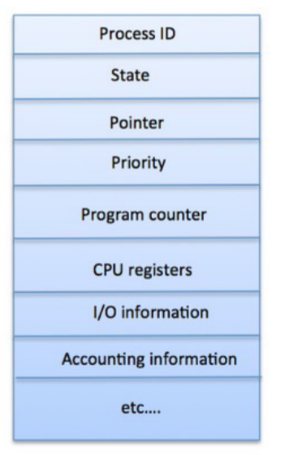

# Processes, Execution, and State
## Processes
- Processes are an executing instance of a program, thought of as a virtual private computer for running one piece of code
    - Processes can also be thought of as objects, characterized by its properties (state) and its operations
- The **state** of a process can vary as it continues to execute
    - The state a process in a computer is representable as a set of bits, which can be saved and restored when necessary by the operating system
    - The state of operating system objects are managed by the operating system itself - users cannot directly access or change the state of the operating system but must rather ask the operating system to access or change such state
        - Scheduling priority of a process (what processes are next to run)
        - Current pointer into a file
        - Completion condition of an I/O operation
        - List of memory pages allocated to a process
- Each process has some memory addresses reserved for its private use, known as its address space, which is kept by the operating system
    - A process' address space is made up of all memory locations that the process can address (it cannot access an address outside of the address space - if it were to do so, an execption would occur)
    - Address spaces are virtual - operating systems "pretend" that every process can include all of the memory available, though this is not true under the cover  
        - This virtualization allows for simplicity since programs do not need to worry about which memory addresses they are allowed to access - they can just assume any address works (when in reality their virtual memory is mapped to physical memory)
- A program is a specification of a process, but they are not actually running - only processes are running 
    - Programs sit on disk, ready to be loaded into a running process
        - The ELF header on a program indicates the target ISA and locations of the load and info sections 
            - These sections typically contain the code, data values, and symbol tables (not necessarily, but useful for debugging)
    - Processes sit in memory (address space) containing shared code, private data, shared libraries, and a private stack
        - These different types of memory elements have different requirements - i.e. the code is not writable but must be executable and stacks are readable and writable but not executable
        - Where to place different memory components is up to the operating system (i.e. the code and data towards the beginning of the address space and the stack towards the very end, allowing for it to grow downwards without collision)
- Code Segments:
    - Start with a load module, containing the output of the linkage editor
        - Since linkage has already occurred, all external references have been resolved (function names, symbols, etc.) except for possibly DLLs
    - The code is then loaded into memory since instructions can only be run from RAM - a code segment is created from the load module
        - This requires mapping the code segment into the process's address space
    - Code segments are read/execute only and sharable (if there are multiple instances of the *same* program running, this allows for optimization while still being safe since there is no possibility of writing over the segment)
- Data Segments:
    - Data must be initialized in the address space - created and mapped into the process's address space
    - Data segments are readable and writable and are private only to the process - it can be grown or shrinked (using `sbrk` system call)
- Processes and Stack Frames:
    - Each procedure call allocates a new stack frame, containing local variables for the procedure, storage for invocation parameters, registers (to restore them later)
    - Stack frames are preserved as part of a process state - most modern CPUs have stack support 
- Stack Segment:
    - The size of the stack depends on program activities (grows larger as calls nest more deeply, and shrinks after calls return)
    - The operating system manages each process' stack segment, created at the same time as the data segment
        - Some operating systems allocate a fixed stack size at load time while others dynamically extend the stack as the program needs it
- Libraries:
    - Static libraries are added to the load module
    - Shared libraries use less space, with only one in-memory copy being shared by all processes (faster program loads)
- Other Process State (not in address space):
    - Registers (general registers, program counter, processor status, stack pointer, frame pointer)
    - Process' own operating system resources (open files, current working directory, locks)
    - There is also OS-related state information about the process (its scheduling priority, its owner, etc.)
    - All of this data must be kept track of by the operating system in some data structure
- The **process descriptor** is the basic data structure used by the operating system used to deal with processes
    - It stores all information relevant to the process, containing not only the state (to restore when the process is dispatched), but also references allocated resources and information to support process operations
    - The process descriptor is *not* available to the process, but is still managed internally by the operating system, who may need to use it when considering scheduling, security, or resource allocation
    - The Linux Process Control Block (PCB) is one example of a process descriptor used in Linux/Unix operating systems, keeping track of process ID, state of the process (running), address space information, and various other things
        - 
    - Not all process state is directly stored in the process descriptor though - i.e. application execution state is on the stack (memory), so instead a *pointer* to the stack is retained
        - Linux processes maintain two stacks per process - one stack for user activites and another for system calls (supervisor-mode stack) so that the state of in-progress system calls or interrupts can be retained
- Handling Processes:
    - Creating a process:
        - The operating system creates a process at the *request of other processes* - this requires using some method to initialize their state
        - Processes are associated with parent processes and child processes (i.e. the shell or the windowing interface as parents)
        - The operating system creates a new process descriptor (requires some memory) and places it into a *process table* (it could be a list, linked list, whatever), which is used to organize all currently active processes (possibly even terminated processes)
        - Aside from a process descriptor, a new processor needs an address space (to hold all of its code, stack, heap segments), which is allocated by the operating system (address spaces themselves are another data structure maintained by the operating system)
        - The operating system loads the program code and data into new segments and initializes a stack frame alongside initial registers for the program (program counter, process status word - user mode or privilege mode, stack pointer, etc.)
        - Operating systems can create a process from a "blank" template, with no initial state or resources - done by Windows
            - The system call creating the process still needs basic information to set up the process properly - such as the code to be run
            - In Windows, this is done via the `CreateProcess()` system call, which is a very flexible way to create a new process (there are many parameters with many possible values) - generally, the call includes the name of the program to run (in many parameter locations to maintain a stable interface)
        - Operating systems can also use the calling process (parent) as a template, giving the new process the same initial state as the old one - which is done in Linux/Unix
            - Effectively, the existing parent process is cloned - this approach assumes that the new child process is a lot like the old one
            - After the fork, there are two processes with different process IDs but otherwise the same code
                - To perform actual differing functionality, code is usually implemented so that the parent takes one branch whereas the child takes the other 
                - The `exec()` system call can be used to "remake" a process so that it runs a different piece of code - a common pattern is to do `fork()` and then `exec()` in the child branch
                    - `exec()` resets much of the state of the process calling it (code, stack, and data) and loads new code and other resources
            - The child process from the fork copies the same code as the parent but has its own stack that is initialized to match the parent's
                - The child also has its own data segment (heap), but this data is maintained via a copy on write setup - that is, the memory is shared and only if one of them writes on the memory does an actual copy be created (copy just enough)
    - Destroying a process:
        - Processes terminate, either because they are done or are terminated directly by the operating system
        - A terminating process must be cleaned up by the operating system
            - Its memory, locks, and access to hardware devices should be reclaimed 
            - Any other processes that were previously interacting with the process must be informed of the process's termination - i.e. pipe communications or parent/child processes
            - The process descriptor associated with the process should be removed from the table (reclaim memory)
    - Running processes:
        - Processes must execute code to do their job, meaning that they must be able to access a processor core 
        - Since there are more processes than cores on a typical machine, they must share cores
        - To run a process on the core, the core's hardware must be initialized
            - Load the core's registers
            - Initialize and set the stack pointer
            - Set up any memory control structures
            - Set the program counter
        - Once a program is loaded on the core, it is executed through a model known as **limited direct execution** - that is, most instructions are directly executed on the core without any operating system intervention
            - There are instructions intended to cause a *trap* to the operating system (i.e. system call), typically involving privileged instructions that can only execute in supervisor mode 
                - The operating system must be able to take over the core at this point, and traps allow for this to happen by switching from user mode to kernel mode
                - There is hardware support for catching these *exceptions*, allowing for control to be transfered to the operating system
                    - Usually, processors reserve one or more privileged instruction for *system calls*, so that when a user program attempts to perform the instruction, the system traps (flips a bit that changes from user mode to supervisor mode) into the operating system who can handle the appropriate system call
                    - There are system call linkage conventions (i.e. which register should keep the system call number and which register(s) should keep the arguments)
                    - There is a *trap table* associated with system call numbers that allows for an appropriate jump to the system call handler (in kernel mode) 
                        - The *first level trap handler* looks for the type of system call being performed and jumps to the approriate *second level trap handler* with the actual implementation of that system call
                            - 1st level handler -> trap gate -> 2nd level handler
                        - Trap handlers are just code, meaning that they require a stack to run
                            - The supervisor-mode stack saves the user program's program counter and processor status registers, the user's general registers, parameters to the system call handler, the return value, and the system call handler stack frame
                    - With the arguments, the operating system can execute the designated system call and then return to the program after the system call
                    - Asynchronous system calls (like reading from drive) involves waiting which lets the processor do something else during the wait
                        - *Event completion callbacks* allows the operating system to keep track of what process made the asynchronous system call when it finally completes
            - Direct execution on the CPU is the most efficient approach, so it should maximized - save the occasional traps (system calls) or timer interrupts (time sharing) 
- The operating system defines numerous types of signals that can be caught and handled by processes
    - The process can either ignore the signal or designate a handler for the signal
- Process state is managed by both the operating system and the process itself
    - The stack is managed by the process itself
    - The operating system manages resources that have been allocated to the process - its address space, open files, its supervisor stack, etc.
- A blocked process is one that is not ready to run - it might be waiting for I/O or some other resource request
    - Whether a process is blocked or not acts as "note" to the scheduler
    - Any part of the operating system can set blocks, and any part can remvoe them - a process can ask to be blocked itself through a system call (though another process needs to make a system call request to unblock them)
    - Usually, a resource manager will handle the blocking of processes, such as when a process needs an unavailable resource (and then unblocks them when the resource is available)