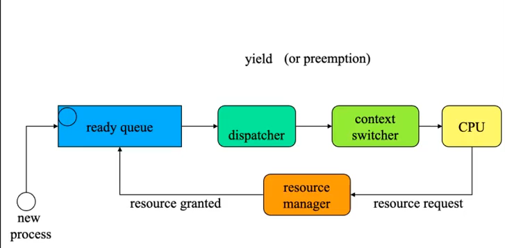
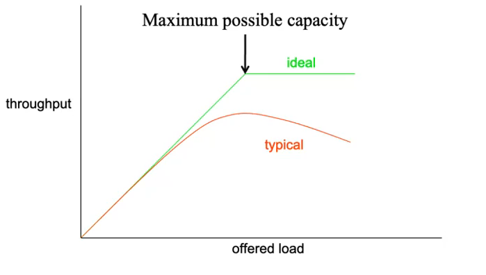
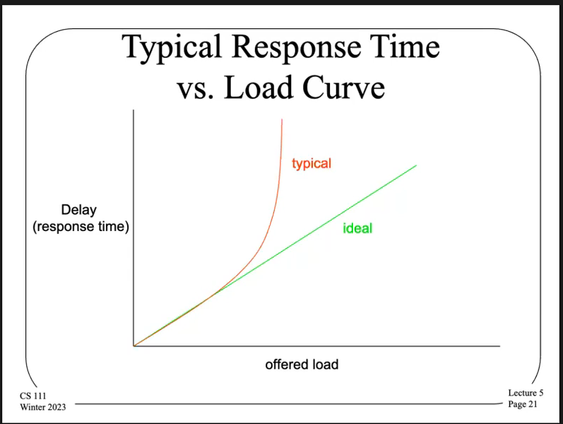

# Scheduling
- Scheduling is a type of decision making done by the operating system dealing with serving a limited (unpartitionable) resource between multiple clients
    - This involves determining which client gets the resource next, and for how long
    - The most common resource that concerns scheduling is scheduling the processor (CPU) among different processes - what job is to run next on an idle core, and how long should it be allowed to run?
        - Other common resources, though, do require scheduling - such as multiple flash drives requests, multiple network messages, etc. 
- Scheduling algorithms are made with *system goals* in mind - some goals may be at odds with each other, requiring a tradeoff 
## Process Queue
- The operating system typically creates a queue of processes (process descriptors) that are ready to run, which are ordered by *whichever should run next*, dependent on the scheduling algorithm used
    - When it is time to schedule a new process, the first one on the process queue is ran
    - Processes that are not ready to run are either outside of the queue, are at the end of the queue, or are ignored by the scheduler
## Scheduling Goals
- Types of Goals:
    - Maximize throughput
        - Get as much work (process code) done as possible
    - Minimize average waiting time
        - Try to avoid delaying too many processes for long
    - Ensure some degree of fairness
        - Minimize the worst case waiting time
    - Meet explicit priority goals
        - Scheduled items tagged with a relative priority (very important processes)
    - Real time scheduling
        - Scheduled items tagged with a deadline to be met
- Types of Systems:
    - Time shared systems often require a fast response time for interactive programs, with each user getting an equal share of the CPU
    - Batch systems often require the total system throughput to be maximized, so the delays of individual processes are unimportant
    - Real-time systems require critical operations to happen on-time, at the cost of possibly non-critical operations not happening at all
    - Service level agreement systems seek to share resources between multiple customers (i.e. cloud computing), ensuring that various, differing agreements are met
## Policy and Mechanism
- The scheduler will move jobs onto and off of a processor core, known as *dispatching*
    - The actual process of dispatching is a *mechanism* for scheduling, independent of the policy of what program actually runs
## Preemptive vs. Non-Preemptive Scheduling
- In considering scheduling, there is a choice to let the process run until it finishes (**non-preemptive**) or to interrupt it part way through and let another process run (**preemptive**)
- Non-preemptive scheduling is beneficial in that there is low scheduling overhead, allowing for a higher throughput - less operating system code is run since there is no need to do context switches as much
    - However, it is disadvantageous in that there is very poor response time (think of a very long program causing other programs to wait), bugs can cause the machine to freeze up (infinite loops), there is poor fairness, and there is difficulty in incorporating real time and priority scheduling
- Preemptive scheduling is beneficial in that there is very good response time, fair usage, and ease in incorporating real-time and priority scheduling
    - However, it is disadvantageous in that it is more complex to implement, requires the ability to *cleanly* halt processes at any instruction and save its state, may not yield good throughput, and may result in higher overhead 
## Scheduling the CPU
- 
## Scheduling and Performance
- The way in which scheduling is implemented has a major effect on the system's performance
- There are different aspects of performance, and not all of such aspects may be optimized
- Scheduling performance has a very different characteristic depending on the system load (light vs. heavy)
- Scheduler Performance Metrics:
    - Throughput (processes/second)
        - Different processes need different run times
        - Process completion time is not controlled by the scheduler - it is controlled by the process itself
    - Delay (milliseconds)
        - There is a question of what kind of delay should be measured - time to finish a job (turnaround time), time to get a reponse, etc.
        - Some delays are not the scheduler's fault (time to complete a service request or wait for a busy resource)
    - Mean time to completion (seconds)
        - This can be done with a particular job mix (benchmark)
    - Mean response time (milliseconds)
        - Measured by the time spent on the ready queue
- Measuring CPU Scheduling:
    - A process execution can be divided into phases: time spent running, time spent waiting for resources or completions, time waiting to run when ready
    - The first two phases are not under the control of the operating sytem, but the last phase is - this can be optimized
- 
    - The ideal throughput cannot be achieved for scheduling because scheduling *is not free* - there is overhead associated with dispatching a process, which leaves less time available to run processes
    - The performance gap can be minimized by reducing the overhead per dispatch and minimize the number of dispatches (this may be done by allowing preemption)
- 
    - Real systems have finite limits (such as a queue size), and so when these limits are exceeded, requests are typically dropped (infinite response time for those dropped processes)
    - Thus if load arrives faster than it is serviced, lots of requests are dropped - overhead will explode during periods of heavy load 
    - This applies beyond scheduling, as DDoS attacks function similarly by sending many responses to overwhelm a system so much that other messages (from normal users) become dropped
- Graceful degradation is optimal for when a system is overloaded - there should be continued service by the system, but with degraded performance
    - Performance should be maintained by rejecting work and then resuming normal service when load is dropped to normal
    - For work that has *not* been rejected, throughput should not be allowed to drop to zero (it should still be done)
## Non-Preemptive Scheduling
- Implementing non-preemptive scheduling involves allowing a process to run until it voluntarily *yields* the CPU
    - This works well for simple systems with a small number of processes with natural *producer-consumer* relationships
    - As mentioned, this allows for throughput to be maximized
    - However, this requires processes to "behave" in that it does not starve other processes or locks up the entire system (if bugged)
- **First Come First Served Algorithm**:
    - Run the first process on the ready queue until it completes or yields, and then run the next process on the queue until it completes or yields
    - This implementation has highly variable delays depending on the implementations of the processes themselves
    - Every process, though, will (eventually) get its turn
    - First come first serve delivers very poor response time, so it makes sense to use when response time is not important (batch processing), when it is more important to minimize overhead than any single job's completion time, or when dealing with embedded systems where procesess are brief
## Real Time Schedulers
- For certain systems, things *must* happen at particular times, based on real-time deadlines
- Hard real time schedulers must *absolutely* meet its deadlines, as otherwise the system will fail (i.e. nuclear powerplant)
    - It is ensured that these deadlines are not missed by very careful analysis, making sure that no possible schedule causes a deadline to be missed by working it out ahead of time
        - In this case, the scheduler must rigorously enforce its deadlines
    - Enforcing hard deadlines requires that there is a deep understanding of the code used in each job - it must be known *exactly* how long it will take, so non-deterministic things must be avoided
        - This requires turning off interrupts
        - It allows requires using non-preemptive scheduler, as this avoids any run-time decisions (which are inherently non-deterministic)
- Soft real time schedulers still prefer for deadlines to be met, but it is fine for some of them to be occasionally missed 
    - The goal of the scheduler is to avoid missing deadlines, with the understanding that a few may be missed
    - These schedulers don't require as much analysis compared to hard real time schedulers 
    - As such, it is fine to use preemption for soft real time schedulers - if a deadline is missed, then it is likely necessary to drop a job (either the current or some future job) to get back on schedule, which can be done with preemption
    The  *Earliest Deadline First* algorithm associates each job with a deadline, based on a common clock, and keeps the job queue sorted by those deadlines
        - Whenever one job completes, pick the first one off the queue, and occasionally prune the queue to remove missed deadlines
        - The goal here is to minimize total lateness
## Preemptive Scheduling
- With preemptive scheduling, a process/thread is chosen to run and will run until either it yields or the operating system decies to interrupt it, allowing some other process/thread to run (with the interrupted process/thread to be run later)
- This implies that a process can be forced to yield at any time, either because a more important process becomes ready or because the process's importance has been lowered (i.e. running too long)
- The interrupted process might not be in a "clean" state, which could complicate saving and restoring its state
    - This may create issues with resource sharing - i.e. one process is switched in the middle of writing to a shared resource used by another, resulting in an incompletely written resource
- There is overhead with performing context switching, because now operating system code must be run during the actual context switch process (and if this context switch is frequent, there will be frequent overhead as a result)
- Implementing Preemption:
    - First, there needs to be a way to get control away from the process
        - This is typically done using clock interrupts, which are built into processors that can generate an interrupt at a fixed time interval, allowing for control to be transferred to the operating system (which can then invoke the scheduler)
            - Clock interrupts are vital to preemptive scheduling
    - The scheduler must be consulted before returning to the interrupted process, where it is decided whether that process should continue running or if another process should run
        - This may involve considering if any ready process has had its priority raised or if the current process has had its priority lowered
    - The scheduler then finds the highest priority process and replaces the current program with it (if it is the current process, then nothing is done and it returns as usual)
- **Round-Robin Scheduling Algorithm**:
    - This is an algorithm with a goal of fair share scheduling - processes are offered equal shares of the CPU and experience similar queue delays
    - Typically, all processes are assigned a time slice (usually the same time slice for all programs), and each process is scheduled in turn, running until its time slice is expired and then put at the end of the process queue
    - This allows all processes a relatively quick chance to do some computation, but at the cost of not finishing any single process quickly
        - This is good for interactive processes
        - This approach also involves far more context switches, which can be fairly expensive though
    - The performance of a preemptive scheduler depends on heavily on how long the time slice is, but there are trade offs with the choice of time slice
        - Long time slices avoid too many context switches (more throughput), but this results in lower response time
        - Shorter time slices provide better response time but results in more context switch overhead (less throughput)
    - Cost of a Context Switch:
        - Requires entering the operating system (taking the interrupt, saving registers, calling the scheduler)
        - Requires choosing who to run (work by the scheduler/dispatcher)
        - Requires moving the operating system context to the new process (switch the stack, process descriptor)
        - Requiring switching out process address spaces
        - Requires losing instruction and data caches (which slows down the next few hundred instructions)
            - This is probably the most significant performance cost
## Priority Scheduling Algorithms
- In a priority scheduling algorithm, the goal is to preferentially run the more important processes first, which is done by assigning each job a priority number and then running jobs according to priority numbers
- If the algorithm is on a non-preemptive scheduler, then priority scheduling simply involves ordering the processes
- For a preemptive scheduler, though, it may be the case that, when a new process is created, it will preempt the current running process if its priority is higher
- **Starvation** may involve a low priority process not running for a long time (or even not at all) due to the presence of higher priority processes always running
    - To combat this, it makes sense to adjust priorities, such as by lowering the priority of processes that have not run for a long time and by occasionally increasing the priority of low priority processes
- Hard Priorities vs. Soft Priorities
    - With *hard priorities*, the higher priority has absolute precedence over the lower when running - the higher priority will *always* run first
    - With *soft priorities*, the higher priority should get a larger share than the lower when running - the higher priority may get a larger time share of the processor
        - Linux uses a soft priority system, with each process having a `nice` value
- Windows uses 32 different priority levels, with half for regular tasks and half for soft real time
    - Users can choose from 5 of these priority levels, and the kernel adjusts priorities based on process behavior with the goal of improving responsiveness
## Multi-Level Feedback Queue Scheduling
- This involves creating multiple ready queues for different types of task behavior
    - Short tasks (that finish quickly) are placed in a high priority queue with short time slices
        - This is useful when needing to optimize response time (i.e. interactive tasks)
    - Long tasks (background) are placed in a lower priority queue with long time slices
        - This minimizes overhead
    - Round robin is performed within each queue
- A new process is initially placed in the high priority queue with a given amount of CPU time allocation
    - Each time it runs, its allocation reduces and, if this allocation runs out, it is moved to a lower priority queue
- All processes are periodically moved to a higher priority queue to avoid starvation