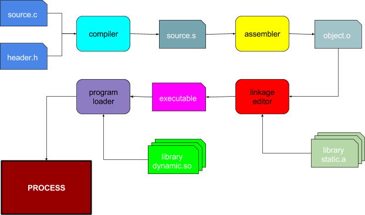

# Object Modules, Linkage Editing, and Libraries
- The most fundamental resource in an operating system is the process, which is effectively just a running instance of a program
- Programs written in a (compiled) language undergo a process in which they become executable programs
    - 
- **Source modules** are editable in some language and are then translated into machine language by a compiler or assembler, thus creating a **relocatable object modules**. These relocatable object modules are not complete programs as they may be missing certain functions that are later to be fetched from **libraries**. Once these library functions are incorporated into the relocatable object modules, a complete **load module** is ready to be loaded into memory and executed
- The **compiler** reads source modules and generates assembly code (rather than machine code), allowing for better optimization and portability
- **Assembly** code in user-mode involves critical data structure manipulations or routines to implement system calls. Assembly code in kernel-mode often involve CPU initialization, trap handlers, and synchronization operations
- The **linkage editor** reads a set of object modules and places their contents into a virtual address space, noting their locations as well as unresolved external references. It then searches through libraries to find modules that resolve those references (*resolution*) and places them in the aforementioned address space (*loading*)
    - Once all modules have been found and placed, it updates all references to relocatable or external symbols and points them to the actual addresses (*relocation*)
- The resulting load module can then be used by the **program loader**, which creates an appropriate virtual address space and reads the instructions from the load module to execute (also allocating a proper stack segment and pointer for the instructions)
- Although machine code instructions are architecture-specific, object module formats are actually common across various architectures, with the most common format being ELF (Executable Linkable Format), consisting of:
    - A header section outlining the type, sizes, and locations of other sections
    - Code and data sections, containing bytes to be loaded into memory
    - A symbol table listing external symbols needed by the module
    - Relocation entries, containing the location of a field (in the code/data section) that requires relocation, the width of the wield (in bytes), and the symbol table entry containing an address to be used to perform such a relocation
- **Static linking** involves directly incorporating library code into the load module, which is ineffective in that it results in common library code being duplicated across the system - it would be better for various programs to share the same library code instead
    - **Shared libraries** achieve this by reserving an address for each shared library and linkage editing a read-only access for that library's code 
        - Redirection tables for various routines are also linkage edited with the client program so that when the program is loaded into memory, the program loader will open the appropriate code segments and map the code segments into the appropriate address space for the program
    - **Dynamically loaded libraries** follow a similar principle to shared libraries, but instead of loading the *entire* library at load time, it loads the library only when needed and can unload the library when no longer needed
        - The application typically asks the operating system to load the library into its address space when needed, to which it returns the address of standard entry points (initialization and shutdown)