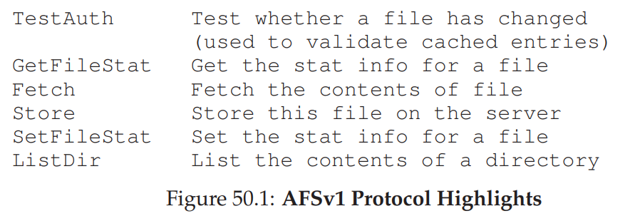
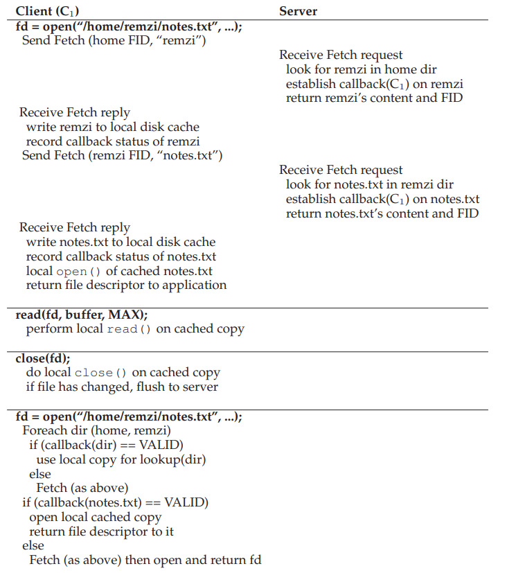

# The Andrew File System (AFS)
- The Andrew File System (AFS) was designed with **scale** in mind 
## AFS Version 1
- 
- All versions of AFS utilize **whole-file caching** on the local disk of the client machine, meaning that the *entire* file is fetched from the server and stored on the client disk
- When a file is first opened, the client-side file system sends a `Fetch` protocol message, traversing the passed in pathname to find the desired file and return it to the client
    - The client stores this file into the local disk and subsequent `read` and `write` calls act *locally*, meaning that accessed blocks are accessed from client disk and cached in client memory - there is no server communication
    - When the file is closed and has been modified, it is flushed to the server using the `Store` protocol
- Subsequent file accesses first contact the server using `TestAuth` to determine if the file has changed - if so, the newest version is fetched, and otherwise the locally cached version is used once more
- The first version of AFS suffered from high-cost path-traversals and too many `TestAuth` protocols, both of which hindered performance since much of the CPU and traffic of the server dealt with those two issues
## AFS Version 2
- AFSv2 utilized **callbacks** where the server would inform the client when a file that they are caching has been modified
    - This introduces **state** into the file system that must be tracked (and also recovered) accordingly
- AFSv2 also utilized **file identifiers (FID)** rather than pathnames, acting similar to file handles in NFS
    - Instead of the server walking the path, the client would instead walk the pathname, thus reducing server load
- 
## Cache Consistency
- In addressing cache consistency between different machines, AFS is able to address **update visibility** and **cache staleness** at the same time
    - When an updated file is closed, it is flushed to the server which then sends a callback to any client with cached copies indicating that their file is no longer valid, prompting them to refetch the newest version of the file
        - This implies a **last writer wins** approach, meaning that whichever client calls `close` last will update the entire file on the server last
- There is an exception with processes on the same machine, as writes to files are *immediately visible* to other local processes without the file needing to be closed, allowing for the file system to behave as expected for local processes
## Crash Recovery
- If a client machine crashes, it should treat its cached contents as stale and ask the server (via `TestAuth`) whether its cached copy is valid
- If the server crashes, every client must treat their cache contents as stale
    - This means that, if the server crashes, the clients must be aware of the crash in a timely manner
        - One approach is to have the server, upon reboot, send a message to every client indicating that it had crashed (and thus all caches should be treated as stale)
        - Another approach is to have clients periodically check on the life of the server via a **heartbeat** message