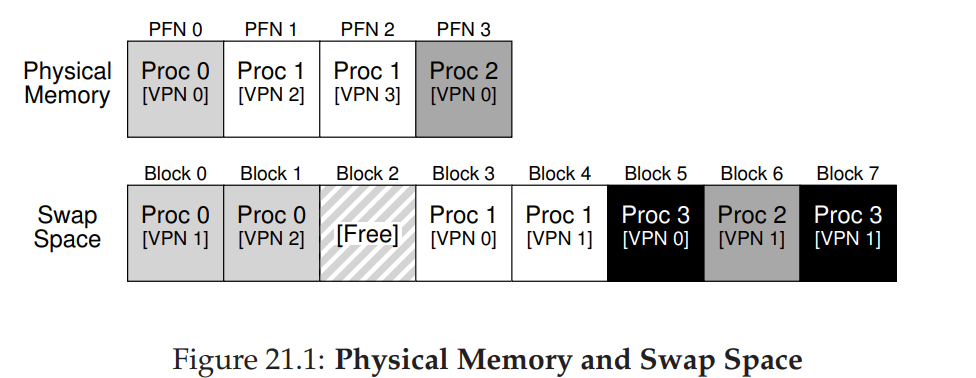
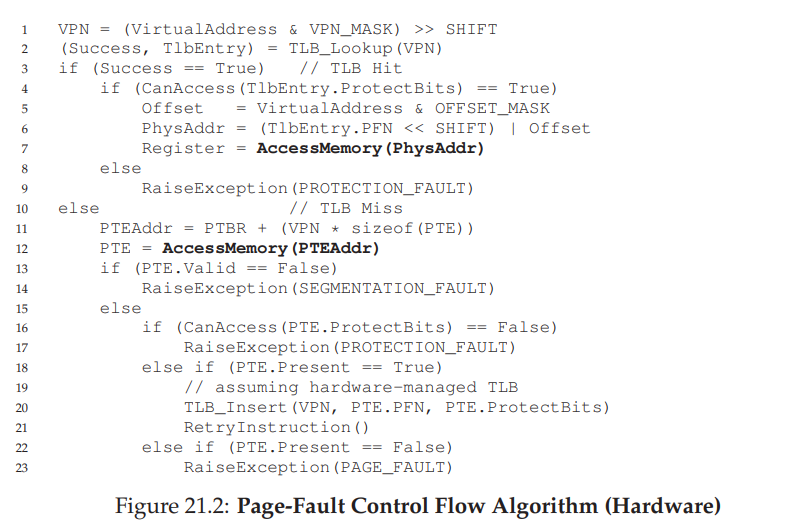
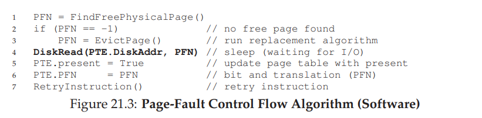

# Beyond Physical Memory: Mechanisms
- In order to support many concurrently-running large address spaces, the operating system must be able to store away not-so-popular pages in **physical storage**, such as **hard disk drives**
    - It is important to maintain the illusion of an unlimited address space to user processes since programmers can write their programs naturally without having to worry about potentially running out of memory - especially when many other processes are also running
## Swap Space
- The operating system typically reserves disk space for moving pages back and forth, known as the **swap space** - it will swap pages out of memory to it and also swap pages into memory from it
    - The swap space is not the only place for holding pages - a program binary, which is located elsewhere on disk, can act as pages necessary for swapping
- 
    - Not all of the pages for a process's address space are together - some are in physical memory (usually the popular pages) while others are in disk (usually the unpopular pages)
## Present Bit
- During a TLB miss, the hardware will perform a lookup to the appropriate **page table entry** - this entry will have a **present bit**, which if is not set, indicates that a page is in disk, resulting in a **page fault** and thus invoking the operating system to run the **page-fault handler**
- The operating system, when dealing with a page fault, will have to actually find the desired page on disk (the disk address could be in the page table entry in place of the physical page number), requiring a disk I/O
    - During this **blocked** state, the operating system can run other processes while the page fault is being serviced
- Once the I/O completes, it will update the page table entry to mark the page as present, update the page frame number to record the now in-memory location of the fetched page, and then retry the instruction (will initially result in a TLB miss, but afterwards it will in the TLB)
- If the memory is full, the operating system may first need to **page out** one or more pages before **paging in** the desired page from the swap space - the process of evicting a page is known as the **page-replacement policy**
## Control Flow
- 
- 
## Replacements
- The operating system usually will ensure that there is a small portion of memory free, typically through a **high watermark (HW)** and **low watermark (LW)** system
- If there are fewer than LW pages available, a background **swap daemon** will free memory (by swapping to disk) until there are HW pages available
- By doing a **cluster** of replacements at once, the efficiency of the disk can be increased    