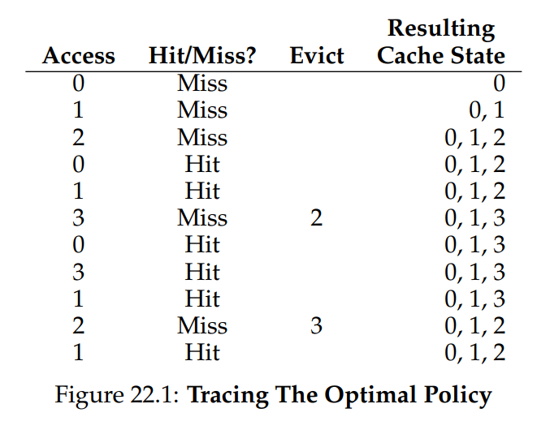
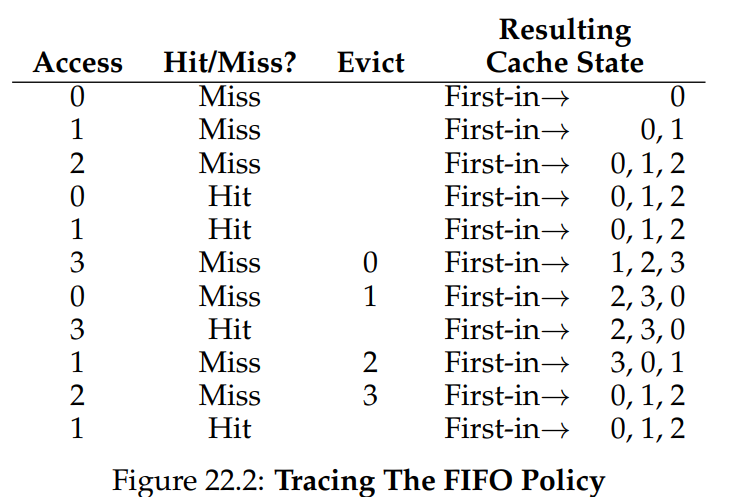
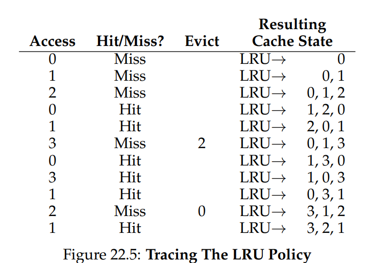
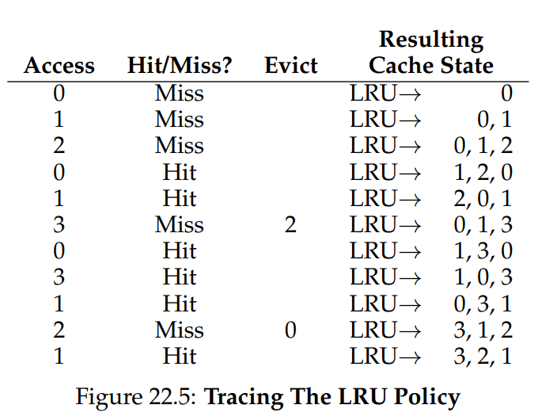
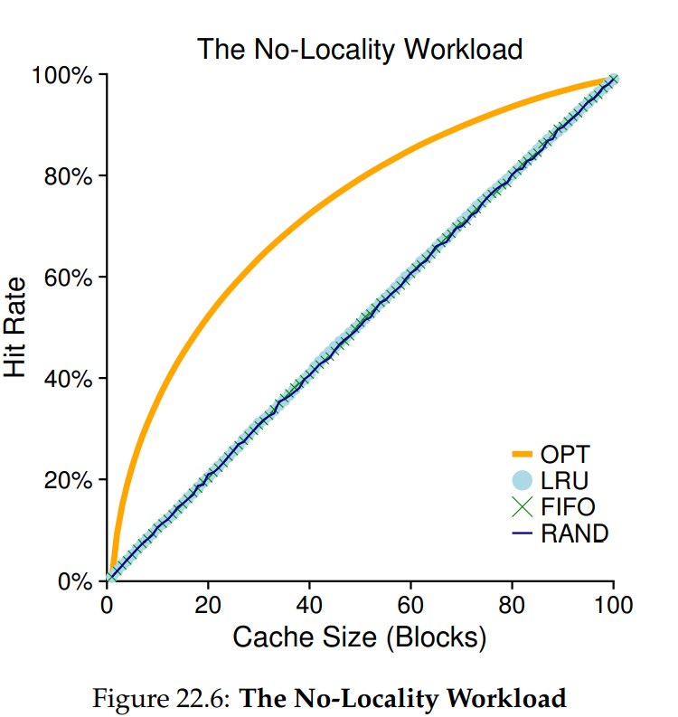
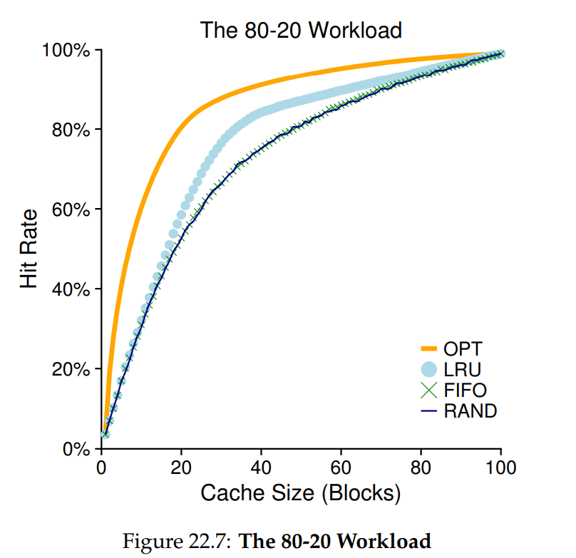
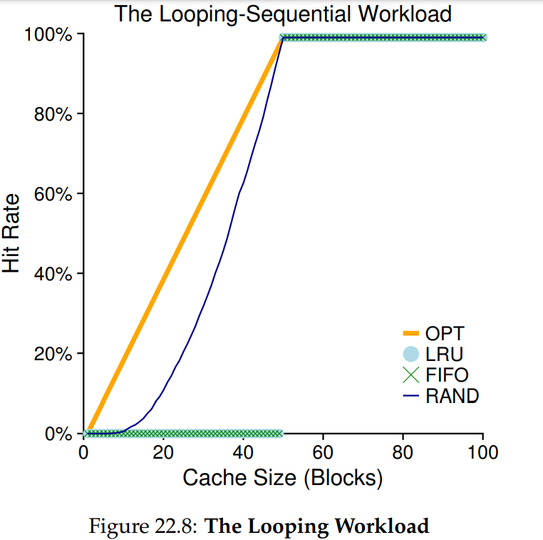

# Beyond Physical Memory: Policies
- In the case where there is not that much free memory available, the operating system must start **paging out** pages - which pages are **evicted** is determined by the **replacement-policy** used by the operating system
- Physical memory can be viewed as a *cache* for all the virtual memory pages in the system - a replacement policy, then, should try to minimize the number of **cache misses** or maximize the number of **cache hits**
    - **Average Memory Access Time (AMAT) = TM + (PMiss \* TD)** 
        - TM is the time cost of accessing memory, TD is the time cost of accessing disk, and PMiss is the probability of a miss (miss rate)
    - Because the cost of accessing disk is so much higher compared to accesssing memory (i.e. 10 milliseconds vs. 100 nanoseconds), even a tiny miss rate will dominate the overall AMAT of running programs - it is vital to minimize misses through a proper replacement policy
        - i.e. For the aforementioned disk and memory costs, a miss rate of 10% would result in an AMAT of 1 millisecond whereas a miss rate of 0.1% would result in an AMAT of 10.1 microseconds
## Optimal Replacement Policy
- The **optimal** replacement policy, which has been proven to lead to the fewest overall number of misses, is one that replaces the page that will be accessed furthest in the future
    - Since obviously future accesses cannot be known ahead of time, the optimal policy acts as a *comparison* benchmark for other policies
- 
## First In, First Out
- The **first in, first out (FIFO)** policy is one of the simplest to implement and simply places each page in a queue when they enter the system and replaces the page on the tail of the queue
    - While it is simple, it is often much worse than optimal because it is unable to determine whether a page is important (frequently used)
- 
## Random
- The **random** policy is also simple to implement, as it chooses a random page to evict 
- 
## Least Recently Used and Least Frequently Used
- A more effective replacement policy is one that uses access history as a basis for eviction, relying heavily on the **principle of locality**
- The **least-frequently used (LFU)** policy consults the **frequency** of page accesses and kicks out the one with the lowest frequency
- The **least-recently used (LRU)** policy consults the **recency** of page accesses and kicks out the one with the least recency
    - 
## Workload Examples
- Accessing 100 Unique Pages Over Time:
    - 
    - When there is no locality, the replacement policy does not matter that much
- 80-20 Workload (80% of references made to 20% of pages):
    - 
    - In this case, since there is more locality exhibited, LRU fares better than FIFO and random
- Looping Sequential Workload (repeating access to same 50 pages in sequential order):
    - 
    - In this case, LRU and FIFO will suffer since older pages are kicked out, despite needing to be accessed soon enough
## Implementation
- Implementing LRU requires on each *page access* for some data structure to be updated to move that page in the front of the access list (it is now the most recently used)
    - This requires work to be done on *every memory reference*, which can add a lot of performance overhead
    - Thus, *real* LRU is not actually done but rather an *approximation of LRU*
- Through hardware support, each page on a system has a **use bit** and whenever a page is referenced, the hardware sets the use bit to 1
    - The operating system clears the bit using a **clock algorithm**; a **clock hand** points to some arbritary starting page and, when a replacement needs to occur, the operating system checks if the currently-pointed to page has its use bit set
    - If it is, then that page is not a good candidate for replacement and its use bit is unset and the clock hand increments to the next page (P + 1) until it finds one with a use bit set to zero
## Other Considerations
- If a page has been modified (**dirty**) while in memory, then evicting it requires writing it back to disk, which is expensive - dirty pages are therefore not as good candidates for eviction as **clean** pages are
    - Hardware support for a **dirty bit** set each time a page is written to is necessary
    - For these modified pages, it is often more effective to **group** write them out to disk
- Another consideration is *when* to bring a page in from disk to memory
    - **Demand paging** involves bringing a page when it is accessed
    - The operating system could also attempt to predict which pages need to be brought in and **prefetch** them
- When the memory requirements of all the running processes exceed the available memory, there will be constant paging - known as **thrashing**
    - Some systems deal with thrashing by only working on a reduced set of processes (**working sets**) that are able to fit in memory
    - Other systems use an **out-of-memory killer** to terminate memory-intensive processes