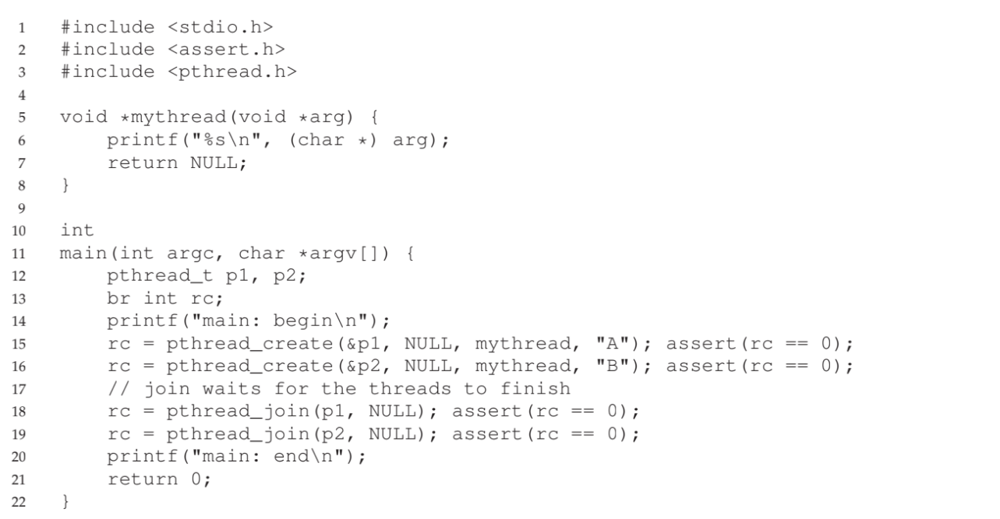
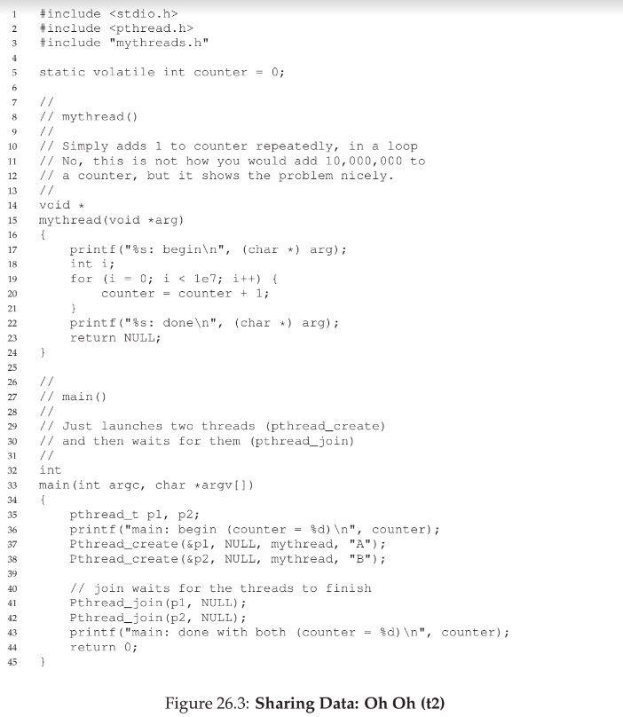
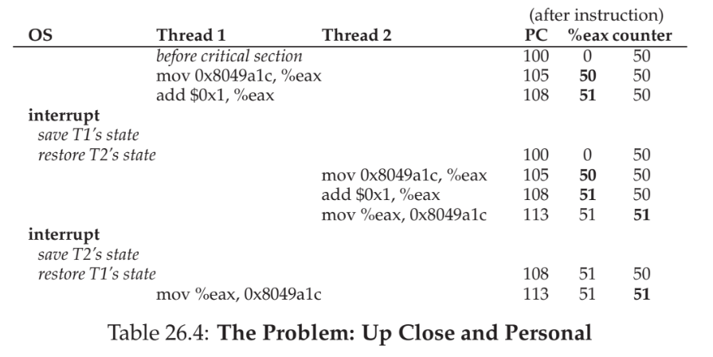

# Concurrency: An Introduction
- A **multi-threaded** program has more than one point of execution within a program - a **thread** can be thought of as like a separate process except that *shares* the same address space and is therefore able to access the same data
    - Each thread, therefore, has its *own program counter* to track which instructions it is fetching, its *own private set of registers*, and its *own private stack* since each thread may declare its own local variables (**thread-local storage**) or make its own procedure calls
    - Threads, however, do share the *heap* and *code* segments
- While multi-threaded programs are common for devices with multiple processors, threads are still entirely valid in the context of a single processor - threads are switched between using the same **context switch** mechanism, though now thread states are managed using **thread control blocks (TCBs)**
- Example:
    - 
        - When each thread is created, *when* they run and the *order* in which they run is entirely under the jurisdiction of the operating system 
            - On a single-processor device, the scheduler could choose to run a thread *whenever*, and it does not necessarily need to be the first thread created that runs (i.e. the thread that prints "B" could run first)
            - On a multi-processor device, the threads *could* run simultaneously, but this is not necessarily always the case
    - 
        - In this example, the result of the counter is not **deterministic** - while it is *expected* to be 20000000, it is often going to be less because the code section of reading and updating the counter is not **atomic**, meaning it does not execute in a single step (it requires first reading the value into the register, incrementing that value, and moving the incremented value back into the stored register)
            - It could entirely be the case that, while a thread is performing the instruction to *read* the counter, an interrupt occurs that switches it to another thread before the initial thread is able to perform the corresponding increment
        - 
        - This is ultimately an example of code that results in a **race condition**, where the results depend on the timing of the execution of the code and are therefore **indetermimate**
            - The code itself is known as a **critical section** since it accesses a shared variable (in the example, this shared variable was a global variable, but it can also be memory on the heap)
            - To solve a race condition, it is important to ensure **mutual exclusion**, which guarantees that if *one thread* is executing within the critical section, others will be prevented from doing so