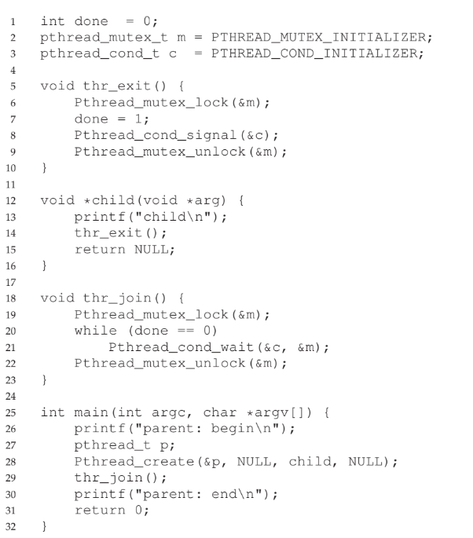
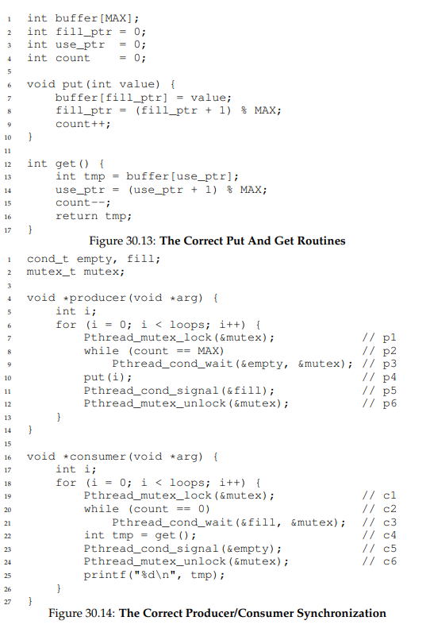

# Condition Variables
- In cases where a thread wishes to check whether a **condition** is true before execution (such as a parent checking if all its children threads have completed), **condition variables** are used
- When the condition is not as desired, the checking thread **waits** until some other thread changes the state of the condition and **signals** the waiting thread(s) to wake
- Example:
    - 
    - Mutex locks are necessary when dealing with condition variables in order to address any possible race conditions
        - The parent could check that `done` is zero but get *interrupted before actually trying to `sleep`*, switching to the child that then changes `done` to one and signals the parent to wake up - but since the parent was interrupted before sleeping, the wake up signal will do nothing and when the parent returns it will sleep forever
        - The lock prevents interrupts from ruining any important functionality since, in the above example, if the parent were interrupted before actually sleeping, the child would not be able to continue since the lock is set by the parent; when the parent does wait (which releases the lock), the child can access the lock as necessary
    - The state variable `done` is necessary, as otherwise, in the case where the child runs first, the child could signal *before* the parent runs `thr_join()`, which would then result in it waiting forever when it does actually call `thr_join()` since it does not know the condition is already desirable
## The Producer/Consumer (Bounded Buffer) Problem
- The **bounded buffer** problem involves one or more producer threads and one or more consumer threads; producers generate data and place them in a buffer, which are taken from the buffer by consumers
- 
    - It is important to ensure that there are *two* condition variables - one to signal consumers (by the producer) and one to signal producers (by the consumer), as otherwise wakeup issues could arise
        - i.e. With a single condition variable, if there are two consumers and one producer, a consumer's signal could wake up the *other consumer* instead of the intended producer (since there is a single signal and which thread to be woken up cannot be chosen), which itself would go back to sleep since there is no buffer available - this results in *all threads* sleeping forever
    - It is also important to ensure that a *while* loop is used to check the condition instead of an *if* statement
## Covering Conditions
- There may be cases where it is useful to wake up *all* threads waiting on a condition variable instead of a single thread (which `pthread_cond_signal()` does)
    - This can be done by using `pthread_cond_broadcast()`
    - This is a **covering condition** as it covers all cases where a thread needs to wake up, but it comes at an overhead cost