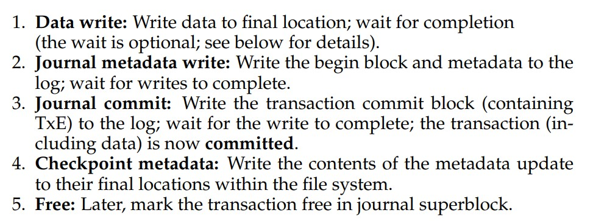

# Crash Consistency: FSCK and Journaling
- Managing persistent file data structures even in the presence of **power losses** or **crashes** is commonly known as the **crash-consistency problem**, as it is possible for a file system to be left in an **inconsistent state** if an issue occurs in the middle of a multi-write operation
## Crash Scenarios
- When a file is written to, requiring a new block, there are three file system data structures to update: the inode block, the data bitmap, and the data block
    - These writes do not occur immediately, as they are often **buffered**, which means it is possible for a *crash* to occur and interfere with updates
- Single successful write:
    - If *just the data block* is written to disk, the system is *not* in an inconsistent state since the data is on the disk but there is no inode pointing to it or bitmap indicating that the block is allocated
    - If *just the inode* is written to disk, the inode will point to the data block where the new data should be, but in reality this pointer will lead to **garbage** data
        - This also results in a **file-system inconsistency** since the inode indicates that the data has been allocated but the data bitmap indicates otherwise
    - If *just the bitmap* is written to disk, there will once again be a file-system inconsistency since there is a disagreement between the bitmap and the inode
        - The block "allocated" by the bitmap would never be used by the file system since it is considered allocated but there is no inode pointing to it; there is a **space leak**
- Two successful writes:
    - If *the inode and bitmap* are written to disk, there is consistency in the file system metadata, though there is still garbage in the data block
    - If *the inode and the data block* are written to disk, there is a correct pointing inode but still an inconsistency between the inode and the bitmap
    - If *the bitmap and data block* are written to disk, there is once again inconsistency, but this time since there is no inode, there is no indication of which file the data block belongs to
## File System Checker
- Early systems utilized the file system checker tool, **fsck**, to deal with inconsistencies in the *metadata* of the file system
    - It would check if the superblock appears to be valid by running simple sanity checks
    - It would scan inodes, indirect blocks, etc. to determine which blocks are currently allocated within the file system and create an allocation bitmap *from the inode information* - any consistency between the real bitmaps and the constructed inode bitmap is resolved by trusting the inode information
    - Inodes are checked for corruption and cleared if suspected of being corrupt
    - The link count of each inode is checked via a scan of the entire directory tree, fixing the inode link count if any inconsistencies are found
    - Duplicate pointers are checked for, potentially clearing the inode associated with the duplicate pointers
- Using tools like fsck to deal with crash recovery is inefficient due to how *slow* the tool is, as it must do scans through the *entire disk* in order to run a recovery
    - It is also often overkill, especially for small consistency issues that can be resolved without going through the entire drive to fix
## Journaling
- A more commonly adopted approach is to utilize **write-ahead logging** or **journaling**, where the file system would log, on disk, the operation being performed before actually performing it
    - Thus, if a crash were to occur, the log could be referred to in order to determine what to fix
- A logged transaction, then, would first contain a **transaction identifier** as well as information about the transaction, an end marker to the transaction, and the transaction contents in between the log sequence
    - If a **physical logging** approach is taken, then the transaction contents are the exact contents of the blocks being written 
    - In the case where a crash occurs *during the log process*, it is important to ensure that the transaction itself is not corrupt, which means that the transaction identifier, *TxB*, and the transaction contents should be written *separately* (before) the transaction end marker, *TxE*
    - 
- When the transaction is on disk, then the actual operations can be performed - the file system is **checkpointed**, or brought up-to-date with the log
- When dealing with **recovery**, if a crash occurs before a transaction is safely logged, then the update should simply be skipped
    - If the crash occurs *after* the transaction log but before the checkpoint, the file system can **replay** the log and attempt to write out the appropriate blocks again
- It is common for updates to be **buffered** so that, instead of multiple transactions being logged, a large, global transaction containing all of the updates (after a certain amount of time) is instead logged and then written to disk in a more efficient manner
- The log, which is on-disk, is treated as a **circular data structure**
    - After a transaction is checkpointed, the log associated with that transaction is freed 
    - This is typically done by marking the oldest and newest non-checkpointed entries in the log inside of a **journal superblock**, indicating that those entries are allocated and the rest are free
    - 
- This type of **data journaling**, while recovery-efficient in the *rare* case of a crash, is slow since each write to disk is being *doubled*, which may incur long seek times between the main file system and the data region of the disk
    - It is more common to utilize **metadata journaling** instead, where only metadata changes (such as inode and bitmap writes) are logged and *not user data*
    - With metadata journaling, then, data blocks should be written *first* before any journaling occurs so that when a crash occurs, it is guaranteed that a pointer to such data blocks are never garbage
    - 
- When dealing with journaling, there may be a case where a data block is written to but then deleted, and another file is created that reuses the same deleted data block
    - If a crash occurs and a replay is issued, then it may be the case where the new data block is overwritten with the contents of the *old block*
    - This issue can be dealt with by ensuring that block reuse does not occur until a checkpoint occurs, or by issuing a new type of journal record for deletes, known as a **revoke record**, to indicate that data should not be overwritten
## Other Approaches
- Some systems utilize a **copy-on-write** approach, where files or directories are never overwritten in place but rather updates are placed into unused disk locations and periodically (perhaps after a number of updates) the file system structures (inode and bitmaps) are corrected
- Another approach is to utilize **backpointer-based consistency**, where each block has a **back pointer** (i.e. data block has a reference to the inode it belongs to), which can be verified for consistency by checking for matches with the forward pointer