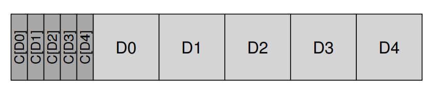
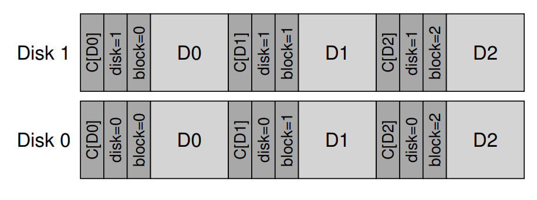

# Data Integrity and Protection
## Disk Failure Modes
- In the context of RAID systems, one type of failure model is the **fail-stop** model where an entire disk is either working or fails completely (a failure of which can be detected easily)
- **Latent sector errors (LSEs)** arise when disk sectors are damaged in some way, though they are often found via in-disk **error correcting codes (ECC)** 
    - The drive will fix latent sector errors if possible, but will otherwise return an error whenever a request is issued to read them
- Disk blocks can also become **corrupt** in a way that is not detectable by the disk itself (faulty disk firmware writes to the wrong location or data is transferred from the host to disk across a faulty bus)
    - These are **silent faults** since there is no indication of there being a problem when faulty data is returned
## Handling Latent Sector Errors
- Since latent sectors are easily detectable, they can be handled in a much more straightforward fashion
    - A RAID system can utilize whatever redundancy mechanism present (mirrors or parity) to **reconstruct** the block
        - For RAID-4/5 systems, reconstruction can only occur if a latent sector error is not encountered on any of the other disks that are being used for reconstruction
            - Some systems add extra redundancy to counteract this case by having two parity disks rather than one (**RAID-DP**)
## Detecting Corruption: The Checksum
- When checking for corruption, modern storage systems utilize **checksums**, which are results of functions that take a chunk of data and outputs a small summary of the data's content, which can be used to check for corruption by recomputing the checksum later and verifying that there is still a match with the original
    - One common checksum is the XOR function, though it is still possible for corruption to bypass it in certain cases (if two bits in the same XOR position change, then the XOR result would not change checksum would still be valid despite there being corruption)
    - Another common checksum is addition, but this may also be faulty if corruption involves the data being shifted
    - The **cyclic redundancy check (CRC)** is another type of checksum function that treats a data block *D* as a large binary number and divides it by an agreed value *k*, with the remainder being the value of the hhecksum
- Checksums are usually small (8 bytes), so one approach to their storage involves utilizing drives that have 520-byte sectors (provided by drive manufacturers) to store the 8 byte checksum and the 512 byte sector
    - For disks that do not have this functionality, another approach is to store *n* checksums together in a sector followed by *n* data blocks
        - This approach is not as efficient for writes because overwriting a block requires also reading and updating the checksum sector
        - 
## Using Checksums
- When a block is read, the file system reads its **stored checksum** and compares it to the **computed checksum** over the read data
    - If the two checksums do not match, then there is corruption detected
## Misdirected Writes
- Another failure mode is that of **misdirected writes**, where a disk writes data correctly but to the *wrong location*
    - This is mitigated by adding a **physical identifier** to the checksum, which contains information about the disk and sector numbers of the data block 
    - 
## Lost Writes
- A **lost write** may occur when the device informs the system that a write has completed when in fact it has not
    - A solution to this involves performing a **write verify** or a **read-after-write** by immediately reading back the data after a write to ensure that it has indeed persisted
        - This is slow since it doubles the amount of I/O operations performed
    - Another approach is to include a checksum in each inode and indirect block for every block included in a file - if the write is lost, then the checksum will not match 
## Scrubbing
- Systems utilize **disk scrubbing**, periodically reading through every block in the system and verifying whether the checksums are valid
## Overheads of Checksumming
- Checksums have minimal space overheads but may have noticeable time overheads since the CPU must compute the checksum over each block (when the data is stored and also when it is accessed)
    - Some systems streamline the process of data copying and checksumming into one operation in order to mitigate this overhead