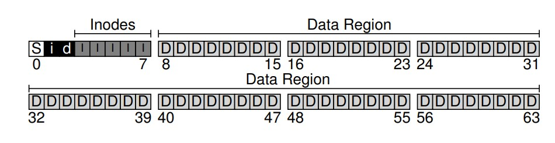
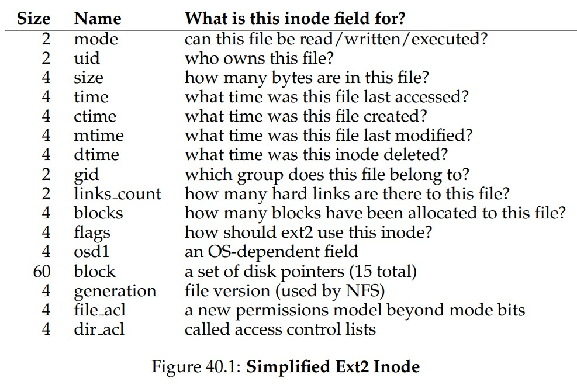
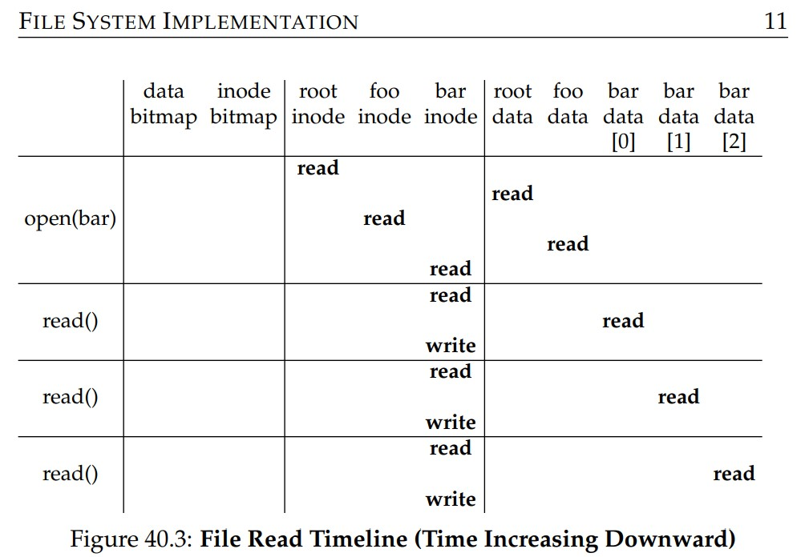
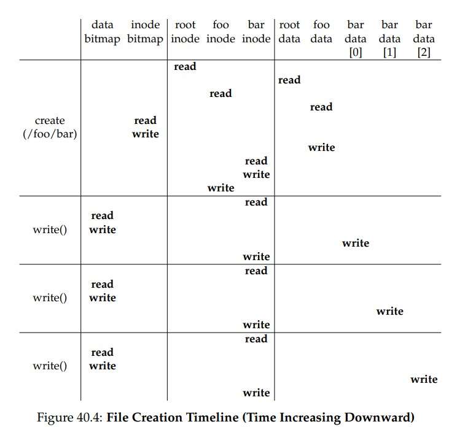

# File System Implementation
## Organization
- In a typical file system, the physical disk is divided into **blocks**
    - File systems often use a fixed block size, usually 4 KB
- A disk partition can thus be viewed as a series of *blocks*, addressed from 0 to N - 1 (where the partition size is N)
- These blocks should store:   
    - User data, in the **data region** - this should be a majority of the block region
    - **Metadata** about files - which blocks in the data region belong to the file, size, owner, permission bits, modification time, etc.
        - This data is usually stored in an **inode**
        - Space on the disk is reserved for inodes in a portion known as the **inode table**
    - **Allocation structures** to track whether inodes or data locks are free or allocated
        - This may involve **free lists** or simple **bitmaps** - either way, two are necessary, as one is needed for the inode table and another is needed for the data region
    - A **superblock**, containing information about a particular file system - number of inodes, number of data blocks, where the inode table begins, a magic number, etc.
- 
## Inodes
- Inodes are implicitly referred to be an **i-number**, which can be used to determine where on disk the corresponding inode is located (usually by indexing the inumber into the inode table) 
    -     blk = (inumber * sizeof(inode_t)) / blockSize;
          sector = ((blk * blockSize) + inodeStartAddr) / sectorSize;
- Inodes contain **metadata** associated with a file
    - 
- Inodes can refer to the actual data blocks associated with a file using an array of **direct pointers**, each referring to one disk block that belongs to the file
- For larger files, which contain more blocks that can be stored with a fixed array of direct pointers, a special pointer known as an **indirect pointer** is used
    - This pointer points to a block containing more pointers, which actual refer to the user data
    - Inodes may therefore have a fixed number of direct pointers and then a single indirect pointers if the file grows large enough to require using it
    - A single indirect pointer adds `(Block Size)/(Address Size)` more pointers able to be used by a file
- For even larger files, a **double indirect pointer** can be used, which refers to a block that contains *pointers* to indirect blocks, each of which contains pointers to *data blocks* - this increases the amount of blocks able to be used by a file by an even larger amount
- This can go even further, such as with **triple indirect pointers**; this **multi-level index** approach will typically have some number of direct pointers, followed by an indirect pointer, and then a double indirect pointer, and so forth
    - This approach is still commonly used because *most files are small* and therefore will not need double or triple indirect pointers most of the time
- An **extent** approach alternatively uses a single disk pointer plus a *length* in blocks of the data region associated with that pointer
    - This is useful for *contiguous* data blocks, though more extents can be used if a file cannot be fully contiguous
## Directory Organization
- Directories are represented by a list of `(entry name, inode number)` pairs
- Directories themselves are special files, so they have an associated inode number and are stored in a similar manner akin to files
    - The on-disk data associated with a directory may be a simple linear list of a more sophisticated data structure such as a B-tree
## Free Space Management
- To keep track of which inode and data blocks are free, **free space management** techniques are often utilized
- In a simple file system, where bitmaps can be used to represent allocation structures, free space management is relatively easy as the bitmaps can be searched for a free block and then marked as being used once allocated
    - For allocating a new inode or a data block, the corresponding inode and data bitmaps simply need to be searched through to find a free spot - it can then be marked as allocated and the appropriate data can be updated
    - When allocating new data blocks for a file, some systems will typically look for a *sequence* of blocks that are free, allowing for some portion of the file to be guaranteed contiguous, thus boosting performance - this is a **pre-allocation** strategy
## Access Paths
- Consider a file read, which requires opening a file, reading it, and then closing it
    - To open a file given only its pathname, the system must **traverse** the pathname to find the associated inode 
        - Traversals begin at the **root directory** (`/`), which has an inode number that is known by the file system 
        - The file system will read in the inode of the root directory, find its direct pointers, and read its data blocks to find an entry for the specified file or directory
            - If the entry is a directory, the traversal must recursively repeat the same process until it walks through the entire path - thus, the amount of I/O operations is proportional to the length of the pathname
        - Once the inode number of the specified file is found, the operating system will read the file's inode into memory, check for any permission bits, and finally allocate a file descriptor for the process (in the open file table) and return it to the user
    - The reading of the file involves consulting the inode to find the location of the file block, updating the inode with the last access time, actually reading the associated data block, and updating the file descriptor with the new offset after the read
    - When the file is closed, the file descriptor is deallocated
    - 
- For a file write, it may be necessary to **allocate** blocks, which requires consulting the allocation structures on disk
    - A write requires I/O to read the data bitmap in order to find a free block, a write to update the bitmap, a read and write to the inode to include the new block's location, and a write to the actual block
    - File creation requires allocating an inode and space within the directory containing the file; this involves I/O to read and write the inode bitmap, a write to initialize a new inode, a write to the data of the directory containing the file, and a read and write to the directory inode to update it 
    - 
## Caching and Buffering
- Since reading and writing files incur many I/O operations, most file systems utilize system memory (DRAM) to cache important blocks
    - Modern systems use a **dynamic partitioning approach** where memory can be flexibly allocated between virtual memory (for processes) and the file system, depending on which needs more memory at a given time
- Caching allows for much more efficient reads since important blocks will be in memory
- Caches do not help much on writes, but many systems use **write buffering** so that writes are delayed, allowing for **batch** writes to be utilized, which are more I/O effective
    - There is a tradeoff, though, in that if the write is not yet dispatched and the system crashes, the updates are lost