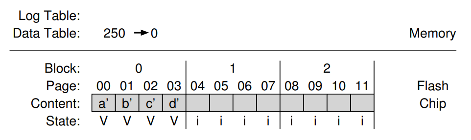

# Flash-Based SSDs
- **Solid-state storage** devices have no moving parts (like hard drives do) and are instead built out of transistors
    - These devices are built using **flash** technology, which require that a flash block is erased before writing out flash pages
## Storing a Single Bit
- Flash chips store one or more bits in a single transistor, with the level of charge stored in the transistor being mapped to a binary value
    - **Single-level cell (SLC)** store only a single bit within a transistor and are generally more expensive as a result (more transistors are needed)
    - **Multi-level cells (MLC)** store multiple bits within a single transistor (i.e. 2 bits are represented by low, somewhat low, somewhat high, and high levels of charge)
## Storing Many Bits
- Flash chips are organized into **banks**, which consist of a large number of cells
    - Banks can be accessed in two sized units, **blocks** (usually 128 KB or 256 KB) and smaller **pages** (usually 4 KB)
- 
## Basic Flash Operations
- A flash chip can **read** any page by specifying the read command and a page number
    - Unlike disk, flash reads are very fast (microseconds) *regardless of location* on the device - they are **random access**
- Before writing a *page*, a flash chip requires that the entire *block* is **erased** first, which involves setting each bit to 1
    - This typically means that a block should be copied elsewhere before an erase occurs (either to memory or to another flash block) in order to ensure that data is not lost
    - The erase command is expensive in terms of speed (milliseconds)
- After a block has been erased, the **program** command can be used to write to any page (by changing the 1's to 0's) in that block (as long as it has not been programmed before)
    - Programming a page is slower than reading a page but faster than erasing an entire block
## Performance and Reliability
- Repeatedly erasing and programming a block can cause the block to **wear out**
    - The block may accrue extra charge as more erases and programs occur, which makes it difficult to differentiate between a 0 and 1
- Flash chips also deal with **disturbance**, where accessing a particular page (during either a read or a program) causes bits to get flipped in neighboring pages
    - Disturbance can be reduced by writing or programming pages *in order*
- 
## Flash-Based SSDs
- A solid-state storage device consists of a number of flash chips, some volatile memory to cache and buffer data and store mapping tables, and control logic to manage device operation
- Client reads and writes are turned into internal flash operations via the **flash-translation layer (FTL)**, translating operations on logical blocks (requested via the storage interface) to operations on physical blocks
## Log-Structured FTL
- Most flash-translation layers are **log structured**, meaning that a write to a logical block *N* is appended to the next free spot in current physical block being written to
    - This requires a **mapping table** to be kept (in memory and on persistent storage) for subsequent reads of *N*
        - This mapping table keeps translations from logical blocks to physical pages 
## Garbage Collection
- Since there may be **garbage** associated with old versions of data on the device, **garbage collection** must be periodically performed
- One way a garbage detector can determine whether a block is **dead** is by having the device store, within each block, information about which logical blocks are stored within each page - the mapping table can then be consulted to determine whether each page within the block holds live data
- After findingg a block with one or more garbage pages, the live pages are read and written out (to the end of the log), and then the entire block is erased (and therefore reclaimed)
- The cost of garbage collection can be reduced by **overprovisioning** the device, which involves adding extra flash capacity so that cleaning can be delayed and pushed to the background (maybe done when the device is not busy)
## Mapping Table Size
- Mapping tables can grow to be extremely large if done at the **page-level**
- An alternate approach is to do **block-based mapping**, where a pointer is only kept *per block* instead of *per page* 
    - A physical page is found by extracting a chunk number and an offset from each logical block address
        - The chunk number is looked up on the mapping table and then the offset is added to the resulting physical page address
    - Whenever a write occurs, the flash-translation layer must copy the entire block and write it out to a new location
        - This yields performance issues for small writes (ones that are less than the size of a physical block) since a large amount of data from the old block must be read and copied into a new block
- Modern flash-translation layers utilize **hybrid mapping** utilizes a small set of per-page mappings, stored in a *log table*, as well as a larger set of per-block mappings, stored in a *data table*
    - The log table is consulted first and if a miss occurs, the data table is then consulted
    - Per-page mappings are kept in **log blocks**, which are blocks that are kept erased and have writes directed to them
    - The flash-translation layer periodically analyzes log blocks and *switches* them into blocks that can be pointed to by a single block pointer - this ensures that the number of log blocks is kept small (reduces the amount of memory needed for per-page mappings)
        - **Switch merge** are the best case for merges
            -  
                - In this case, all that needs to be done is to replace the per-page pointers with a single block pointer (and then erase the old block)
        - A **partial merge** is the case where physical pages must be read and then moved to the existing log block before switching the log block's mapping from a per-page mapping to a per-block mapping
            -  
                - In this case, *c* and *d* would first need to be read from physical block 2 and then written to physical block 0 before the pointers are replaced and the old block is erased
        - A **full merge** is a worst-case scenario, where merging blocks requires reading from *multiple* other blocks in order to perform cleaning 
            - i.e. If a physical block has logical blocks 0, 4, 8, and 12, then switching requires reading 1, 2, and 3 from their respective blocks and then placing them into a data block alongside 0 and doing the same for the other logical blocks
- Another approach is to cache only the *active parts* of the mapping tables in memory, thus reducing the memory cost (though the other parts are still kept in storage)
    - This can perform poorly if the memory cannot contain the **working set** of necessary translations
    - This also requires dealing with cache policies such as when to **evict** mappings and dealing with **dirty** mappings
## Wear Leveling
- Flash-translation layers implement **wear-leveling**, where work is spread *across all blocks of the device evenly*
    - In some cases, if a block is filled with long-lived data that does not get overwritten, it is periodically moved elsewhere so that blocks are used evenly