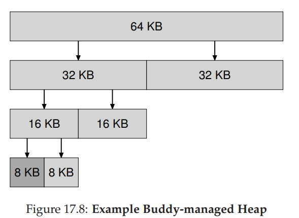

# Free Space Management
- **Free space management** is necessary when dealing with variable-sized memory units, such as those allocated using `malloc` at the address-space level and memory segments at the physical memory level
    - The goal of free space management is to minimize **external fragmentation**, which is a result of there being no single continuous space able to satisfy a given memory request do to the free space being split into different sizes
- A **free list** is a data structure used to manage free space in the heap, containing references to all of the free chunks of memory in a memory-managed region (i.e. the heap)
## Free List Mechanisms
- Consider the heap:
    - 
- The free list would be the following:
    - 
- A request for anything greater than 10 bytes would not be possible, but anything less than or equal to that amount *can* be serviced
- In the case where there is a request for memory that is less than the amount of space in an available chunk, **splitting** will occur - the given memory chunk will be split into two, with the first chunk being returned to the requester and the second chunk remaining on the list (updated)
    - i.e. Requesting 1 byte, using the second chunk on the free list
        - 
- Allocators also make use of **coalescing** by merging adjacent chunks of free space into a larger free chunk - this would normally occur when `free` is called, requiring a traversal through the free list to determine if any entries need to be coalesced
    - i.e. The 10 bytes at address 10 is returned, initially resulting in a free list like this:
        - 
    - After coalescing, it would look as follows:
        - 
## Tracking Size
- The `free` interface does not take a size parameter, only a pointer - it is able to determine the size of the memory region to be freed from the pointer itself
    - This is done by storing a **header** block before each allocated chunk of memory, containing the size of the region and possibly additional data (i.e. magic number for integrity checking)
- Thus, when a user requests N bytes of memory, they are actually requesting a chunk of size N plus the size of the header
- i.e. 
    - Finding the header pointer when freeing this memory is relatively simple
        - 
## Embedding a Free List
- Since a free list itself is a data structure requiring memory, it must be built *inside the free space itself*
- Example:
    - Free List Node:
        - 
    - Using `mmap` system call to request memory from the operating system
        - 
    - Initial Memory Structure
        - 
    - Allocating 100 Bytes (plus 8 bytes for the header) - this involves *splitting*
        - 
    - Allocating another chunk
        - 
    - Freeing a chunk of memory - the free chunk is inserted at the front of the list, so the head pointer now points to it and the `next` field is updated accordingly
        - 
    - Freeing more memory - in reality the list should be coalesced so that neighboring memory chunks can be combined together
        - 
- If the heap runs out of space, either the request to memory can be treated as a failure or more memory can be requested from the operating system (i.e. via `sbrk` system call), which finds free physical pages and maps them to the address space of the requesting process
## Memory Allocation Strategies
- **Best fit** involves first searching through the entire free list and then returning the *smallest* chunk that meets the memory request demand
    - This attempst to reduce wasted space by finding the closest-sized block, but has drawbacks in potentially performing an exhaustive search through the list
- **Worst fit** involves first searching through the entire free list and then returning the *largest* chunk that meets the memory request demand
    - This is worse than best fit, as it not only requires an exhaustive search, but also results in memory fragmentation
- **First fit** involves finding the *first* big enough block and returning it to the user
    - This has a speed advantage but often pollutes the beginning of the free list with small objects
        - To deal with ordering of the free list, some allocators use **address-based ordering**, where nodes in the free list are ordered by their address - making coalescing easier
- **Next fit** works similarly to first fit but keeps an extra pointer to the location within the list where it was looking at last - allowing for searches to be spread throughout the list more uniformly
## Alternate Approaches
- An alternate free lists are **segregated lists**, which keeps a separate list for popular-sized requests frequently made - other requests are forwarded to a more general memory allocator
    - Dealing with a known size of memory allows for management to be much easier
- Another alternate is **buddy allocation**, which allocates memory in terms of powers of two
    - 
    - This approach allows for coalescing to be done much more easily since the address of buddy "pairs" only differ by a single bit
    - However, this also results in more fragmentation since blocks given out can only be powers of two