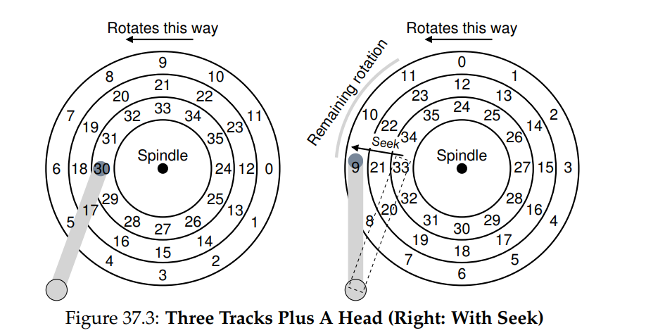
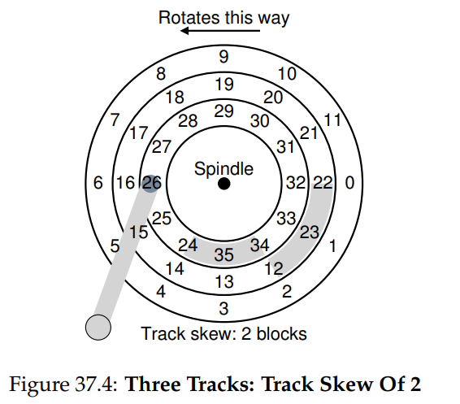
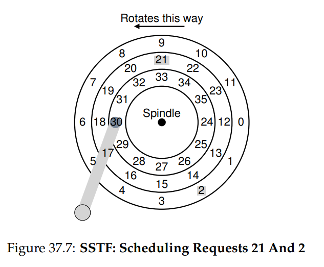

# Hard Disk Drives
## Interface
- Modern hard disk drives typically consist of a large number of readable/writable sectors, which are 512-byte blocks
    - For a drive with n sectors, its **address space** can be thought of as an array from 0 to n - 1
    - Drive manufacturers guarantee that a single sector write (512 bytes) is **atomic** 
        - Operations at a higher sector granularity are not guaranteed to be atomic and may suffer from **torn writes** (partial writes) in the case of failure
    - It can be assumed that, with disks, sequential access of sectors is the fastest access mode (better than random access)
## Basic Geometry
- Disks contain one or more **platters**, which are circular hard surfaces that allow for persistent data storage (through induced magnetic changes) - each side of a platter is known as a **surface**
    - Data is encoded in concentric circles of sectors known as **tracks** - a typical surface contains thousands of tracks tightly packed together
- Platters are bound together around a **spindle**, which is connected to a motor that spins the platter around at a fixed rate of **rotations per minute (RPM)**
- A surface is read from or written to using a **disk head** (able to sense magnetic patterns or induce a change in them), which is attached to a **disk arm**, which moves across the surface to read or write to the desired track
## A Simple Disk Drive
- 
    - Limiting to a *single track*, the disk head is able to perform reads or writes to the surface by waiting for the desired sector to rotate under it - the amount of time it waits is the **rotational delay**
    - With *multiple tracks*, the disk head may need to read a sector on a different track than the one it is currently one, requiring the disk arm to first be moved to the correct track in a process known as a **seek**
        - Seeks involve first *accelerating* the disk arm to get an initial motion, then *coasting* as it moves at full speed, and finally *deceleration* and *settling* as it is positioned over the correct track - **settling time** is often significant and costly
    - The actual process of a disk head reading or writing data to the surface is known as **transfer**
- Drives typically incorporate a **track skew** to ensure that sequential reads are fast even across tracks
    - 
    - Track skews account for the time to seek so that, by the time the seek is finished, the disk head will be at the next desired block without having to wait for a full rotation to occur
- Modern disks have a **cache** or **track buffer** holding a small amount of memory to hold data read from or written to disk
- With writes, drives can either acknowledge a write completion as soon as data is put into its memory (**write back** caching) or after the write has actually been performed (**write through**)
## Disk Math
- The time for a disk operation is the sum of its seek time, rotational time, and transfer time
    - *TI/O = Tseek + Trotation + Ttransfer*
- The rate of I/O for a disk operation is the size of the transfer divided by the time for the transfer
    - *RI/O = SizeTransfer / TI/O*
## Disk Scheduling
- Many disk devices have a built in **disk scheduler** to examine requests and decide the order in which to schedule them
    - Compared to process scheduling, disk scheduling is easier since the time of a disk request can be reasonably estimated, allowing for the scheduler to follow a **shortest job first** algorithm
- **Shortest-seek-time-first (SSTF)** orders I/O requests based on the nearest track to complete first
    - 
        - In this example, the request to 21 would be issued first since it is the closest, followed by the request to 2
    - If disk scheduling is done by the operating system instead of the drive, then **nearest-block-first (NBF)** is implemented instead
    - SSTF may be prone to **starvation**, such as in a case where there are constant requests to sectors in the inner track, resulting in no requests being dispatched to those in outer tracks
- A **SCAN** algorithm moves back and forth across the disk, servicing requests in order across the tracks
    - The **F-SCAN** algorithm freezes the request queue during a sweep (placing them in a queue that is serviced later) to combat starvation, as late-arriving requests that are near the scan do not delay on-time far away requests
    - The **C-SCAN** algorithm does not sweep in both directions across the disk but rather from outer-to-inner always (so it will reset back to the outer after each sweep), allowing for more fairness between the outer and inner tracks compared to the middle tracks (which are sweeped twice in a normal scan)
- The **shortest positioning time first (SPTF)** algorithm, implemented by the drive, makes a calculation based on the seek time and rotational delay to choose the shortest request and then issue that one
- Shortest positioning time first requires knowledge about the internals of the disk, so it is implemented by the disk scheduler itself
    - The operating system can still perform its own disk scheduling by scheduling a batch of requests to send to the drive, which are then scheduled internally by the disk using SPTF
- Operating system disk schedulers often incorporate **I/O merging**, where a series of adjacent requests are combined into two-block requests to be given to the drive
    - This raises a question of how long the operating system should wait before sending a request to disk - immediately (**work-conserving**) or after some time has passed (**non-work-conserving**)