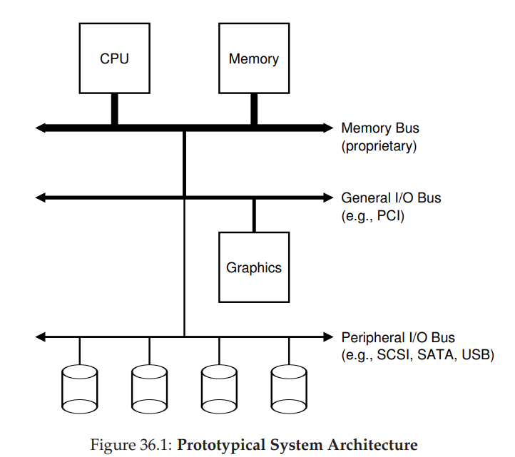
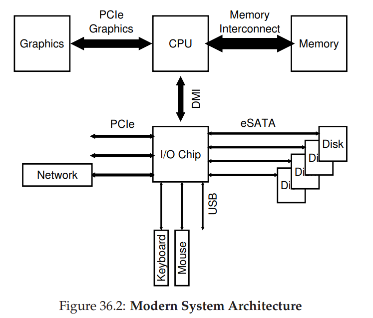
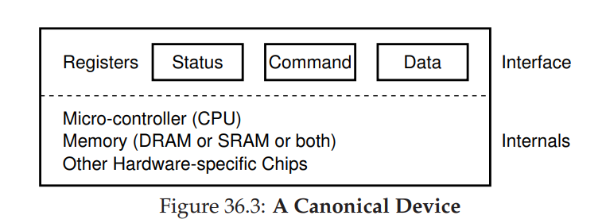
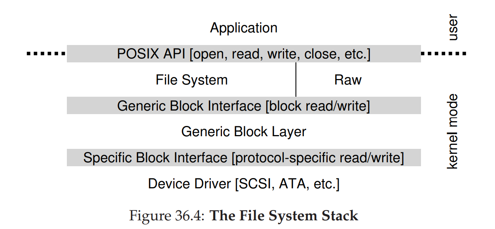

# I/O Devices
## System Architecture
- 
    - A hierarchical structure for devices is necessary to balance speed and cost, as components that demand high performance (i.e. graphics cards) are closer to the CPU whereas components that demand lower performance (i.e. disks) are further from the CPU
- 
    - The CPU connects to I/O via a **Direct Media Interface (DMI)** and the rest of the devices connect to this I/O chip via various interconnects
        - Hard drives connect to the system via the **eSATA** interface, which is an evolution from **AT Attachment (ATA)**, then **Serial ATA (SATA)**, and finally **External SATA (eSATA)**
        - Low performance peripherals (i.e. mice and keyboards) are connected to the I/O chip via **Universal Serial Bus (USB)** connections
        - High performance peripherals (i.e. network interfaces and NVMe devices) are connected to the I/O chip via **Peripheral Component Interconnect Express (PCIe)**
## Canonical Device and Protocol
- An arbritary I/O device consists of two components - the **hardware interface** it presents to the rest of the system, allowing for the software to control the system, and the **internal structure**, which is implementation specific (often containing many device-specific chips and micro-controllers with **firmware** to implement functionality)
    - 
- A canonical I/O device such as this one should have registers to describe its **status**, to issue it **commands**, and to pass in or read **data**
-     While (STATUS == BUSY); // wait until device is not busy
      Write data to DATA register
      Write command to COMMAND register // starts the device and executes the command
      While (STATUS == BUSY) // wait until the device is done with the request
    - In this type of protocol, the operating system first waits until the I/O device is able to receive a command by waiting, or **polling** the device
    - Then, it sends data to the data register and issues a command to the command register, which prompts the device (implicitly) to use its data from the data register to begin processing the command
    - The operating system then polls the device again to wait to see it has completed the command
## Interrupts
- While the aforementioned protocol does work, it incurs overhead by repeatedly waiting, which is why most operating systems use **interrupts** rather than polling
    - The operating system issues the I/O operation and then puts the calling process to sleep
        - When the I/O operation completes, the device will raise a hardware interrupt, resulting in the operating system jumping to an **interrupt handler** that will finish the request
    - By making use of interrupts, the operating system can **overlap** other computation between the I/O activity
- An interrupt approach is not always ideal, however, as cases where I/O completes quickly only results in extra overhead associated with interrupt handling
    - For a fast device, then, it is better to stick to the polling approach; for a slow device, it is better to use interrupts
        - A **hybrid** approach can be used for devices of unknown speed (poll for a while and, if not complete, use interrupts)
    - Interrupts could also potentially result in **livelock** in the case where the operating system is only processing interrupts rather than letting user-level processes run (i.e. a lot of network packets each generate an interrupt)
        - In this case (for a network server), it is better to use polling
- Interrupts can be optimized by **coalescing** - a device that raises an interrupt can wait a bit for other requests to complete before delivering an interrupt to the CPU, allowing for multiple interrupts to be delivered as one
## Direct Memory Access (DMA)
- Another issue with the canonical protocol is the speed associated with large data transfers - copying data from memory to the device is costly as it wastes CPU time on copying when something else can be done
- This issue is solved with **Direct Memory Access (DMA)**, which is a device on the system that enables transfers between devices and main memory without CPU intervention
    - Thus, to transfer large amounts of data, the operating system would program the DMA engine by giving a location in memory of the data to be transferred, how much data to copy, and which device to send it to
        - The operating system could then perform other work as the DMA does the copying, and once the copying is done, it could resume to interacting with the device by responding to an interrupt generated by the DMA
## Device Interaction
- One way in which the operating system interacts with external devices is via explicit **I/O instructions**, which specify a way for the operating system to send data to specific device registers
    - On x86, this is done with the **in** and **out** instructions, which which are **privileged**
- Another approach to interaction is through **memory-mapped I/O**, where the hardware makes device registers available as if they were memory locations, though behind the scenes these addresses are routed to the device instead of main memory
## Device Drivers
- Although devices themselves vary and may have specific interfaces, they must still be able to work with operating systems 
    - This is done by **abstracting** the devices through **device drivers**, which are pieces of software in the operating system that know in detail (at the low level) how a device works and are able to encapsulate functionality into a more general, abstract interface
- Abstraction is useful for operating system design as it enables implementations to work without needing to know the specifics about a device (i.e. what type of storage is being used) - these specifics are instead left to the device driver
    - 
        - **Raw interface** devices enable direct reads and writes to blocks without a file abstraction, which may be used by low-level storage applications