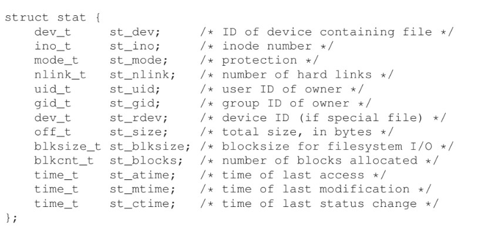

# Interlude: Files and Directories
- A **persistent storage** device such as a **hard disk drive** or a **solid-state storage** device can store information permanently, even when there is power loss
## Files and Directories
- A **file** is an abstraction of storage, acting as a linear array of bytes that can be read from or written to
    - Each file has a low-level file name known as its **inode number**
    - Files often contain extensions (.txt, .jpeg, etc.) to specify the **type** of that file, however this type is *not enforced* - it is just a convention
- A **directory** is another abstraction, containing a list of user-readble names mapped to inode numbers
    - Directories also possess inode numbers
    - Directories can hold other directories within them, allowing for arbritrary **directory trees** to be built
        - A typical directory hierarchy starts at a **root directory** (usually `/`) and a separator (usually `/`) is used to name subsequent **sub-directories** 
## Creating Files
- A file can be created using the `open()` system call
    - `int open(const char *pathname, int flags)`
    - `int fd = open("foo", O_CREAT | O_WRONLY | O_TRUNC);`
        - `O_CREAT` creates the file with the specified name
        - `O_WRONLY` opens the file for writing only
        - `O_TRUNC` truncates the file to zero bytes if it already exists
    - The system call returns a **file descriptor**, which is a private, per-process integer used to access files - think of it as a pointer to a file-type object
        - Running processes usually have three file descriptors already open: standard input (0), standard output (1), and standard error (2)
- A file descriptor can be closed using the corresponding `close()` system call
    - `int close(int fd)`
## Reading and Writing Files
- Given a file descriptor, a file can be read using the `read()` system call
    - `ssize_t read(int fd, void *buf, size_t count)`
    -     int fd = open("foo", O_RDONLY | O_LARGEFILE);
          read(fd, buf, 4096);
        - `O_RDONLY` opens the file only for reading
        - `O_LARGEFILE` uses a 64-bit offset
    - The `buf` argument is a buffer to store the output of the read to, and the `count` argument indicates the size of this buffer
    - The call returns the number of bytes successfully read
- A file can also be written to using the `write()` system call
    - `ssize_t write(int fd, const void *buf, size_t count)`
    - `write(1, "hello\n", 6)`
## Nonsequential Reading and Writing
- For each open file descriptor, the operating system tracks a current offset to determine where the next read or write should be done from
- If reads or writes need to be done from a specific offset within a file, the `lseek()` system call can be used to set this offset
    - `off_t lseek(int fd, off_t offset, int whence)`
        - `whence` determines how the seek is performed
            - `SEEK_SET` sets the offset to `offset` bytes
            - `SEEK_CUR` sets the offset to its current location + offset bytes
            - `SEEK_END` sets the offset to the size of the file plus offset bytes  
## Writing Immediately
- Often, a call to `write()` will be **buffered** by the operating system for performance reasons - the writes will be buffered in memory for some time (usually to wait for other writes) before the write actually occurs
- The `fsync()` system call can be used to force all dirty data to be written to disk
    - `int fsync(int fd)`
## Renaming Files
- The `rename()` system call can be used to change the user-readable name of a file
    - `int rename(const char *oldpath, const char *newpath)`
    - It is guaranteed that the rename is done **atomically** - even if the system crashes, there will be no in-between state
- The atomic nature of the system call can be useful for implementing an in-program file update
    -     int fd = open("foo.txt.tmp", O_WRONLY | O_CREAT | O_TRUNC); // create temp file
          write(fd, buffer size); // write out new version of file
          fsync(fd); 
          close(fd);
          rename("foo.txt.tmp", "foo.txt"); // swaps new file with old, which also deletes old
## Getting Information About Files
- The `stat()` or `fstat()` system calls can be used to get the **metadata** of a file, which is usually kept in the file's inode
    - `int stat(const char *path, struct stat *buf)`
    - `int fstat(int fd, struct stat *buf)`
    - 
## Removing Files
- Files can be removed from the file system using the `unlink()` system call
    - `int unlink(const char *pathname)`
    - When a file is removed, its **reference count**, containing the number of hard links to a particular inode, is decremented - if this count is zero, the file is permanently deleted
## Making Directories
- Directories cannot be written to directly, as they must maintain an expected structure
- A directory can be created using the `mkdir()` system call
    - `int mkdir(const char *pathname, mode_t mode)`
    - Newly created directories have two entries: `.` (refers to itself) and `..` (refers to its parent)
## Reading Directories
- The `opendir()`, `readdir()`, and `closedir()` system calls can be used to open directories, read from them, and then close such directories after usage
    - `DIR *opendir(const char *dirname)`
    - `struct dirent *readdir(DIR *dirp)`
    - `int closedir(DIR *dirp)`   
## Deleting Directories
- The `rmdir()` system call can be used to remove an *empty* directory
    - `int rmdir(const char *pathname)`
## Hard Links
- The `link()` system call creates a hard link to a file, which is another file name that refers to the *same* inode number of the original file - no copying is done, as both instances refer to the same file
    - `int link(const char *oldpath, const char *newpath)`
- Hard links cannot be created to directories or to files in other disk partitions
## Soft Links
- The `symlink()` system call can be used to create **soft links**, which are files which effectively hold the *pathname* of the linked-to file - meaning if the original file is deleted or renamed, a **dangling reference** is left of the soft link
    - `int symlink(const char *target, const char *linkpath)`
- Soft links *can* link to directories or other disk partitions
## Making and Mounting a File System
- A directory tree can be assembled from many underlying, even different, filesystems by first making such file systems and then mounting them
- File systems can usually be made using a `makefs` tool which, given a device (i.e. disk partition) and file system type as input, writes an empty file system onto that device
- This created file system is not accessible within the system's file tree unless it is mounted, usually with a `mount` program that takes an existing directory as a **mount point** and implements the file system onto the directory tree at that point