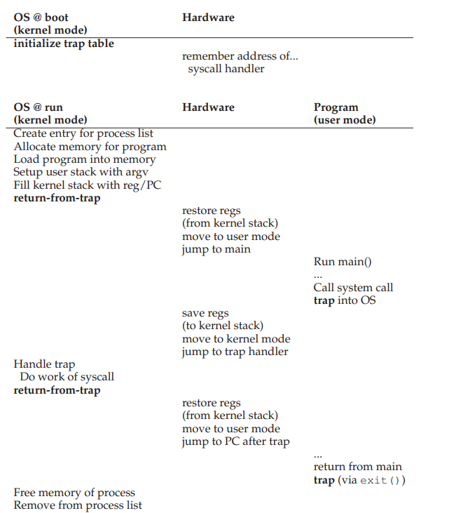
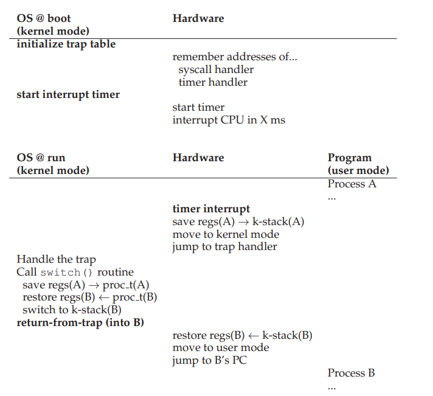

# Limited Direct Execution
- The technique of **limited direct execution** involves running a program directly on the CPU with limits in place to ensure that it does not perform forbidden operations and can be swapped out for another process by the operating system
## Restricted Operations
- The operating system deals with the issue of preventing programs from using restricted operations by running such programs in **user mode**, whichc cannot do certain actions (such as I/O requests)
    - In contrast, **kernel mode**, which is what the operating system runs in, allows for programs to access privileged operations (such as those that directly use hardware)
- A user process can perform a privileged operation through **system calls**, which expose certain key functionality to user programs - accessing the file system, creating or destroying new processes, allocating memory, etc.
    - A system call is executed through a special **trap** instruction jumps to kernel mode, allowing the system to perform whatever privileged operation is necessary and once finished, perform a **return-from-trap** instruction to return to user mode
    - When executing a trap, the operating system must ensure that the caller's registers are saved so that there is a seamless transition via the return-from-trap instruction - important registers are typically saved on the **kernel stack**
    - When a trap occurs, the process does not specify the address containing the trap instructions to jump to; rather, the kernel consults the **trap table**, which is set up at boot time (the machine boots up in kernel mode, allowing for this table to be set up by the operating system), which contains the location of **trap handlers** containing instructions for special interrupts and system calls
        - User programs can request a specific system call by calling the appropriate **system call number** - the indirection through system call numbers and trap tables/handlers acts as a means of protection from malicious users
- 
## Switching Between Processes
- To actually switch processes, the operating system must *regain control* of the CPU - there is another process running, and there must be some way to transfer control back to the operating system
    - Old machines had a **cooperative** approach, where the operating system trusts the processes of the system to behave reasonably and periodically give up control to the CPU whenever they make a system call
        - These machines had a **yield** system call, which would do nothing but transfer control to the operating system
        - If a program were to enter an infinite loop with no system call being made, there would be no other solution to regaining control other than to reboot the system
    - The most common method is through the usage of a **timer interrupt**, which raises an interrupt every chosen milliseconds and is handled by a preconfigured **interrupt handler** in the operating system, thus regaining control of the operating system
        - The hardware must save the state of the system whenever an interrupt occurs so that the interrupted process can rerun
- When the operating system regains control, its scheduler makes the decision to continue running the current process or start a new process - if a starting a new process, it executes a **context switch**, where it saves a few register values for the currently running process and restores register for the soon-to-be-running process
    - Once all the registers are saved, the *switch code* is performed by changing the stack pointer to use the new program's stack instead of the old program
- 
