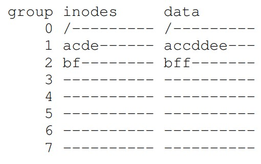
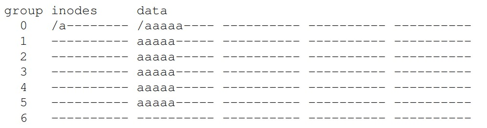

# Locality and the Fast File System
- While a basic file system is able to deliver an intended purpose of supporting standard file abstractions, there is an obvious issue with *performance*
    - Spreading data across the disk incurred expensive positioning costs - consider data blocks being far away from its inode, as an example
    - Moreso, fragmentation resulting from file deletions or additions to existing files often made it difficult for data blocks to be contiguous
        - 
## FFS: Disk Awareness Is The Solution
- A file system, known as the **Fast File System (FFS)** was made to be more "disk aware" in terms of its design - though it still ensured that the same existing file system API was adhered to (`read`, `write`, `close`, etc.)
## Organizing Structure: The Cylinder Group
- FFS may organize the disk into a number of **cylinder groups**, which consist of **cylinders**, or tracks on different surfaces of a hard drive that are the same distance from the center
- FFS on modern drives use **block groups**, which are consecutive portions of the disk's address space
- Regardless of whether cylinder groups or block groups are used, by placing two files in the *same group*, it is ensured that accessing them one after another will not yield long seeks
- Thus, FFS places all necessary file system structures *within a single group*
    - 
    - A **super block** is kept in each group for reliability purposes (if any are corrupt, a replica can be accessed)
    - The **inode bitmap** and **data bitmap** are *per-group* structures, as are the **inodes** and **data blocks**
## Policies: How to Allocate Files and Directories
- When placing files and directories, FFS mainly tries to follow the notion of *placing related files together*
- For placing directories, FFS finds the group with a *low number of allocated directories* and a *high number of free inodes*
- For placing files, FFS tries to ensure that *data blocks are allocated in the same group as its inode* and place *files that are in the same directory in the same group*
    - This prevents long seeks when going from a file's inode to its data blocks, and also improves performance in the very common case of files in the same directory being accessed together
    - i.e. Directories `/`, `/a`, and `/b` and files `/a/c`, `/a/d`, `/a/e`, `/b/f`
        - 
## The Large File Exception
- There is an exception in FFS for large files; if a single file were to entirely fill a block group, then other, related files would no longer be able to be placed in that group, which hinders performance
- After some number of blocks are allocated into the block group, FFS places subsequent "chunks" of the file into another block group 
- i.e.
    - 
- Although spreading the contents of a file can hurt performance, the overhead associated with seeks between chunks can be **ammortized** if a large enough chunk size is chosen
- FFS would typically place the first twelve blocks (direct pointers from inode) in the same group as the inode, and then place each subsequent indirect block and the blocks it pointed to in a different group
## Other Information
- FFS typically utilized 4KB blocks, which was large enough for good data transfer but at the cost of increased **internal fragmentation**, especially since many files were 2KB at the time of its introduction
    - To account for this, **sub-blocks** were introduced, which were 512-byte blocks that FFS could allocate to files
        - A small file would occupy sub-blocks instead of an entire block until it grew large enough (4KB) to fill an entire block, at the point of which FFS would find a block (4KB) to copy the sub-blocks into (and then free the sub-blocks)
    - This was also usually optimized by buffering writes so that the overhead associated with sub-blocks would not always be present (i.e. if there are many writes, then waiting to see if they are large enough to use an entire block instead of multiple sub-blocks is faster)
- FFS introduced **long file names** as well as **symbolic links**