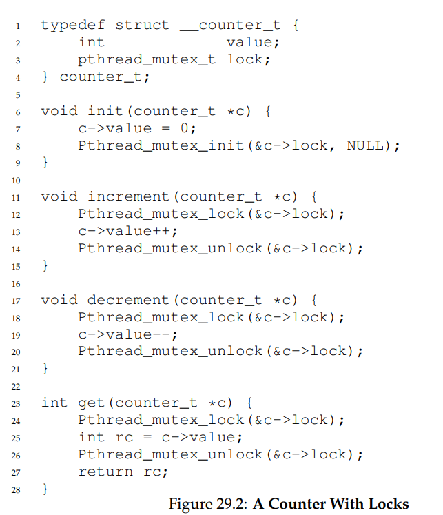
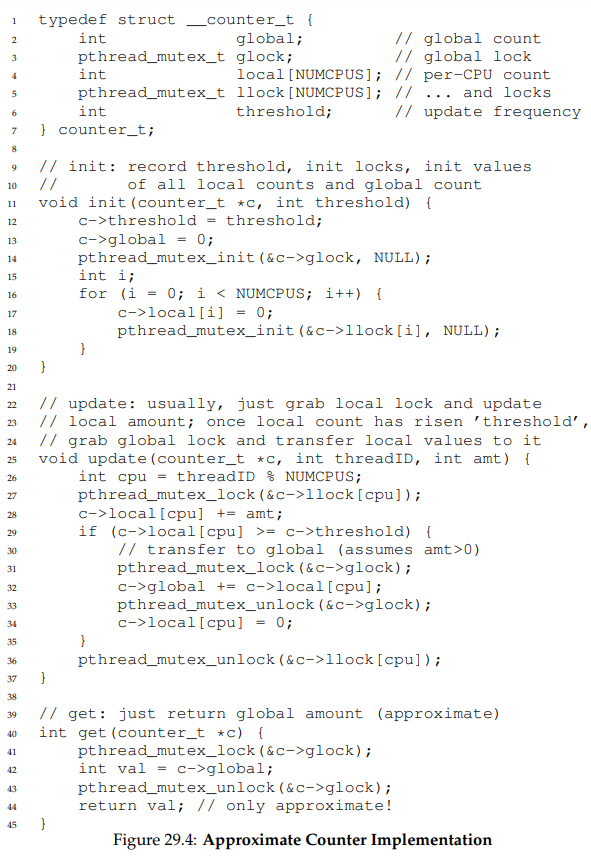
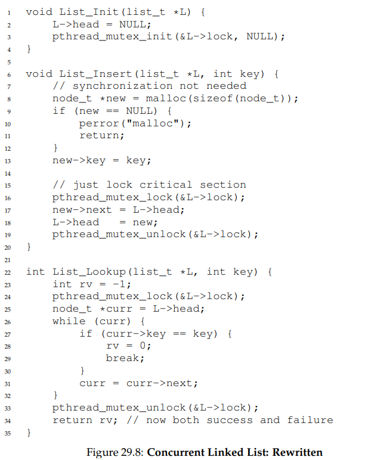
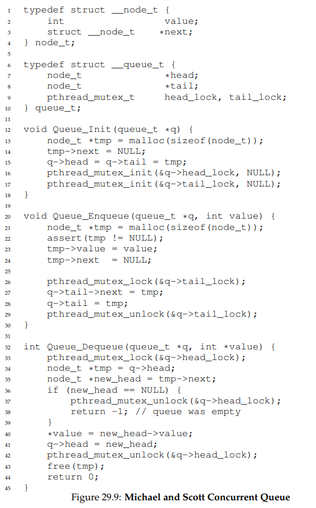
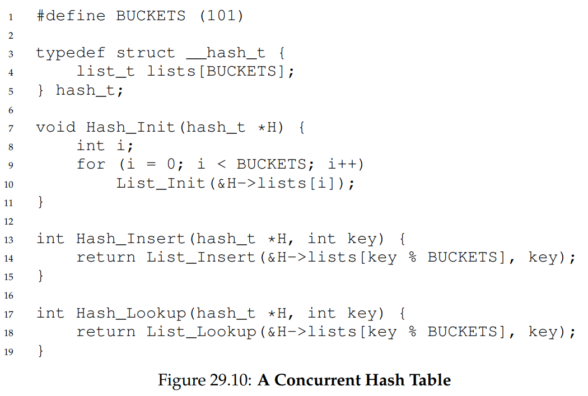

# Lock-based Concurrent Data Structures
## Concurrent Counters
- A basic **thread-safe** counter data structure simply involves locking the counter whenever the counter is incremented or decremented and then unlocking when done
    - 
- While this implementation does indeed work, it is not particularly scalable, especially as the amount of threads using the data structure increases
- An alternate approach known as the **approximate counter** utilize numerous *local* physical counters (typically one per CPU core) and a single *global* counter
    - A thread running on a core increments that core's local counter (using a lock for that local counter), allowing for updating to be scalable
    - Reads are performed from the global counter, and this global counter is kept up-to-date by periodically transferring local values to the global counter (making use of a global lock in the process) and then resetting the local counters back to zero
        - The threshold for which transfers should occur is known as the **approximation factor** and should be tuned accordingly
    - 
## Concurrent Linked Lists
- With **thread-safe** linked lists, it is important to ensure that the lock is always released, even in cases of failure for a single thread - i.e. if `malloc` fails
    - 
- A more scalable implementation of concurrent linked lists make use of a technique known as **hand-over-locking**, where a lock is added *per node* of the list - during traversal, then, the next node's lock is acquired and then the previous node's lock is then released (order is important here to ensure deadlock does not occur)
    - This adds a lot of overhead however, so a hybrid approach of locking a *certain amount of nodes* rather than each node could fare better
## Concurrent Queues
- An optimized implementation of a concurrent queue makes use of *two locks*, one for the head (enqueue operations) and one for the tail (dequeue operations)
    - 
## Concurrent Hash Table
- An optimized implementation of a concurrent hash table does not lock the entire hash table upon usage but rather locks each hash bucket (represented by a linked list) - this is incredibly scalable
    - 