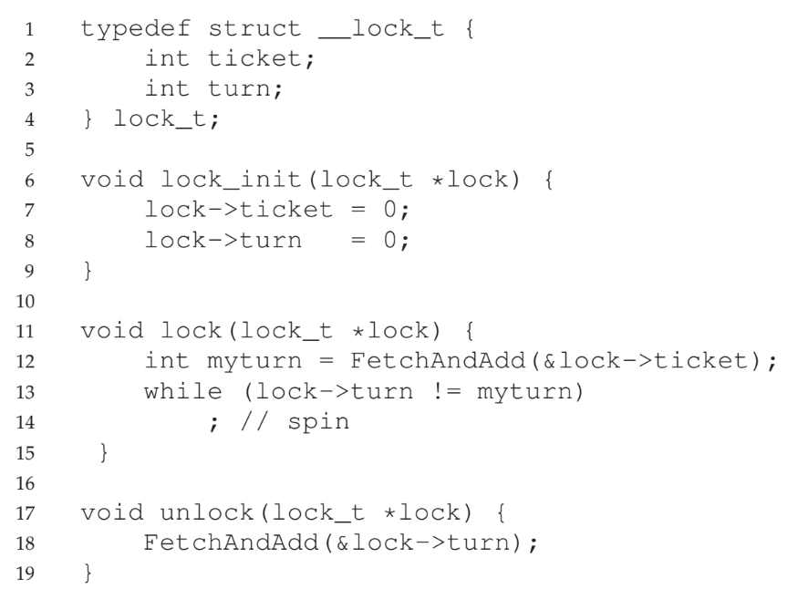

# Locks
- **Locks** are used around critical sections to ensure that they are accessed by only one thread - this ensures that such sections are executed *atomically*
- Locks make use of **lock variables**, which holds the *state* of the lock at any instant of time - whether it is **available** or **acquired** by exactly on thread (which is assumed to be in the critical section)
    - A thread calling the `lock()` routine will acquire a given lock if no other thread owns it - thus, if a different thread tries to acquire the same lock, it will not return from the `lock()` call until the lock is freed, thus preventing it from entering the critical section that another thread is currently in
    - The owner of the lock can then call `unlock()` to free the lock, allowing for the other thread(s) waiting for the lock to attempt to acquire it 
- When actually using locks, it is a common strategy to use many, *different* locks for different critical section variables - this is a **fine-grained** approach to locking
## Implementing Locks
- Actually implementing locks requires both hardware and operating system support
- A feasible implementation of a lock should provide **mutual exclusion** - meaning that it succeeds in preventing multiple threads from entering a criticals ection at once
- Locks should also provide some degree of **fairness** - when a lock is freed, each thread contending for it should get a fair chance at acquiring it (perhaps in order of request) so that no threads **starve**
- Locks should still be efficient in terms of **performance** - there should be minimal overhead when dealing with locks, whether it in the case where there is no contention between threads for a lock or in the case where this contention between multiple threads for the same lock
## Early Attempt: Disabling Interrupts
- In early, *single-processor* systems, locking involved simply turning off interrupts and unlocking similarly involved turning interrupts back on
- Since there is a single CPU, threads can only run one at a time, so disabling interrupts ensures that the thread entering the critical section does not get switched to another thread by the scheduler
- While this approach is simple, it requires performing a *privileged operation* which can easily be abused - an arbitrary program could issue a lock call at the beginning of the program and never turn it off, allowing it to hog the CPU
- A program could also issue an infinite loop in the critical section, which could not be recovered from since interrupts are disabled
- Most significantly, this approach completely fails when dealing with more than one processor since threads can run on other cores, even if interrupts are disabled
## Test-and-Set (Atomic Exchange) Spin Locks
- Most systems provide hardware support for locking by providing **atomic** operations
- One common atomic operation is the **test-and-set** instruction:
    -     int TestAndSet(int *ptr, int new) {
            int old = *ptr;     // fetch old value at ptr
            *ptr = new;         // store 'new' into ptr
            return old;         // return the old value
          }                     // On hardware, this is all done simultaneously
- This test-and-set instruction can be used to build a **spin lock**:
    - 
- If the lock is not being held, the flag is zero, so the test-and-set operation will *simultaneously* return that it is not being held (zero) and set it to being held (one), allowing for the calling thread to exit out of the while loop and return from the lock call
- If the lock is being held, the flag is one, so the test-and-set operation will continue to return that it is being held (one) until it is the case where the lock is freed - when this is the case, it will return zero (so the while loop can be exited) and set the flag back to one
- Spin locks work only on **preemptive schedulers** as otherwise a thread waiting for the lock will spin indefinitely (since the scheduler will never switch to thread actually holding the lock)
- Spin locks do indeed provide correctness, but they do not guarantee fairness, as there is no guarantee that a waiting thread will ever enter the critical section (other, incoming threads could always take the lock before it)
- Spin locks are also heavily inefficient in regards to performance
    - With a single processor, if the thread holding the lock is switched while in the critical section, the scheduler may run *every other thread*, each of which will try to acquire the lock and spin for their entire time slice as a result (since the thread *with the lock* has not given it up yet)
    - Spin locks are not as bad on multiple processor devices where the number of processors is roughly equal to the number of threads - threads waiting on the lock will not spin as much if they are on their own processor since presumably the critical section is short (and the processor with the thread in this section can finish its job quickly)
## Compare-and-Swap
- Another atomic hardware instruction is the **compare-and-swap** instruction:
    -     int CompareAndSwap(int *ptr, int expected, int new) {
            int actual = *ptr;
            if (actual == expected)
                *ptr = new;
            return actual;
          }
- This can also be used to implement a spin lock:
    - 
- With similar logic to test-and-set, if the lock is not already being held (flag is zero), the compare-and-swap instruction will return zero while simultaneously setting the lock value to one (held), allowing for the loop to be exited
- If the lock is being held, the compare-and-swap instruction will return one, resulting in the loop continuing until the lock is no longer held
## Load-Linked and Store-Conditional
- Hardware platforms may also include **load-linked** and **store-conditional** instructions:
    - 
    - The store-conditional instruction will only update `ptr` with `value` if no intermittent store to the address just load-linked from has taken place
- This allows for another alternate implementation of a spin lock:
    - 
- In this lock, it *is* possible for two threads to both bypass the first while loop with the `LoadLinked` instruction; however, only *one* while return out of the loop since the `StoreConditional` guarantees that only one thread can successfully update the flag (the other will continue to the next iteration of the loop)
## Fetch-And-Add Ticket Locks
- Another hardware primitive instruction is the **fetch-and-add** instruction:
    -     int FetchAndAdd(int *ptr) {
            int old = *ptr;
            *ptr = old + 1;
            return old;
          }
- This type of instruction can be used to implement more fair **ticket locks**
    - 
- In this lock, each thread is able to determine its "turn" to get the lock using the `FetchAndAdd` instruction on the `ticket` data entry
- When a thread using the lock is done with it, it performs a `FetchAndAdd` instruction on the `turn` data entry, which allows for the corresponding thread to now own the lock
- This implementation allows for all threads to get the lock at some point in the future instead of possibly spinning forever if it gets unlucky when trying to acquire it
## Dealing with Spinning
- A simple approach to deal with the inefficiencies of spinning is to have threads just *yield* the CPU whenever they encounter a set lock
    - While this approach is better than just allowing the spinning to occur, there is still overhead associated with the system call that does the actual yielding
    - This overhead becomes especially relevant with more threads, as the thread holding the lock would still need to wait for all the other threads to run-and-yield before being able to run once more
- Instead of yielding, a better approach is to use a queue to keep track of threads waiting for a lock and put those threads to *sleep*, waking them up when it is their turn
-     typedef struct __lock_t {
        int flag;
        int guard;
        queue_t *q;
      } lock_t;

      void lock_init(lock_t *m) {
        m->flag = 0;
        m->guard = 0;
        queue_init(m->q);
      }

      void lock(lock_t *m) {
        while (TestAndSet(&m->guard, 1) == 1)
            ; // acquire guard lock by spinning
        if (m->flag == 0) {
            m->flag = 1; // lock is acquired
            m->guard = 0;
        } else {
            queue_add(m->q, gettid());
            setpark();
            m->guard = 0;
            park(); // sleep
        }   // Remember that getting to this point means the 
            // lock has been acquired and the routine is exited
      }

      void unlock(lock_t *m) {
        while (TestAndSet(&m->guard, 1) == 1)
            ; // acquire guard lock by spinning
        if (queue_empty(m->q))
            m->flag = 0; // let go of lock; no one wants it
        else
            unpark(queue_remove(m->q)); // hold lock (for next thread)
        m->guard = 0;
      }
- In this implementation, there is still *some* spin waiting for the guard lock in case a thread is interrupted while acquiring or releasing the lock - but this is minimal
- When a thread cannot acquire the lock, it *inserts itself into the lock queue*, unlocks the guard lock, and sleeps (it must sleep last as otherwise the guard lock would never unlock)
    - The next thread on the queue is woken up when the current thread holding the lock releases it - it is not necessary to set the flag back to zero since the lock is now in possession of the next thread (when this thread returns from the `park()` command, it will exit the `lock()` call and be able to continue on to the critical section in the code)
- The `setpark()` routine indicates that a thread is *about* to park, which accounts for timing issues if a thread is switched out before it is about to `park()`
    - If the thread that has called `setpark()` is interrupted before actually being able to call `park()` and another thread calls `unpark()` on it, the subsequent `park()` is ignored
- The `park()`, `setpark()`, and `unpark()` system calls are provided by the Solaris operating system; Linux provides a similar mechanism known as a **futex**, which is associated with a specific memory location that corresponds to an in-kernel queue
    - `futex_wait(address, expected)` puts the calling thread to sleep, assuming the value at `address` is equal to `expected` - otherwise, the call returns immediately
    - `futex_wake(address)` wakes one thread waiting on the queue
    - 
        - A single integer is used to characterize the lock, with the highest bit indicating whether the lock is held and all other bits indicating the number of waiters