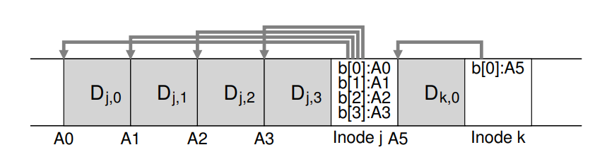
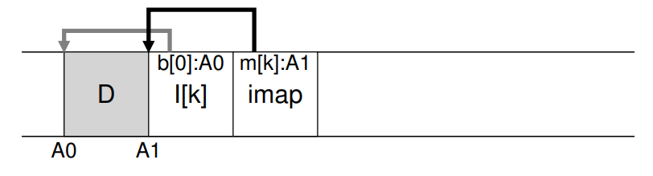

# Log-Structured File Systems
- As systems grew to accomodate more memory, it became apparent that disk performance was more dependent on *writes* rather than *reads* since the latter could be simply cached
    - To maximize write performance, it is ideal to make use of *sequential* operations on disk rather than *random* operations, especially with common workloads (such as file creation)
- A new file system thus emerged, the **Log-structured File System (LFS)**, where all writes would be first buffered via an in-memory segment and, when this segment is full, is written *sequentially* to an unused part of disk
    - Existing data, thus, is never overwritten but rather new segments are always written to free locations, enabling disk performance to be very efficient
## Writing to Disk Sequentially and Effectively
- Whenever a user writes a data block, other data blocks containing **metadata** must also be updated (i.e. the **inode**)
- In the case of LFS, all updates are written sequentially, so both the data blocks and the metadata blocks (i.e. inodes) are written to disk sequentially
- To maximize the efficiency of sequential writes, LFS utilizes **write buffering**, where updates are kept in memory and written to disk all at once after a certain number of updates have been performed
    - The chunks of data written to disk at a time are known as **segments**
        - The size of a segment should be chosen appropriately, based on factors related to the disk performance, in a manner such that the cost is **amortized**
    - 
## Finding Inodes
- In a typical Unix file system, inodes are organized in an array and are at fixed disk locations, allowing for them to be easily located
    - Searching for inodes is more difficult to do in LFS since they are scattered throughout disk and are not updated in place
- In LFS, inodes are found through an **inode map**, which maps an inode number to the disk address of its most recent version
    - The inode map is not stored in a fixed disk location, as this would result in performance loss since writes to and from inodes and the inode map would no longer be sequential (and thus be slower)
    - Instead, *chunks* of the inode map are placed in the disk location where the write is occurs 
        - 
    - Pointers to these *chunks of the inode map* are kept in a fixed region on disk known as the **checkpoint region (CR)**, which is updated *periodically* to minimize any performance losses associated with the action of updating
        - 
- A typical read, thus, involves first reading the checkpoint region, then reading the pointers to the entire inode map and caching it into memory, then looking up the inode-number to inode-disk address mapping from a given inode, and finally reading the data block using the inode's direct or indirect pointers
    - In the common case, the entire inode map should be cached in memory so the only extra work done is to look up the inode's address from the inode map
## Garbage Collection
- LFS leaves old versions of file structures scattered throughout disk, such as **garbage** data blocks and inodes
    - To deal with potential storage waste, the file system must periodically find the dead versions of file data, inodes, and other structures and free them in a process known as **garbage collection**
- Garbage collection should be done in a manner that minimizes the number of **holes** mixed between allocated space, as write performance could be degraded otherwise (due to a lack of contiguity)
    - Thus, the cleaner should work on a *segment-by-segment* basis by reading a number of old, partially-used segments and determining which blocks are live in those segments
        - These live blocks are written out to a new set of segments and the old segments are freed
        - Ideally, the moved segments should be **compacted** so that if the cleaner reads *M* existing segments, their contents should be placed into *N* new segments where *N < M*
### Determining Block Liveness
- To determine whether a block *D* in a segment *S* is live or not, LFS adds to the head of each segment a **segment summary block**, which includes the inode number and offset (which block of the file) for each data block
    - With this information, the inode map can be consulted to find the file's inode number and check if the actual file data is at the location being cleaned
        - If the addresses match, then the block is considered alive; otherwise, it is considered dead
    - 
### Determining Which Blocks to Clean and When
- Blocks are usually cleaned periodically, either during idle time or when the disk is full
- Determining which segments to clean is more difficult to determine - one approach is to utilize *hot* and *cold* segments, where the former is a segment constantly being written to and the latter is a segment that is not as constantly being written to
    - It is better to wait or a long time before cleaning hot segments and clean immediately for cold segments
## Crash Recovery
- To account for the case where a crash occurs while the checkpoint region is being written to, LFS maintains *two* checkpoint regions (at each end of the disk) and writes to them alternatively
    - Updates to (either) checkpoint region involves first writing a header (with a timestamp), then the body of the checkpoint region, and finally an ending block (with a timestamp); the timestamps are used to detect any inconsistencies 
- If a crash occurs during a write to a segment, the checkpoint region can be consulted to find the latest consistent snapshot of the file system