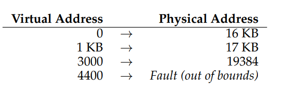
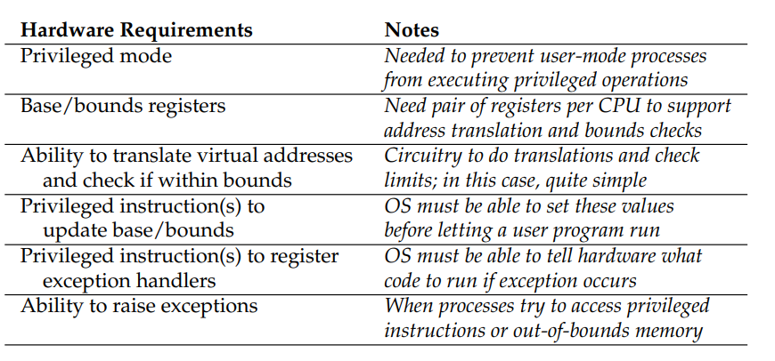
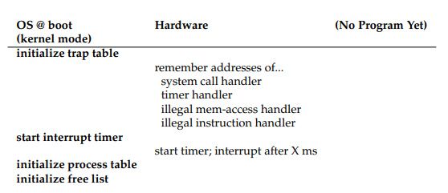
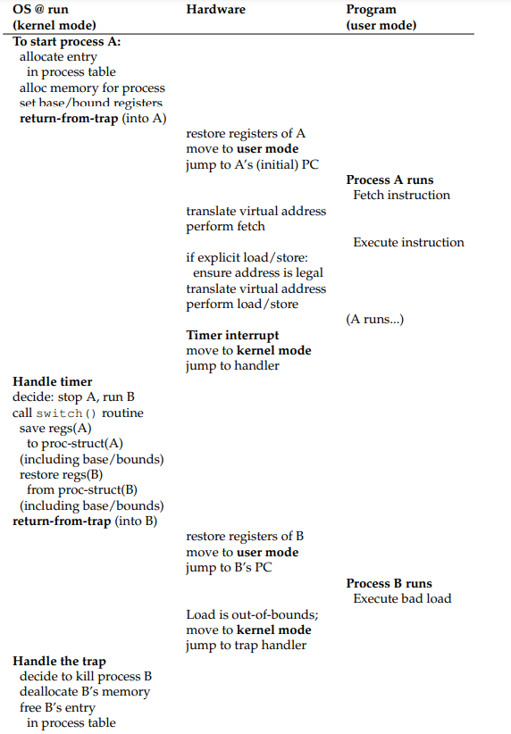

# Mechanism: Address Translation
- The virtualization of memory is achieved through **hardware-based address translation**, where the hardware transforms each memory access from *virtual* to *physical*
    - Address translation is the low-level mechanism; the operating system must get involved to manage memory, such as by tracking which locations and free and maintaining control over how memory is used
- From a program's perspective, its address space starts at 0 - to virtualize memory, though, the operating system must **relocate** the process somewhere else in physical memory 
## Dynamic (Hardware-based) Relocation
- The **base and bounds** technique, or **dynamic relocation** involves the usage of two hardware registers in the CPU - the **base** register and the **bounds** or **limit** register - that allow for a program's address space to be placed anywhere in memory
- The program is written and compiled as if it were loaded at address zero, but when it actually starts running, the operating system decides where in physical memory it should be loaded at and sets the base register to that value
    - When any memory reference is generated by that process, it is translated by the processor `physical address = virtual address + base`
- The bounds register contains a limit value used to check that a memory reference is within bounds of its address space - if the *virtual* address exceeds the bounds value (or is negative), the CPU will raise an exception
    - The bounds register can either hold the *size* of the address space (so it just needs to be checked against the virtual address, which starts at 0), or the *physical address* of the end of the address space (so the translated address is checked instead)
- Example: Process with a address space of 4 KB (bounds) loaded at physical address 16 KB (base)
    - 
## Hardware Support Summary
- For process virtualization, the CPU needs a **processor status word**, which indicates what mode (user or kernel) that the CPU is currently running on and is able to switch upon special occasions (interrupts)
- For memory virtualization, the CPU needs the **memory management unit (MMU)**, consisting of the base and bounds registers so that it can add the base to each virtual address and check it against the bounds
    - There must be privileged instructions to modify the base and bounds registers (by the hardware)
- 
## Operating System Issues
- When a process is created, the operating system must find space for the process's address space in memory - if we assume that address spaces are all the same size and are smaller than the size of physical memory, this can be easily be done by viewing physical memory as an array of "slots"
    - A **free list** is a data structure used to find room for the new address space and mark it as used
- When a process is terminated, the operating system must reclaim all of its memory and open the corresponding spot back up on the free list
- When a context switch occurs, the operating system must save and restore the base-and-bounds pair when switching between processes 
    - These registers are saved in memory in some per-process structure (such as the process control block)
- The operating system might also need to move an address space from one location to another in memory when the process is stopped
    - This requires copying the address space from the current location to the new and then updating the saved base register to correspond to the new location
- The operating system must also provide exception handlers (installed at boot time) to deal with exceptions 
- 
- 
