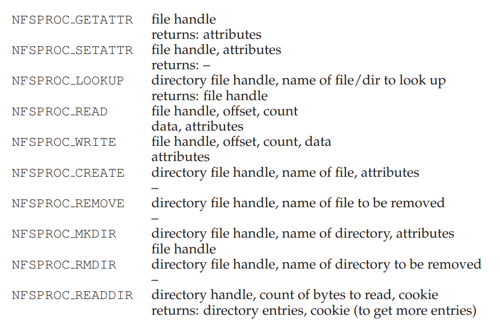
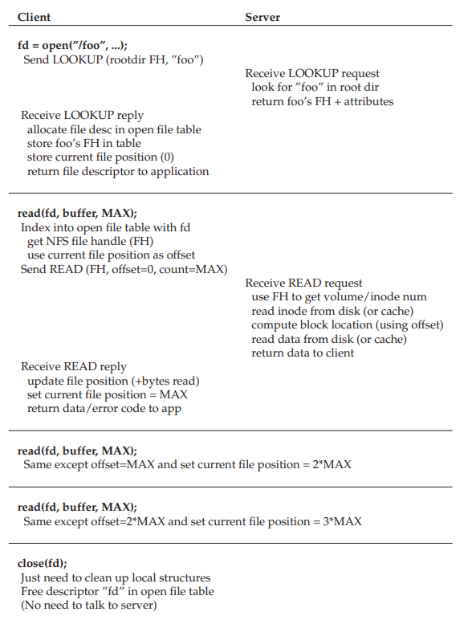

# Sun's Network File System
- A client/server distributed file system makes use of a **client-side file system**, which issues the standard **system calls** associated with a file system (`open`, `write`, `read`, etc.), which sends a message to the **server-side file system**
- The Sun Network File System (NFS) is defined as an **open protocol** which simply specified message formats to be followed by clients and servers
    - This allows for groups to develop their own NFS servers while still maintaining interoperability
## Simple and Fast Server Crash Recovery
- The NFS protocol was designed with the goal of *simple and fast server crash recovery*, and this was primarily done by implementing a **stateless** protocol, meaning that the server does not keep track of any information in regards to clients
    - Each protocol request is designed to deliver *all the information* needed to complete the request, as opposed to a stateful protocol that, for example, maintains all open file descriptors and offset locations
- By maintaining a stateless protocol, there is no need to recover **shared state** (which is a very expensive process) upon server crashes
    - Since there is no need to maintain state, there is also no need for the server file system to deal with client crashes
## NFS Protocol
- Most NFS requests require passing in a **file handle**, which is an identifier for a file or directory containing information about the *volume*, *inode number*, and *generation number* (this is incremented whenever an inode number is reused to ensure a client with an old file handle does not access a new one)
- 
    - The `LOOKUP` protocol is used to obtain a file handle, which is used for subsequent data accesses
        - The directory file handle for the root directory is provided during the **mount protocol**, which occurs when the client and server first connect
    - The `READ` and `WRITE` protocols require passing in an offset (along with the file handle)
## From Protocol to Distributed File System
- The client-side system keeps track of open files and translates application requests into relevant protocol messages, which the server responds to
    - This means that the client tracks all relevant **state** for the file access, such as the mapping of the file descriptor to the appropriate file handle as well as the current file offset
- Server interactions occur frequently whenever a long pathname is traversed, as the client must perform a `LOOKUP` for each element in the file path (each directory and the target file itself)
- 
## Handling Server Failure With Idempotent Operations
- A client in NFS handles failure, whether it be due to server crashes or network errors, by simply *retrying* the request (the client sets a timer on each request and if a reply is not received before the timer goes off, the request is reissued)
    - NFS requests are **idempotent**, meaning that the effect of performing the request multiple times is equivalent to performing the request once
        - `LOOKUP` and `READ` are idempotent, as well as `WRITE` since a write request contains the data, count, and the exact offset to write to - doing this write multiple times achieves the same effect
## Client-Side Caching
- Performance in NFS is improved through client-side **caching**
    - The client-side file system caches file data and metadata read from the server into client memory
    - The client-side file system also performs **write buffering**, buffering write data into client memory before eventually sending out the actual write to the server-side file system
### Cache Consistency Problem
- Utilizing caching with distributed systems introduces the **cache consistency problem**
    - Write buffering means that other clients may get *stale* versions of the file - an issue of which is known as **update visibility**
        - NFS addresses this using a **flush-on-close** approach, meaning that when a file is *closed*, the client flushes all updates to the server
    - Once a write is flushed out to the file server, it is still possible for other clients to have a **stale cache** instead of the most recent copy of the file
        - NFS addresses this by having clients first check to see whether a file system has changed before using its cached contents, done using the `GETATTR` request to check if the time of last modification is more recent than the time the file was cached - if so, the file is **invalidated** and the latest version is requested on the next read or write
        - This approach flooded the NFS server with `GETATTR` requests, of which were often unnecessary as no changes had been made recently
            - An **attribute cache** was added to each client, containing the attributes for a particular file with a timeout after a certain amount of time (thus requiring the attributes to be refetched)
## Server-Side Implementation
- The server-side file system *cannot* implement write buffering - it must inform the client of success or failure on each request
    - If the file system did not do so and instead returned a success on every operation, the client would have no way of detecting failure (and could not retry the request as a result)
- The lack of server-side write buffering, though, implies that writes can be a major bottleneck for NFS