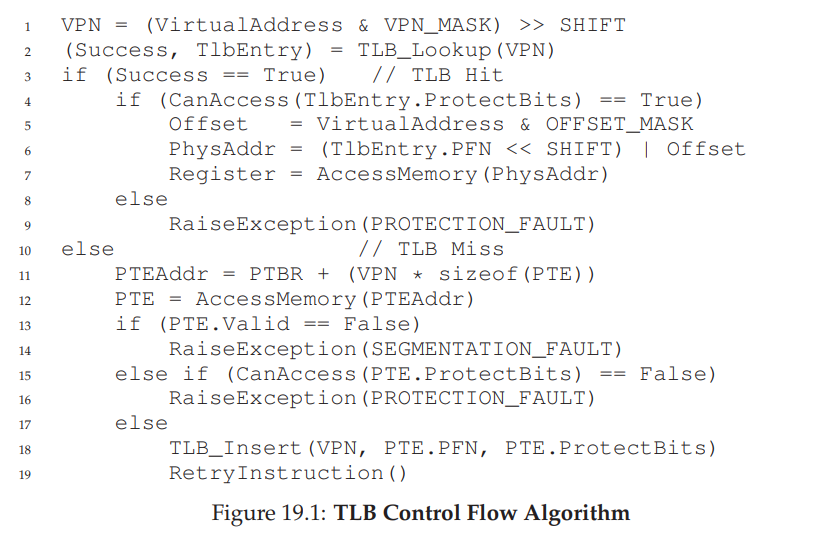
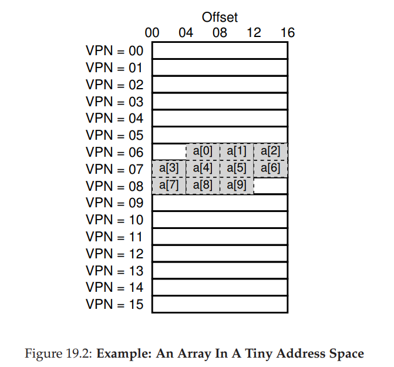
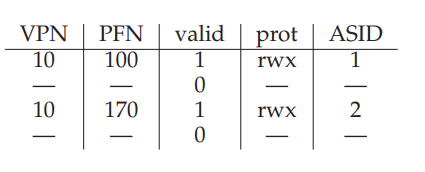

# Paging: Faster Translations (TLBs)
- The additional memory lookup required with paging can be mitigated through hardware support - specifically, through the usage of a **translation-lookaside buffer (TLB)**, which is a part of the chips memory management unit (MMU)
    - The translation-lookaside buffer simply acts as a *cache* for popular virtual-to-physical address translations - if a translation is held in the cache, then there is no need to consult the page table
## Control Flow
- The code for the hardware would need to first extract the virtual page number from a given address and check if it exists in the TLB 
    - If it does, then there is a **TLB hit** and the physical page frame number can be extracted from the TLB, concatenated with the offset, and looked up in memory (assuming any checks do not fail)
    - If it does not, then there is a **TLB miss** and the hardware must access the page table to find the translation, update the TLB if it is a valid translation, and retry the instruction
        - Misses are costly since they incur an extra memory access to the page table
    - 
- Example:
    - 
        - `A[0]` will miss, but `A[1]` and `A[2]` will hit
        - `A[3]` will incur another miss, but `A[4]`, `A[5]`, and `A[6]` will all hit
        - `A[7]` will miss, but `A[8]` and `A[9]` will hit
        - In this example, the hit rate is 70%
## Locality
- Any cache (including TLBs) benefit from **spatial** (elements close in memory are favorable to the cache) and **temporal** locality (the same elements accessed frequently in near time are favorable to the cache)
## Miss Handling
- Complex-instruction set computers (CISC) often have **hardware-managed TLBs** when dealing with misses, knowing exactly where page tables are located in memory and their exact format
- Reduced-instruction set computeres (RISC) often have **software-managed TLBs** when dealing with misses - the hardware raises an exception during a miss, jumping to a trap handler where the operating system deals with the page table lookup 
## TLB Contents
- Most TLBs are **fully associative**, meaning that a translation can be anywhere in the TLB - the hardware must search the entire TLB (in parallel) to find (or not find) a valid translation
    - Each entry may appear like `VPN | PFN | other bits`
    - TLBs commonly have a **valid bit** (this indicates whether the *TLB* entry has a valid translation or not, but it is not the same as a page table valid bit), **protection bits**, an **address-space identifier**, a **dirty bit**, etc.
## Context Switching
- TLBs contain entries relevant only for the currently-running process, so during a context switch it is important to ensure that the next process does not accidentally use the translations from the previously run process
- One solution to this is to **flush** the TLB on context switches, which involves setting all valid bits to 0
    - The new process, though, will incur frequent TLB misses - and if there are frequent switches, the frequent misses will be noticable
- Another solution is to include an **address-space identifier (ASID)**, allowing for translations for different processes to be held in the TLB - though now the TLB must have a register to know the ASID of the current process (and this register must be changed during a context switch)
    - 
## Cache Replacement
- One common **cache replacement policy** is to evict the **least-recently used (LRU)** entry in the cache - this will incur a miss on every access if a program loops over n + 1 pages with TLB of size n
- Another common approach to minimize such aforementioned edge cases is to use a **random policy**