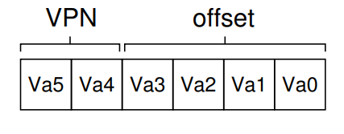

# Paging
- While segmentation can be a useful technique, it can result in the *fragmentation* of memory, making allocation much more challenging over time
- The alternative approach of **paging** involves splitting physical memory into *fixed-sized* pieces, known as **pages**
    - This allows for physical memory to be thought of as an array of fixed-size slots known as **page frames**
## Overview
- Paging occurs at both the address space level *and* the physical memory level
    - 
    - 
- Paging is useful over segmentation in that it provides *flexibility* - the abstraction of an address space can be used effectively without making any assumptions of how a process actually uses that address space (no need to assume the directions of stack and heap growth)
- Through paging, free-space management is also made much *simpler*, as it can use aforementioned strategies such as a **free list** when determining which physical pages to hand out to processes requiring an address space
    - The *physical pages* consisting of a program's address space do not necessarily need to be consecutive as the translation will allow for it to *appear* to the program that they are
- Where each *virtual page* of an address space is placed in physical memory is kept in a *per-process* data structure known as a **page table**, which stores **address translations** 
    - It must be a per-process data structure since each process has its *virtual* pages starting from zero
- Each virtual address has two components - the **virtual page number (VPN)** and the **offset** within the page
    - i.e. A 6-bit machine (address space of 26 = 64 bytes) with a 16-byte page size
        - 
    - When an address is loaded, the bits pertaining to the virtual page number are extracted and translated using the page table to the physical page number; the offset still acts the same 
        - 
## Page Table Organization
- The simplest data structure to store page tables is the **linear page table**, which is just an array that is indexed by virtual page number (remember that a page table is per-process)
    - Aside from containing the physical page number, each page-table entry may also contain other bits such as a **valid bit** to indicate whether a translation is valid (i.e. unused space in between stack and heap is invalid) - this lets the operating system not need to allocate physical frames for invalid address ranges
        - They may also contain a **protection bit** to indicate the read, execution, and writing status of the page
        - They may also contain a **present bit** to indicate if the page is in physical memory or on disk
        - They may also contain a **dirty bit** to indicate whether a page has been modified since it was brought into memory
        - They may also contain a **reference bit** to track whether the page has been accessed (useful for determining cache eviction policy)
## Performance
- Paging, as understood without any separate hardware support, can be very slow, as it first requires the system (hardware) to first fetch the proper page table entry from the process's page table, perform the translation, and then load the data from physical memory - this requires each memory reference to be accompanied by an *additional* reference
- 