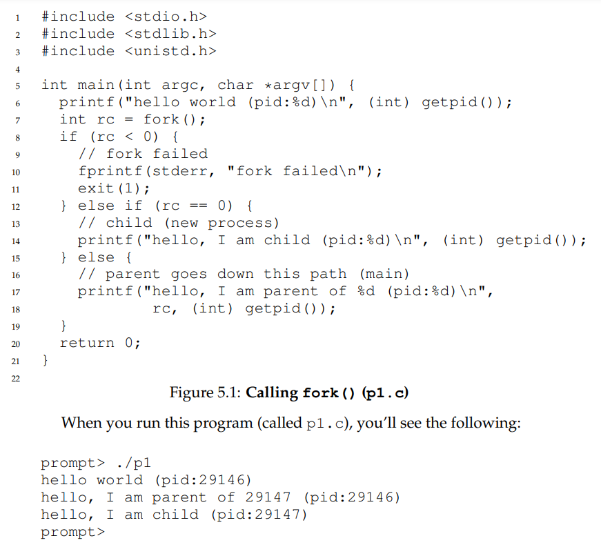
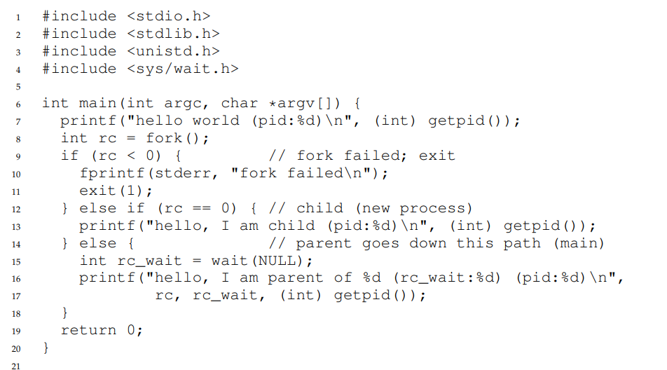
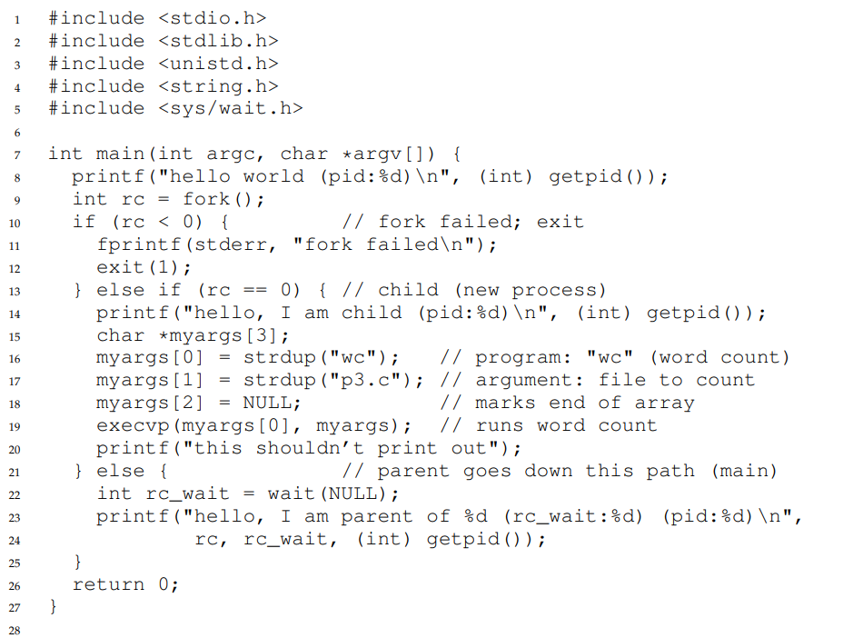

# Process API
## fork() System Call
- The `fork()` system call creates an *almost exact copy* of the calling process, starting from where `fork()` was originally called
    - The child process has its own address space, registers, etc. and has a *different return value to the caller of `fork()`* - *the parent call to `fork()` returns the PID of the child while the child return value is just 0*, allowing for different cases to be handled (parent or child code)
    - 
        - The output is not deterministic, the child output could have been first in a different run of the same program
## wait() System Call
- The `wait()` system call can be used for a parent to wait for its child process to finish executing before continuing
    - This allows for programas to be deterministic
    - 
## exec() System Call
- The `exec()` system call is useful for running a *different program* than the calling program
    - `exec()` and its variants, given the name of an executable (command or program) and some arguments, loads the code from that executable and overwrites the current code segment (along with other necessary reinitializations) and then runs the program
        - This means that a new process is not created, but rather the currently running program transforms into a different running program - `exec()` never returns, so if the parent process still needs to be referenced, a call to `fork()` should be made first
            - Separating `fork()` and `exec()` allows for code to be run *after* `fork()` but before `exec()`, allowing for easier implementation of functionality such as piping and redirection
    - 
## Process Control
- The `kill()` system call can be used to send **signals** to a process, of which may be a signal to pause, die, etc.
    - Signals can be sent to individual processes or **process subgroups** - a process can catch these signals using the `signal()` system call
        - Typically, **users** can only send signals to processes that they have launched