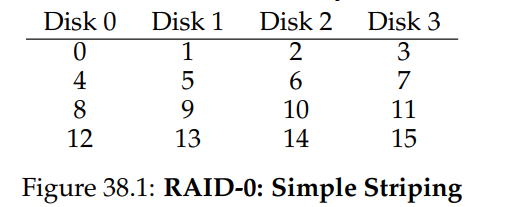
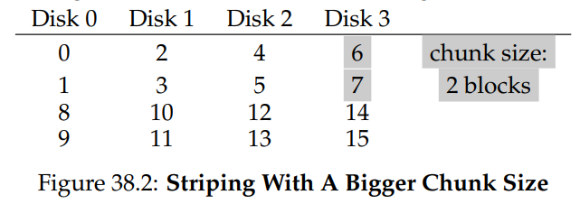
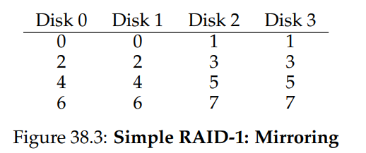
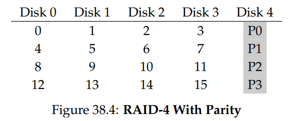
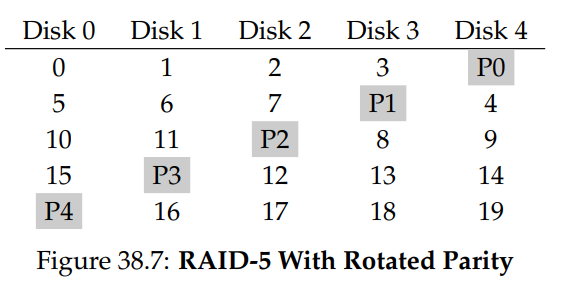
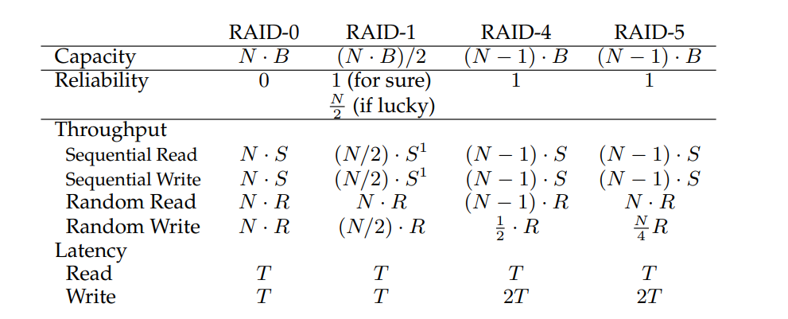

# Redundant Arrays of Inexpensive Disks (RAIDs)
- The **Redundant Array of Inexpensive Disks (RAID)** is a technique using multiple disks to build a faster, larger, and more reliable disk system
    - Externally, a RAID can still be thought of as a disk, allowing for reading and writing
        - Thus, a RAID system is **transparent**, as a computer implementing a RAID configuration will just view it as a large disk
    - Internally, though RAID consists of multiple disk, memory, and processors to manage the system - the system can be thought of as a computer specialized for the task of managing groups of disks
- RAIDs are advantageous to single disk systems because they allow for *performance* through parallelism, *capacity* through the presence of more disks, and *reliability* through spreading data across multiple disks, even allowing for **redundancy** in some cases
- The interface that a RAID system presents is the same as a standard disk - a linear array of blocks that can be read or written
    - When an I/O request is issued to a RAID system, it internally calculates which disk(s) to access in order to complete the request and then issue the actual physical I/O, the details of which depend on the RAID level being used
## RAID Level 0: Striping
- RAID level 0 functions by **striping** blocks across the disks of the system, which allows for parallelism to be leveraged upon sequential accesses 
    - 
- The **chunk size** can be varied - that is, the amount of blocks placed on a disk before moving on to the next disk
    - 
    - A small chunk size enables more parallelism since reads can be across different disks, but this also increases the positioning time to access blocks across multiple disks since it is now dependent on the maximum positioning times across *all* drives
    - A large chunk size reduces parallelism but increases positioning time
- For *N* disks of size *B* blocks, RAID 0 delivers *(N)(B)* blocks of capacity
- In terms of reliability, RAID 0 will incur data loss on *any* disk failure
- For performance, RAID 0 works will due to the aforementioned usage of parallelism
    - The system is most efficient with sequential access, as there is less time seeking and waiting for rotation for each disk
        - Throughput for *N* disks and a sequential transfer rate *S* is just *(N)(S)*
    - The system is least efficient with random access, since there is more time seeking waiting for rotation for each disk
        - Throughput for *N* disks and a random transfer rate *R* is just *(N)(R)*
## Raid Level 1: Mirroring
- RAID level 1 functions by making an additional copy of each block in the system (placed on a separate disk), allowing for fault tolerance
- There are many ways to place the additional copies, but a common arrangement is to use mirrored pairs and then stripes on top of them, known as **RAID-10** or **stripes of mirrors**
    - 
- Whenever a read occurs, the RAID system can read from either copy. On writes, however, the system *must* write to both copies (though this can often be done in parallel)
- In terms of capacity, RAID 1 delivers *(N)(B)/2* blocks of capacity due to mirroring
- For reliability, though, RAID 1 is guaranteed to tolerate *at least* one disk failure and *potentially* tolerate up to *N/2* failures depending on which disks fail
- For sequential performance, RAID 1 works similar to RAID 0 in terms of reads. For writes, however, there is a difference since writes must be done on *both blocks*
    - For sequential writing, throughput is *(N)(S)/2*
    - For random writing, throughput is *(N)(R)/2*
## Raid Level 4: Saving Space with Parity
- RAID level 4 presents an alternative approach to redundancy using **parity**, which increases the effective capacity of the system at the cost of performance
- In this system, each stripe of data has an additional parity block that stores redundant information for that stripe of blocks 
    - This is done using the **XOR** function, which, if performed on a set of bits, will return 0 if there are an even number of set (1) bits and 1 if there are an odd number of set (1) bits; in other words, the number of set bits, including the parity bit from an XOR, must be *even*
        - This invariant can be used to recover from failure if a drive is lost since any bit (including the parity bit) can be **reconstructed** from the others
    - Each bit for a parity block in a stripe is just the XOR of all the corresponding bits from the other blocks in that stripe
    - 
- In terms of capacity, RAID 4 only uses 1 disk for parity, so it has an effective capacity of *(N - 1)(B)*
- In terms of reliability, RAID 4 can *only* handle one disk being lost at a time 
- Performance:
    - For sequential reads, the system utilizes all disks except for the parity disk, so the effective bandwidth is *(N-1)(S)*
    - For big chunks of sequential writes, an optimization known as a **full-stripe write** can be performed, where the new parity can be calculated and then writes can be done to all blocks in a stripe (including the parity block) in parallel, allowing for an effective bandwidth of *(N-1)(S)*
    - The logic for random reads is similar to that for sequential reads, and the effective bandwidth is *(N-1)(R)*
    - Understanding random writes requires more work, as overwriting a block requires also updating the corresponding parity block
        - One method to do so, **additive parity**, involves reading in the other blocks of the stripe in parallel and then taking the XOR with the new block, resulting in a new parity block - this is inefficient as it scales with the number of disks
        - Another method, **subtractive parity**, involves reading the old data and the old parity; if the old data and the new data are the same, then the parity bit should remain the same as in the old parity block - otherwise the old parity bit should be flipped
            - *Pnew = (Cold XOR Cnew) XOR Pold*
        - The **small-write problem** with random writes is that, if writes are performed to *different stripes*, both requests must read from the parity disk, which ultimately becomes a bottleneck that prevents parallelism
            - For this reason, random writes incur an effective bandwidth of *(R/2)* since there is essentially no parallelism
## Raid Level 5: Rotating Parity
- RAID level 5 addresses the small-write problem by **rotating** the parity block across drives, thus removing the bottleneck of the parity drive
    - 
## Summary
- 