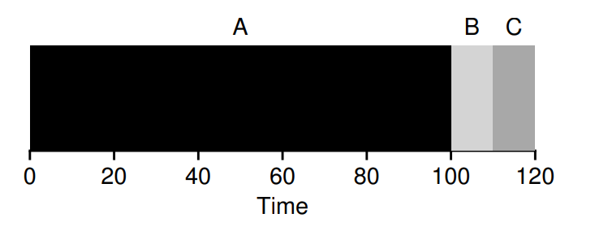
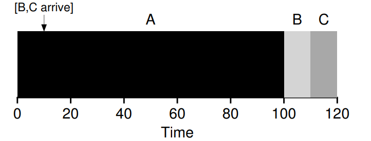
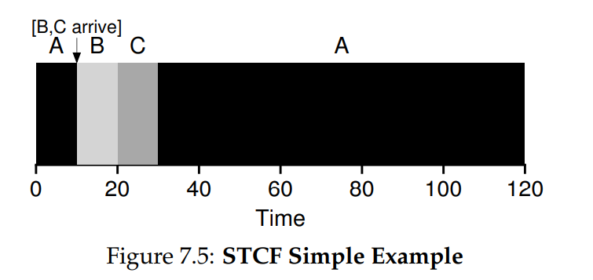
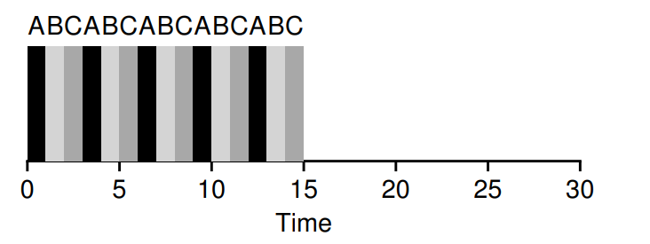
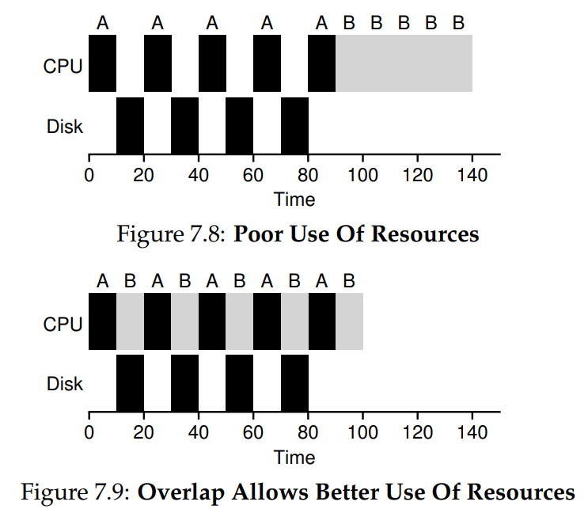

# Scheduling: Introduction
## Scheduling Metrics
- When considering various **scheduling policies**, it is important to compare such policies via **scheduling metrics**
    - **Turnaround time** is a common **performance metric** defined as the time at which the job completes minus the time at which the job arrives in the system
        - *Tturnaround = Tcompletion - Tarrival*
    - A metric for interactive performance is **response time**, which is the time from when a job first arrives to the system to the time it is first scheduled
        - *TResponse = Tfirstrun - Tarrival*
    - Another metric is **fairness**
## First In, First Out (FIFO)
- **First in, first out** scheduling involves running jobs *to completion* and *in the order that they arrived*
    - This form of scheduling tanks in turnaround time if long jobs are ran first, resulting in the subsequent shorter jobs having to wait for the long job to finish before being scheduled - known as the **convoy effect**
- 
    - Here, assume that the order in which the jobs arrive is A, B, and then C
    - Although B and C take much less time than A, since they arrived later they must wait for A to complete, resulting in an average turnaround time of 110 ((110 + 110 +120)/3)
## Shortest Job First (SJF)
- **Shortest job first**, as the name suggests, involves running jobs *in order of time to complete*
    - If all jobs arrive at the same time and their runtimes are known, then shortest job first is optimal
    - If, however, jobs do *not* arrive at the same time and jobs *must run to completion*, then shortest job first suffers if a long job arrives first and the shorter jobs arrive later, as now the shorter jobs must wait for the longer job to complete
- 
    - The average turnaround time in this case is (100 + (100 - 10) + (120 - 10))/3 = 103.33
## Shortest Time-to-Completion First (STCF)
- If jobs do not need to run to completion and can be switched (context switch mechanism), then the scheduler can **preempt** the current job if it is long and run the shorter jobs, resuming the current job later - this is the **shortest time-to-completion first** or **preemptive shortest job first (PSJF)** scheduler
    - Any time a new job enters the system, the scheduler determines which of the remaining jobs has the least time left and schedules that one
    - Shortest time-to-completion first is good for turnaround time, but is not good for response time since a queued job must wait for the other jobs to finish in their entirety before running
- 
    - Here, the average turnaround time is ((120 - 0) + (20 - 10) + (30 - 10))/3
    - Assuming A arrives at time t = 0, and B and C arrive at t = 10, the response time for each job is A = 0, B = 0, and C = 10, which is a particularly bad response time for C
## Round Robin
- The **round-robin** scheduling approach runs a job for a **time slice** and then switches to the next job in the run queue, repeatedly doing so until all jobs are complete
    - The length of a **time slice** must be a multiple of the processor timer interrupt 
        - A short time slice allows for a better response-time, but making the slice *too short* adds too much overhead when it comes to the cost of performing a context switch
            - This overhead not only involves saving and restoring registers, but also flushing CPU caches, TLBs, branch predictors, and so forth
    - Round-robin is great for response time and fairness, but is not so great for turnaround time - a tradeoff
- 
    - The average response time is (0 + 1 + 2)/3 = 1
    - The average turnaround time is (13 + 14 + 15) = 14
## Incorporating I/O
- Allowing I/O operations introduces another decision for the scheduler to make - jobs using I/O are **blocked**, allowing the scheduler to schedule another job while the blockage occurs
    - When the I/O operation completes, an interrupt is raised, allowing the operating system to move the previously blocked process back to ready - here, the scheduler has another decision to make of whether or not to run that process again now that its I/O is back
- Shortest time-to-completion first schedulers can make use of **overlap** when dealing with I/O operations, treating each section between a process runtime and its I/O operations as an independent job
    - This allows for a longer job to be interweaved between I/O gaps
- 