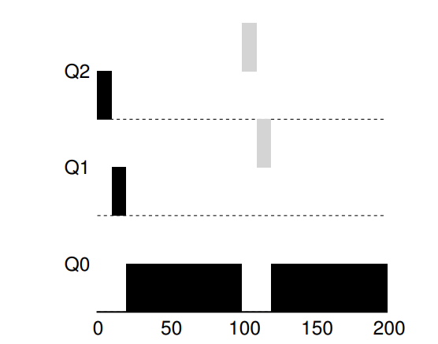

# Scheduling: Multi-Level Feedback Queue
- The **multi-level feedback queue (MLFQ)** is a common scheduler that deals with processes of an *unknown runtime*  while attempting to optimize both turnaround time and response time
- At its core, the scheduler uses a number of distinct **queues**, each with a **priority level**, to hold jobs
    - **If Priority(A) > Priority(B), A runs and B does not**
    - **If Priority(A) = Priority(B), then both A and B run in round-robin**
    - **When a job enters the system, it is placed at the highest priority (topmost queue)**
    - **Once a job uses up its time allotment at a given level, regardless of how much it has given up the CPU, its priority is reduced**
    - **After some time period *S*, move all jobs in the system to the topmost queue**
- MLFQ scheduling does not give a fixed priority to each job but rather *varies* the priority of a job based on its *observed behavior* - such as by keeping high priority for a job that repeatedly gives up CPU while waiting for input or reducing priority for a job that uses the CPU for a long amount of time
    - The scheduler thus attempts to use the *history* of processes to try to predict its *future* behavior 
- 
    - A, upon starting, is initially at the highest level queue, but then lowers in priority (twice) after using up its allotted time slice
    - B, upon starting, is also initially at the highest level queue, and since A has previously lowered in priority, B solely runs
        - B also lowers in priority after using up its allotted time, but it completes before reaching the lowest level priority
- Without a **priority boost**, it is possible for **starvation** to occur where high-priority jobs take up all the CPU time without leaving any for those in the lower levels - even if such lower level jobs do take up a lot of CPU time, they should still at least be able to make some sort of progress on their jobs
    - 
- Without enforcing allotment times, it is also possible for smart programs to try to **game the scheduler** - if there was not a total allotment time and it was instead based on single period usage, then programs could try to issue a short I/O request before their time ends so they remain in the same priority level
    - 
- There are many parameters to MLFQ - the number of queues, the size of the time slice per queue, the time period (S) for a priority boost
    - Typically, high priority jobs are given short time slices (10 or few milliseconds) whereas low priority jobs are given longer time slices (100s of milliseconds)
    - Many systems reserve the highest priority to operating system services; others allow for **advice** to set priorities (using `nice` on the command line for some systems helps to increase the priority of a job, for example)
    - It is good to find good default values for these parameters, but it is also important to ensure that they are configurable (i.e. by a system administrator)
