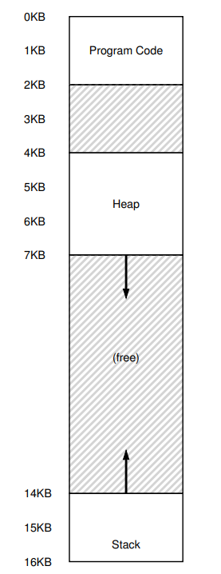

# Segmentation
- Contiguous address spaces often have large, unused memory between the stack and the heap that results in **internal fragmentation**
    - 
- **Segmentation** is a technique that splits an address space in terms of its logical segments (code, stack, heap), reserving a base-and-bounds pair for each one in the memory-management-unit
    - Thus, each segment can be placed in different parts of the physical memory, minimizing unused virutal addresses
    - 
- Translation for the code and heap segments involves adding the base value to the *offset* into the appropriate segment (and still checking for bounds)
    - i.e. If the heap, with the base located at 34K, starts at address 4096 and you have a virtual address at 4200, then you would add the offset into the virtual address (4200 - 4096) to the base, so `104 + 34KB = 34920` 
- Translation is slightly different for the stack since it grows downwards, requiring hardware support denoting which way the memory segment grows (1 if grows positively - code and heap, and 0 if it grows negatively - stack)
    - Given the offset from a virtual address, the hardware *subtracts* the maximum segment size (bounds register) from this offset and then adds it to the base 
        - The bounds check occurs in the absolute value of the offset - maximum segment size
    - i.e. Stack with base at 28K, bounds of 4K, and offset of 3K
        - `3K - 4K + 28K = 27K`
- Going out of bounds results in a **segmentation fault**
## Determining Segments
- One approach that the hardware is able to determine what segment it is in is *explicitly*, by chopping up the address space so that the top two bits represents the segment (00 code, 01 heap, 11 stack) and the rest of the bits represent the *offset* into the segment
    - With this, all the hardware needs to do is first take the segment bits to determine which base register to use, and then add this base register's value to the offset value in order to get the final physical address
        - To check for bounds, only a comparison between the offset and appropriate bounds register needs to be made
    - This approach, however, limits each segment to a maximum size since taking away the top two bits shortens the maximum possible offset size (and therefore address)
- There are also *implicit* approaches where the hardware can try to determine what segment an address is from by noticing how the address was formed (i.e. if its from the program counter, it is likely a code instruction fetch)
## Support for Sharing
- To save memory, it is often useful to share certain memory segments between address spaces (**code sharing**); doing so, however, requires additional hardware support in the form of **protection bits**, indicating whether a program can read, write, and/or execute a segment
    - If protection bits are supported, the hardware must then check if a particular access is permissible in addition to validating the bounds
## Fine-grained vs. Coarse-grained Segmentation
- **Coarse-grained segmentation** involves just a few, large segments whereas **fine-grained segmentation** involves many, smaller segments
## OS Support
- Whenever there is a context switch, all segment registers must be saved and restored
- Whenever segments grow or shrink, the operating system would need to update segment registers accordingly (i.e. when a `malloc` call is made)
- The operating system needs to manage free space in physical memory, especially addressing the issue of **external fragmentation** where there are many little holes of free space that makes it difficult to allocate new segments (even if the total amount of free space is enough)
    - The operating system could *compact* physical memory by rearranging existing segments (stop processes and then move the memory, updating the appropriate registers once done) - but this is expensive and also makes it harder for existing segments to grow
    - What is more commonly done is the usage of free-list management algorithms, which vary in approach
    - 