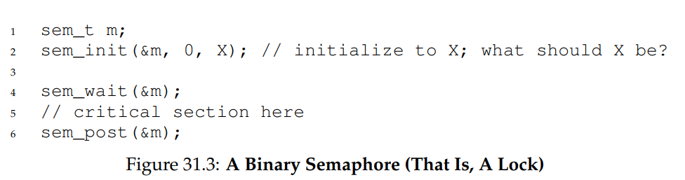
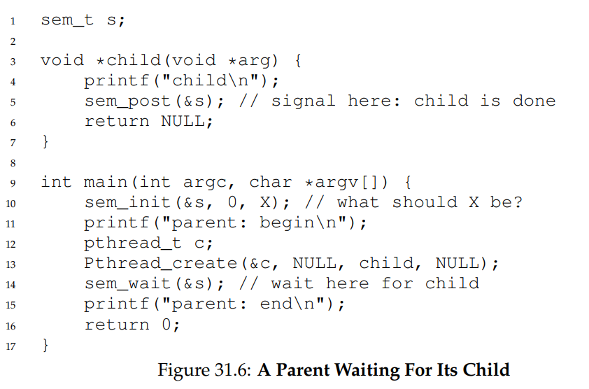
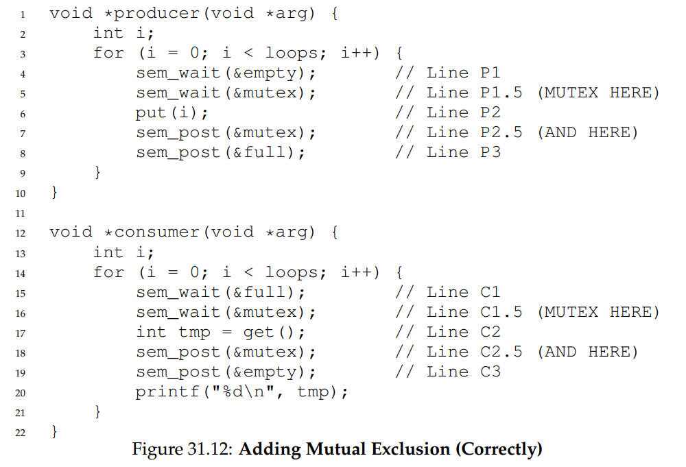
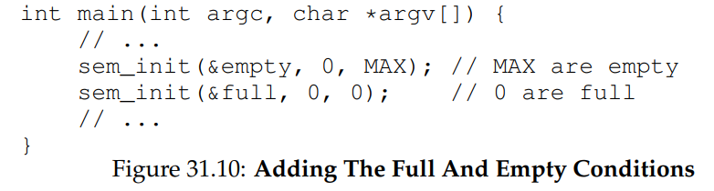
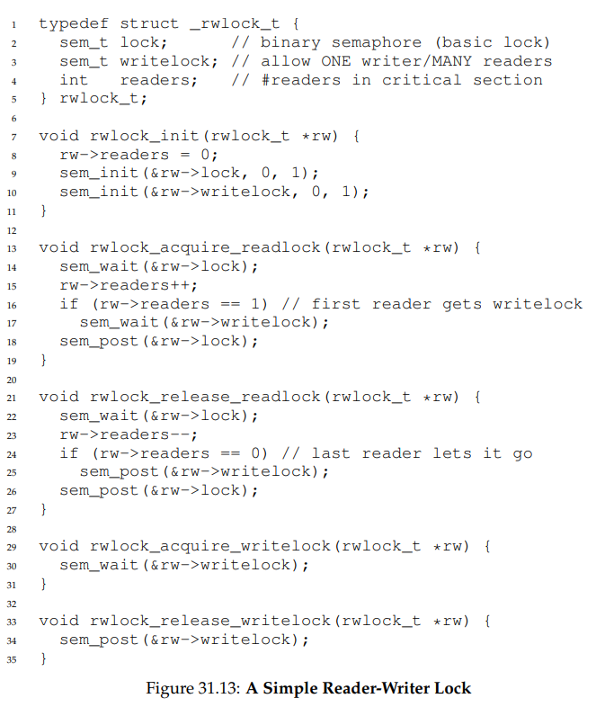
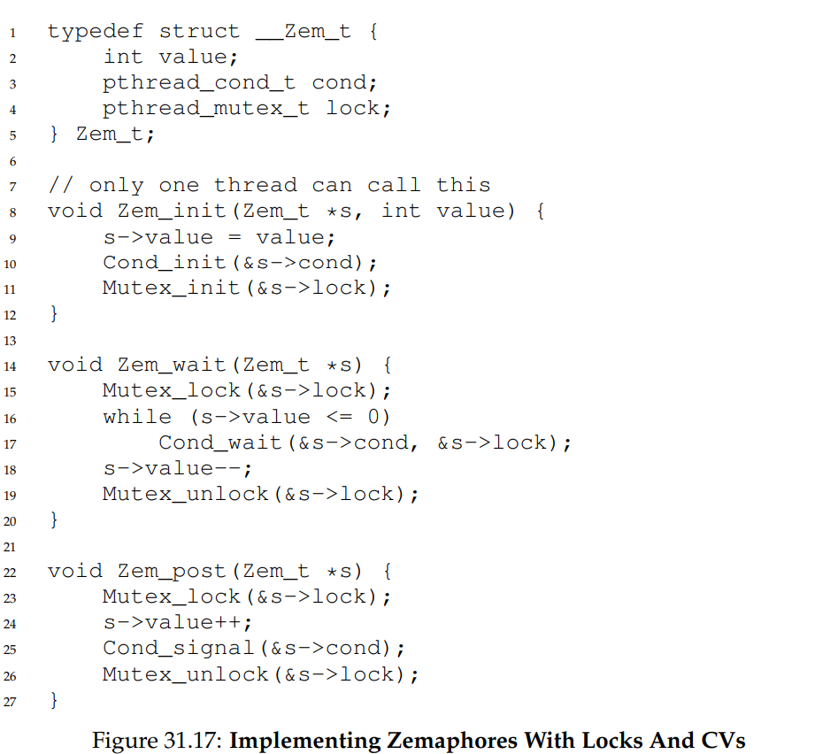

# Semaphores
- A **semaphore** is another type of synchronization primitive that can act as both a lock and a condition variable
- POSIX Semaphores:
    - `#include <semaphore.h>`
    - `int sem_init(*sem_t s, int pshared, unsigned int value)` 
        - Initializes a semaphore to hold `value`
        - The second argument indicates whether the semaphore is shared between the threads of a process or between processes (`0` to share between all threads of a process)
    - `int sem_wait(sem_t *s)`
        - Decrements the value of the semaphore s by one and waits if the value of the semaphore is negative
    - `int sem_post(sem_t *s)`
        - Increments the value of the semaphore s by one, and if there are one or more threads waiting, one is waken up
- The semaphore routines are performed *atomically*, so there is no need to worry about race conditions with the semaphores themselves
## Binary Semaphores (Locks)
- Semaphores can be used as locks - this can be done by *initializing the semaphore value to 1* and then surrounding the critical section with `sem_wait` and `sem_post`
- 
    - If the semaphore is unlocked, then it will have a value if one - when `sem_wait` is called, it will decrement to zero, but since this is not negative the calling thread will return instead of sleeping
    - If the semaphore is locked, then it will have a value of zero or lower, and when it is decremented it will be guaranteed to be negative, resulting in the calling thread sleeping until the semaphore is unlocked 
        - This unlocking occurs with `sem_post`
## Semaphores For Ordering
- Semaphores can be used as condition variables - this can be done by *initializing the semaphore value to 0* and using `sem_wait` to wait on a condition and `sem_post` to signal a condition
- 
    - If the child runs first, it will call `sem_post` to increment the semaphore from zero to one - thus, if the parent were to run immediately after, it calling `sem_wait` would not result in it sleeping since the semaphore is not negative (zero)
    - If the parent runs first, it will call `sem_wait` and immediately sleep since the semaphore value is now negative - when the child runs and calls `sem_post`, it will wake up
## The Producer/Consumer (Bounded Buffer) Problem
- A solution to the aforementioned bounded buffer problem can be implemented with semaphores
- 
    - 
    - In this implementation, there are two semaphores used as condition variables (`empty` and `full`), and they are incremented/decremented appropriately by the producer and consumers whenever necessary
    - There is also an additional semaphore used as a lock around the `put` and `get` routines in order to protect the critical section
        - It is important these locks are placed *after* the condition variables as otherwise deadlock could occur  
            - Otherwise, a thread with a lock could be waiting on a signal from another thread, which itself needs the lock in order to send the signal
            - By placing the mutual exclusion lock *after* the condition variables, it is ensured that any thread holding the lock is not waiting for any signal
## Reader-Writer Locks
- Semaphores can be used to implement  **reader-writer locks**, which can be used for data structures (like linked lists) that permit *lookups* to occur concurrently
- 
    - In this implementation, the writer lock is only released once there are no more readers - so a writing thread must wait for all reading threads to finish before continuing
## Thread Throttling
- The number of threads entering a certain region (perhaps one that is memory-intensive) can be limited (or **throttled**) using semaphores
    - The semaphore can simply be initialized to the maximum number of threads that should enter the region, and the code region itself should be surrounded by `sem_wait` and `sem_post`
## Implementing Semaphores
- 