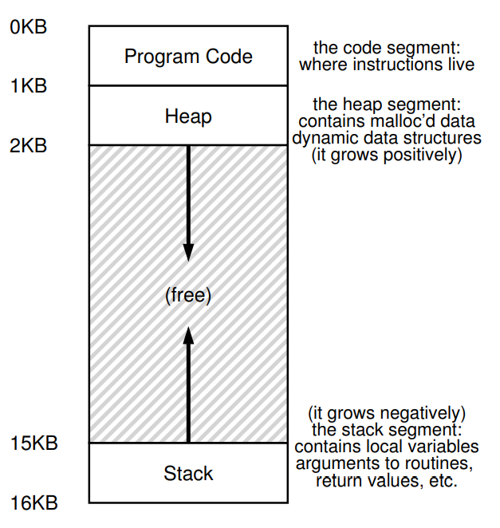

# The Abstraction: Address Space
- Early machines did not have address spaces - when a program ran, it would have full access to the machine's memory (aside from the memory reserved for the operating system)
    - When a context switch was performed, the memory would be saved into disk and the new process running would have its memory restored from disk - this was very inefficient due to frequent reads and writes to disk
- More modern machines leave processes in memory when switching between them, giving each program its own **address space**, which is an easy-to-use abstraction of physical memory
    - The address space of a process contains the **code** of the program, the **heap** (growing upwards), and the **stack** (growing downards)
        - 
        - This memory space is an abstraction - the memory locations are where the program *believes* they are, but in actuality the memory segments may be in entirely different locations on the actual physical memory; memory **virtualized** and the addresses that are referenced by programs are actually **virtual** addresses mapped to physically addresses
- When virtualizing memory, three main goals are apparent:
    - **Transparency**: Virtual memory should be implemented in a way that is invisible to the running program - the program should not be aware that memory is virtualized, and so the operating system and hardware should be doing work behind the scenes to manage memory and perform the actual mapping of memory from virtual to physical
    - **Efficiency**: Virtualization should be as efficient as possible, in terms of both time and space
    - **Protection**: The operating system should make sure processes are protected from each other by ensuring that one process cannot access the memory of another - that is, memory is **isolated**