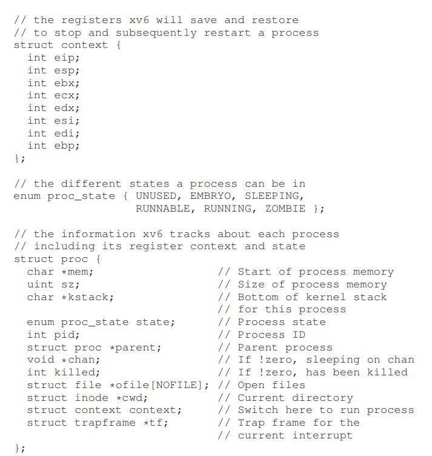

# The Abstraction: The Process
- A **process** is just a running program. One of the concerns of an operating system is to have *many* processes running at once, which involves **virtualizing** the CPU 
    - At any instant of time, a process is summarized by its **machine state**, consisting of its *memory*, *registers*, as well as I/O devices that it is using
        - The process's instructions and the data reads and writes with sits in its memory address space
        - The value of the registers used by the process, including special registers such as the *instruction pointer*, *stack pointer*, and *frame pointer*, are important for specifying the state of a machine
- The illusion of many virtual CPUs existing is done via the technique of **time sharing**, where one process runs and then is stopped so another can run
    - The *mechanism* - the low level protocol to implement functionality - by which this is done is the **context switch**, in which the operating system stops one program and starts another on the CPU
    - The *policy* - algorithms for making operating system decisions - for **scheduling** makes use of a wide variety of information to decide which processes to schedule
## Process API
- **Create**: An OS must be able to create new processes
    - To create a program, the OS must read the program's executable from disk and load its code and static data into memory (virtual address space)
        - This step can be done eagerly (all at once) or lazily (loading code/data only when needed), with the latter method being more common in modern operating systems
    - Once the code and static data are loaded, the OS allocates memory for the program's stack and initialize it with any arguments (i.e. `argc` and `argv`). It will also allocate memory for the program's heap (dynamically allocated memory) - as the program makes more call to functions such as `malloc`, the OS will get involved and provide more memory
    - Other initialization tasks are performed, such as opening file descriptors for processes (input, output, and error)
    - Once all initialization is performed, the OS starts the program from its entry point (jumping to `main()`) and transfers control to the CPU
- **Destroy**: An OS must be able to destroy an existing process forcefully (kill)
- **Wait**: An OS must be able to provide some interface for *waiting* for a process to complete
- **Misc. Control**: An OS should be able to do other control actions on processes, such as suspending and resuming it
- **Status**: An OS must be able to provide some interface to get information about a process (how long it has been running, its state, etc.)
    - A basic process can be in one of three states:
        - *Running*: It is executing instructions on a processor
        - *Ready*: It is ready to run but has not been chosen to yet
        - *Blocked*: It has performed some kind of operation that makes it not ready to run until some other event takes place (i.e. I/O request)
    - A process is *scheduled* when it is moved from ready to running, and is *descheduled* when it is moved from running to ready
        - Deciding when to run schedule one process (and therefore deschedule another) involves many factors (i.e. optimize by scheduling another process when the current is blocked by I/O), made by the OS **scheduler**
    - A process tends to be blocked when I/O is initiated and unblocked when I/O completes
## Process Data Structures
- The operating system keeps track of the state of each process ready to run usually through a **process list** data structure (also known as a **Process Control Block (PCB)**)
- Other data structures are necessary to track which process is currently running, which processes are blocked, when I/O is completed (and to what process it performed the operation for), and so forth
- xv6 Proc Structure:
    - 
        - There are other states, such as a **zombie** state where the process has finished but has not been cleaned up - this allows for the parent process to examine the return code