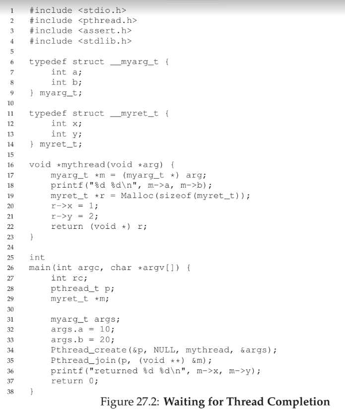
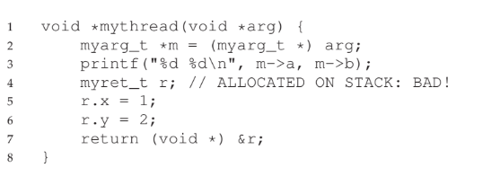
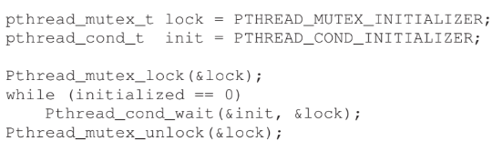
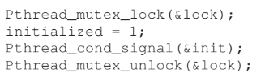

# Interlude: Thread API
- `<pthread.h>` is the header for thread-related operations
- With gcc, the `-pthread` flag should be used when compiling
## Thread Creation
- `int pthread_create(pthread_t *thread, const pthread_attr_t *attr, void *(*start_routine)(void*), void *arg)` is used to create a thread
    - Argument `thread` is a pointer to a `pthread_t` structure that is initialized in the actual `pthread_create()` call - this structure can be used to interact with the thread later on in the code
    - Argument `attr` optionally specifies the attributes of the thread, such as its stack size, and is initialized *separately* using `pthread_attr_init()`; if no attributes need to be specified, `NULL` can be used
    - Argument `start_routine` is a **function pointer** 
        - Typically, the start routine is in terms **void pointers**, which are pointers that can be *typecasted* into any other pointer types - allowing for any type of argument or return value to be supported (though this may require some unpacking to be done)
    - Argument `arg` is the argument to be passed into the `start_routine` function upon execution
- 
## Thread Completion
- `int pthread_join(pthread_t thread, void **value_ptr)` is used to wait for a thread
    - Argument `thread` is the `pthread_t` structure initialized during `pthread_create()`
    - Argument `value_ptr` is a *pointer* to the return value of the routine passed into `pthread_create()`, which itself returns a pointer (usually a void pointer)
- When working with threads, *avoid* returning a pointer to something allocated on the calling thread's stack - since each thread has its own private stack which is *deallocated* upon thread completion, passing back a pointer will result in undefined behavior
    - The pointer should point to data allocated on the heap instead (perhaps using `malloc()`) since this is global and is only deallocated manually
    - 
## Locks
- Mutual exclusion to critical sections is provided via **locks**
- `int pthread_mutex_lock(pthread_mutex_t *mutex)` sets a lock
- `int pthread_mutex_unlock(pthread_mutex_t *mutex)` unsets a lock
- The `pthread_mutex_t` structure must be initialized, and this can be done in two ways
    - Static Way: `pthread_mutex_t lock = PTHREAD_MUTEX_INITIALIZER;`
    - Dynamic Way: `int rc = pthread_mutex_init(&lock, NULL); assert(rc == 0);`
- When `pthread_mutex_lock()` is called and no other thread holds the lock, the current thread holds the lock; if another thread does hold the lock, it waits (does not return from the call) until it unlocks
- Example:
    -     pthread_mutex_lock(&lock); // assume lock has already been initialized
          x = x + 1; // critical section
          pthread_mutex_unlock(&lock);
## Condition Variables
- **Condition variables** are useful when it is necessary to perform some sort of signalling between threads
- `int pthread_cond_wait(pthread_cond_t *cond, pthread_mutex_t *mutex)` is used to wait for a signal
    - Argument `cond` is the signal condition variable that, when signaled, will wake up the thread
        - `cond` must be initialized using an initializer, akin to that for a mutex lock
        - `cond` itself is just the signal, usually a variable containing a value is associated with it
    - 
        - The lock `mutex` is set before the condition check; if the condition is not initialized, then `pthread_cond_wait()` is called and the lock is *released* while the thread sleeps - after the thread awakes, the thread *acquires* the lock again
            - This is obviously necessary since another thread must be able to acquire the lock in able to change the condition variable and therefore send the signal
            - It is good practice to re-check the condition in a while loop since some pthread implementations can erroneously wake up without being signalled
- `int pthread_cond_signal(pthread_cond_t *cond)` is used to signal
    - 
        