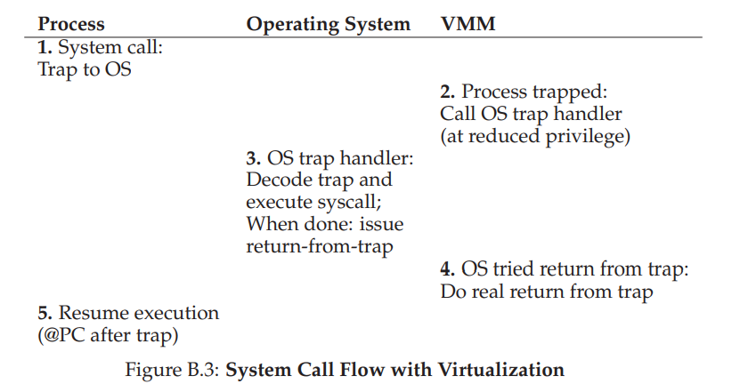
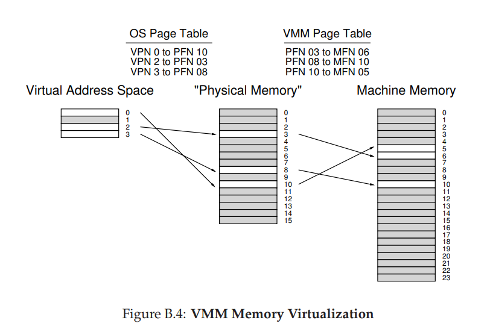
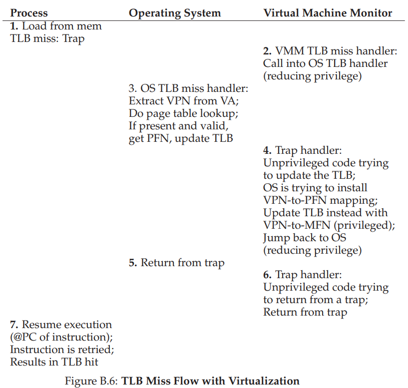

# Virtual Machines
- A **virtual machine monitor (VMM)**, also known as a **hypervisor**, sits between one or more operating systems and the hardware and gives each operating system the illusion that it controls the machine, though in actuality it is the monitor that is in control of the hardware
## Virtualizing the CPU
- Virtual machines utilize the same underlying technique as virtualizing processes - **limited direct execution**
    - When a new operating system is booted on top of the visor, it runs as any other process would, though now it is necessary to account for **machine switches** if multiple virtual machines are involved
        - This requires the visor to save the entire machine state of the current operating system (not only registers and PC, but also privileged hardware state), restore the machine state of the to-be-ran operating system, and then jump to the program counter of the to-be-ran operating system (which may be within the operating system itself or within a process running under the operating system)
- When the virtual operating system tries to perform a **privileged operation**, it does not actually perform the privileged instruction itself but rather traps into the actual physical machine (the visor), which *intercepts* the privileged operation 
    - When the virtual operating system boots, it tries to install its own trap handlers - this is a privileged instruction that causes the visor to record where its trap handlers are (in memory)
        - Thus, when the visor receives a trap from a process running on the virtual operating system, the visor jumps to the appropriate operating system trap handler and lets it handle the system call
        - When the virtual operating system finishes the system call, it executes a return-from-trap instruction (which is also a privileged instruction), causing another trap into the visor, which itself realizes that return-from-trap instruction was called and finally does a real return to trap
            - This entire process can be fairly expensive
        - 
- The virtual operating system itself does not run in kernel mode, usually in a special **reduced privilege** or **supervisor** mode, which does not provide it privileged operations but provides it a bit more extra memory than in user mode, which it can use for (virtual) kernel data structures
## Virtualizing Memory
- Virtual operating systems possess an extra layer of memory mapping
    - Each process in a virtual operating system has a virtual address space, which is mapped to a "physical" address space for that virtual operating system, but this virtual operating system address space is mapped to the *actual* physical memory on the machine (controlled by the visor)
    - 
- When considering a software-managed translation lookaside buffer (TLB), when a process running on a virtual operating system makes a memory reference and misses in the TLB, it is the *visor's* miss handler that runs
    - Since the visor does not know how to handle the TLB miss, it jumps to the virtual operating system's TLB handler (which it knows from the recording the location of the trap handlers at boot time for the virtual operating system)
    - The virtual operating system does a page table lookup for the virtual page number and tries to install a virtual-to-physical mapping in the TLB, but since this is a privileged instruction, the visor is once again trapped
    - The visor, instead of installing a virtual-to-physical mapping, installs a virtual-to-machine mapping
    - 
## Information Gap
- The visor often does not know what the virtual operating system is doing, a lack of knowledge which is known as the **information gap** that could potentially lead to inefficiencies
- If the virtual operating system, for example, goes into an idle spin loop, the visor would not be able to tell that the virtual operating system is not doing anything (it is just waiting) and thus may not switch it out (for perhaps a different virtual operating system)
- The visor, for security reasons, zeroes each page it gives to each virtual operating system - but the operating system may do the same thing when giving out that page to a process, resulting in the same operation being performed twice
