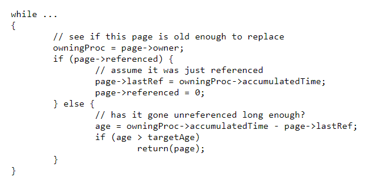

# Working Set Replacement
- While LRU is an effective paging policy, it begins to suffer when performing Round-Robin timesharing, as now the *most recently used* pages will belong to processes that do not run for a long time while the *least recently used* pages will belong to processes that are about to run, thus resulting in many page faults
    - Thus, instead of using a *global LRU*, it would be better to use a *per-process LRU* where each process is given its own dedicated set of page frames and where replacement occurs within this **working set**
- With this in mind, page faults should be kept at a manageable rate, generally only occuring when a process is swapped (i.e. the time-slice length)
    - **Thrashing** should be avoided, especially in cases where processes are running in too little memory - processes should be removed from the ready queue if there is not enough memory for them
- A process's **working set** is the number of pages such that increasing pages will make very little difference in performance while reducing pages will result in very noticable performance hits
    - The working set of a process can be inferred from its behavior - if it experiences many page faults, then its working set should be increased, and if it is not experiencing many page faults, then it may have too much memory allocated to it
- Page Stealing Algorithm:
    - 
    - This functions similarly to a clock hand algorithm, but works with a working set of pages, each of which are associated with an *owning process* - this owning process has an *accumulated CPU time* to measure recency rather than a global CPU time (since time sharing interferes with this)
    - Each page frame has a *last referenced time*, which subtracts from the *accumulated CPU time* to determine if the frame maintains a *target age*
    - If a page is older than the target age, then it is taken away from the owning process and given to some other process (it may be the same process getting another page)
    - If a full scan occurs without finding anything older than the target age, then the actual oldest page in memory (not based on accumulated time) can be replaced - this is expensive, however
        - Usually though, this is an indicator of thrashing and therefore should involve the number of processes being reduced
- The page stealing algorithm is an example of a **dynamic equilibrium mechanism** since processes are constantly transferring (stealing) pages from other processes, ultimately resulting in processes referencing pages more often having larger working sets while processes referencing pages less having smaller working sets
